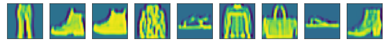

# 第6章 卷积神经网络

## 6.1 从全连接层到卷积

### 练习 6.1.1

假设卷积层(6.3)覆盖的局部区域$\Delta = 0$。在这种情况下，证明卷积内核为每组通道独立地实现一个全连接层。

**解答：** 

&emsp;&emsp;局部区域$\Delta=0$ 表示卷积核的大小等于输入的大小。实际就是问，1×1的卷积核是否等价于全连接（参见本书7.3节：NiN网络结构）。因此，每个卷积核只能覆盖一个像素点，在这种情况下，卷积层的计算方式与全连接层非常相似。因为每个卷积核只能看到一个通道的信息，相当于每个卷积核只是一个全连接层的权重矩阵。 所以，卷积内核可以看作是每组通道独立地实现一个全连接层。每个卷积核都有自己的权重，每个输入通道都被独立处理，输出通道是各个输入通道的加权和。这种独立处理的方式有效地减少了权重的数量，从而降低了计算成本，并且能够提取出输入数据中的空间特征。


```python
# 代码验证
import torch
import torch.nn as nn


class MyNet1(nn.Module):
    def __init__(self, linear1, linear2):
        super(MyNet1, self).__init__()
        self.linear1 = linear1
        self.linear2 = linear2

    def forward(self, X):
        return self.linear2(self.linear1(nn.Flatten()(X)))


class MyNet2(nn.Module):
    def __init__(self, linear, conv2d):
        super(MyNet2, self).__init__()
        self.linear = linear
        self.conv2d = conv2d

    def forward(self, X):
        X = self.linear(nn.Flatten()(X))
        X = X.reshape(X.shape[0], -1, 1, 1)
        X = nn.Flatten()(self.conv2d(X))
        return X


linear1 = nn.Linear(15, 10)
linear2 = nn.Linear(10, 5)
conv2d = nn.Conv2d(10, 5, 1)

linear2.weight = nn.Parameter(conv2d.weight.reshape(linear2.weight.shape))
linear2.bias = nn.Parameter(conv2d.bias)

net1 = MyNet1(linear1, linear2)
net2 = MyNet2(linear1, conv2d)

X = torch.randn(2, 3, 5)
# 两个结果实际存在一定的误差，直接print(net1(X) == net2(X))得到的结果不全是True
print(net1(X))
print(net2(X))
```

    tensor([[0.1190, 0.2377, 0.1443, 0.1020, 0.0702],
            [0.1301, 0.2734, 0.1215, 0.0839, 0.1271]], grad_fn=<AddmmBackward0>)
    tensor([[0.1190, 0.2377, 0.1443, 0.1020, 0.0702],
            [0.1301, 0.2734, 0.1215, 0.0839, 0.1271]],
           grad_fn=<ReshapeAliasBackward0>)


### 练习 6.1.2

为什么平移不变性可能也不是好主意呢？

**解答：** 

&emsp;&emsp;平移不变性可能会降低模型的准确性和泛化能力。对于某些任务，平移不变性并不是必须的特性。例如，对于图像分类任务，我们通常希望模型能够识别物体的位置和姿态，并根据这些信息对其进行分类。在这种情况下，平移不变性可能会降低模型的准确性，因为它忽略了物体的位置和姿态等重要信息。 其次，平移不变性可能会导致模型的泛化能力下降。

&emsp;&emsp;参考：[https://arxiv.org/pdf/1805.12177.pdf](https://arxiv.org/pdf/1805.12177.pdf)

### 练习 6.1.3

当从图像边界像素获取隐藏表示时，我们需要思考哪些问题？

**解答：** 

&emsp;&emsp;考虑是否填充`padding`，以及填充多大的`padding`的问题。可以使用`torch.nn`模块中的`functional.pad`函数对图像进行填充操作，以保证边界像素的信息完整。填充后还需要进行额外的处理，例如使用图像复制、填充、平滑等方法来获取隐藏表示。

### 练习 6.1.4

描述一个类似的音频卷积层的架构。

**解答：** 

&emsp;&emsp;一种基于卷积神经网络的音频特征生成方法，首先对声音信号进行预处理和离散傅里叶变换计算声音信号的幅度谱，形成二维谱图信号；然后搭建以上述二维谱图信号为输入的一维卷积神经网络并进行模型训练，得到特征生成器模型；最后对待测声音进行预处理和离散傅里叶变换得到二维谱图信号，并将其送入训练好的一维卷积神经网络，通过卷积网络计算，得到输出即为所要生成的音频特征，实现声音信号的音频特征生成。

### 练习 6.1.5

卷积层也适合于文本数据吗？为什么？

**解答：** 

&emsp;&emsp;卷积层也适合于文本数据。 在自然语言处理中，文本数据通常表示为词向量矩阵，其中每行代表一个词的向量表示。卷积层可以在这个矩阵上进行卷积操作，类似于图像卷积层中对图像进行卷积操作。 在卷积层中，卷积核会在输入矩阵上进行滑动窗口计算，输出一个新的特征矩阵。在文本数据中，这个特征矩阵可以看作是对输入文本的不同n-gram特征的提取。例如，一个大小为3的卷积核可以提取出输入文本中每个长度为3的n-gram特征。这些特征可以用于后续的分类或者回归任务。 此外，卷积层还可以与循环神经网络（RNN）结合使用，形成卷积神经网络（CNN）和循环神经网络（RNN）的混合模型。这种模型可以同时捕捉文本中的局部特征和全局特征，提高模型的性能。 因此，卷积层适用于文本数据，可以对文本数据进行卷积操作，提取出不同n-gram特征，并且可以与RNN结合使用，提高模型的性能。

### 练习 6.1.6

证明在式(6.6)中，$f * g = g * f$。

**解答：** 

&emsp;&emsp;通过式(6.6)的定义，我们可以得到：

$$(f * g)(x) = \int_{-\infty}^{\infty}f(y)g(x-y)dy$$

$$(g * f)(x) = \int_{-\infty}^{\infty}g(y)f(x-y)dy$$

&emsp;&emsp;要证明$f * g = g * f$，即证明：

$$\int_{-\infty}^{\infty}f(y)g(x-y)dy = \int_{-\infty}^{\infty}g(y)f(x-y)dy$$

&emsp;&emsp;为了证明上式成立，我们将其中一个积分的变量名改为$t=x-y$，则有：

$$\int_{-\infty}^{\infty}f(y)g(x-y)dy = \int_{-\infty}^{\infty}f(x-t)g(t)dt$$

&emsp;&emsp;再将这个式子代回式(6.6)中：

$$(f * g)(x) = \int_{-\infty}^{\infty}f(x-t)g(t)dt$$

&emsp;&emsp;对比式(6.6)和上面的式子，可以发现它们的形式是完全一样的，只是积分变量名不同而已。因此，我们可以得到：

$$(f * g)(x) = \int_{-\infty}^{\infty}f(y)g(x-y)dy = \int_{-\infty}^{\infty}g(y)f(x-y)dy = (g * f)(x)$$

&emsp;&emsp;因此，$f * g = g * f$，证毕。


## 6.2 图像卷积

### 练习 6.2.1  

构建一个具有对角线边缘的图像`X`。
1. 如果将本节中举例的卷积核`K`应用于`X`，会发生什么情况？
1. 如果转置`X`会发生什么？
1. 如果转置`K`会发生什么？

**解答：** 

**第1问：**

&emsp;&emsp;在对角线处有分别为1和-1的数据，其他区域都为0。


```python
import torch
from torch import nn
from d2l import torch as d2l

def corr2d(X, K):  #@save
    """计算二维互相关运算"""
    h, w = K.shape
    Y = torch.zeros((X.shape[0] - h + 1, X.shape[1] - w + 1))
    for i in range(Y.shape[0]):
        for j in range(Y.shape[1]):
            Y[i, j] = (X[i:i + h, j:j + w] * K).sum()
    return Y

# 如果将本节中举例的卷积核K应用于X，会发生什么情况？
X = torch.eye(8)
K = torch.tensor([[1.0, -1.0]])
Y = corr2d(X, K)
print(Y)
```

    tensor([[ 1.,  0.,  0.,  0.,  0.,  0.,  0.],
            [-1.,  1.,  0.,  0.,  0.,  0.,  0.],
            [ 0., -1.,  1.,  0.,  0.,  0.,  0.],
            [ 0.,  0., -1.,  1.,  0.,  0.,  0.],
            [ 0.,  0.,  0., -1.,  1.,  0.,  0.],
            [ 0.,  0.,  0.,  0., -1.,  1.,  0.],
            [ 0.,  0.,  0.,  0.,  0., -1.,  1.],
            [ 0.,  0.,  0.,  0.,  0.,  0., -1.]])


**第2问：**

&emsp;&emsp;转置后结果不变。


```python
Y = corr2d(X.T, K)
X, Y
```


    (tensor([[1., 0., 0., 0., 0., 0., 0., 0.],
             [0., 1., 0., 0., 0., 0., 0., 0.],
             [0., 0., 1., 0., 0., 0., 0., 0.],
             [0., 0., 0., 1., 0., 0., 0., 0.],
             [0., 0., 0., 0., 1., 0., 0., 0.],
             [0., 0., 0., 0., 0., 1., 0., 0.],
             [0., 0., 0., 0., 0., 0., 1., 0.],
             [0., 0., 0., 0., 0., 0., 0., 1.]]),
     tensor([[ 1.,  0.,  0.,  0.,  0.,  0.,  0.],
             [-1.,  1.,  0.,  0.,  0.,  0.,  0.],
             [ 0., -1.,  1.,  0.,  0.,  0.,  0.],
             [ 0.,  0., -1.,  1.,  0.,  0.,  0.],
             [ 0.,  0.,  0., -1.,  1.,  0.,  0.],
             [ 0.,  0.,  0.,  0., -1.,  1.,  0.],
             [ 0.,  0.,  0.,  0.,  0., -1.,  1.],
             [ 0.,  0.,  0.,  0.,  0.,  0., -1.]]))


**第3问：**

&emsp;&emsp;K转置后，结果也转置了 


```python
Y = corr2d(X, K.T)
X, Y
```


    (tensor([[1., 0., 0., 0., 0., 0., 0., 0.],
             [0., 1., 0., 0., 0., 0., 0., 0.],
             [0., 0., 1., 0., 0., 0., 0., 0.],
             [0., 0., 0., 1., 0., 0., 0., 0.],
             [0., 0., 0., 0., 1., 0., 0., 0.],
             [0., 0., 0., 0., 0., 1., 0., 0.],
             [0., 0., 0., 0., 0., 0., 1., 0.],
             [0., 0., 0., 0., 0., 0., 0., 1.]]),
     tensor([[ 1., -1.,  0.,  0.,  0.,  0.,  0.,  0.],
             [ 0.,  1., -1.,  0.,  0.,  0.,  0.,  0.],
             [ 0.,  0.,  1., -1.,  0.,  0.,  0.,  0.],
             [ 0.,  0.,  0.,  1., -1.,  0.,  0.,  0.],
             [ 0.,  0.,  0.,  0.,  1., -1.,  0.,  0.],
             [ 0.,  0.,  0.,  0.,  0.,  1., -1.,  0.],
             [ 0.,  0.,  0.,  0.,  0.,  0.,  1., -1.]]))


### 练习 6.2.2 

在我们创建的`Conv2D`自动求导时，有什么错误消息？

**解答：** 

&emsp;&emsp;错误信息：The size of tensor a (0) must match the size of tensor b (7) at non-singleton dimension 3

&emsp;&emsp;会提示维度不对称的错误信息，因为torch提供的二维卷积层是nn.Conv2d() 采用的是四维输入和输出格式（批量大小、通道、高度、宽度）,而我们自定义的仅仅是二维的。

### 练习 6.2.3

如何通过改变输入张量和卷积核张量，将互相关运算表示为矩阵乘法？

**解答：** 

&emsp;&emsp;题目的意思应该是如何通过矩阵乘法得到互相关（卷积）运算


```python
def conv2d_by_mul(X, K):
    # 获取卷积核大小
    h, w = K.shape
    # 计算输出图像大小
    outh = X.shape[0] - h + 1
    outw = X.shape[1] - w + 1
    # 调整卷积核形状以便做乘法
    K = K.reshape(-1, 1)
    # 将输入图像切成卷积核大小的块，打平成一维，存放在列表 Y 中
    Y = []
    for i in range(outh):
        for j in range(outw):
            Y.append(X[i:i + h, j:j + w].reshape(-1))
    # 将列表 Y 转为张量，每行代表一块的打平结果
    Y = torch.stack(Y, 0)
    # 用矩阵乘法表示互相关运算
    res = (torch.matmul(Y, K)).reshape(outh, outw)
    # 返回输出结果
    return res
```

### 练习 6.2.4

手工设计一些卷积核。
1. 二阶导数的核的形式是什么？
1. 积分的核的形式是什么？
1. 得到$d$次导数的最小核的大小是多少？

**解答：** 

**第1问：**

&emsp;&emsp;二阶导数的核的形式是：

$$\begin{bmatrix}-1 & 2 & -1\end{bmatrix}$$

**第2问：**

&emsp;&emsp;积分的核的形式是：

$$\begin{bmatrix}1 & 1 & 1 & \cdots & 1\end{bmatrix}$$


**第3问：**

&emsp;&emsp;得到 𝑑 次导数的最小核的大小是 $d+1$。例如，一阶导数的最小核大小为 $2$，二阶导数的最小核大小为 $3$，三阶导数的最小核大小为 $4$，以此类推。

## 6.3 填充和步幅 

### 练习 6.3.1  

对于本节中的最后一个示例，计算其输出形状，以查看它是否与实验结果一致。

**解答：** 

$$out_{shape}=\lfloor(n_h-k_h+p_h+s_h)/s_h\rfloor \times \lfloor(n_w-k_w+p_w+s_w)/s_w\rfloor.$$

&emsp;&emsp;示例中$X.shape = [8, 8]$，计算得出$out_shape = [(8-3+0+3)/3, (8-5+1+4)/4] = [2.67, 2]$,向下取整，所以为$[2, 2]$


### 练习 6.3.2

在本节中的实验中，试一试其他填充和步幅组合。

**解答：** 

略。

### 练习 6.3.3

对于音频信号，步幅$2$说明什么？

**解答：** 

&emsp;&emsp;对于音频信号而言，步幅为2就是以2为周期对信号进行采样计算。

### 练习 6.3.4

步幅大于$1$的计算优势是什么？

**解答：** 

&emsp;&emsp;减小计算量， 减小内存占用， 提高模型的泛化能力。

## 6.4 多输入多输出通道 

### 练习 6.4.1

假设我们有两个卷积核，大小分别为$k_1$和$k_2$（中间没有非线性激活函数）。
1. 证明运算可以用单次卷积来表示。
1. 这个等效的单个卷积核的维数是多少呢？
1. 反之亦然吗？

**解答：** 

**第1问：**

&emsp;&emsp;假设输入的图像大小为$W×H$，设卷积核1的大小为$k_1$，卷积核2的大小为$k2$，它们分别作用于输入矩阵$x$，得到的输出矩阵分别为$y_1$和$y_2$。则可以将$y1$与$y2$的每一个元素相加，得到最终输出矩阵$y$。

&emsp;&emsp;即：$$y[i][j] = y_1[i][j] + y_2[i][j]$$

&emsp;&emsp;可以将两个卷积核的大小相加，得到一个新的卷积核大小为$(k_1+k_2-1)×(k_1+k_2-1)$。然后可以将这个新的卷积核应用于输入图像，得到一个输出图像。这个输出图像的大小为$(W-k_1-k_2+2)×(H-k_1-k_2+2)$。

**第2问：**

&emsp;&emsp;可以使用一个大小为$(k_1+k_2-1)×(k_1+k_2-1)$的卷积核来表示这两个卷积核的运算。

**第3问：**

&emsp;&emsp;反之亦然。如果有一个大小为$k_1+k_2-1$的卷积核，可以将其分解为两个大小分别为$k1$和$k2$的卷积核。这两个卷积核之间没有非线性激活函数，所以它们的运算可以被视为一个单独的卷积核。

### 练习 6.4.2

假设输入为$c_i\times h\times w$，卷积核大小为$c_o\times c_i\times k_h\times k_w$，填充为$(p_h, p_w)$，步幅为$(s_h, s_w)$。
1. 前向传播的计算成本（乘法和加法）是多少？
1. 内存占用是多少？
1. 反向传播的内存占用是多少？
1. 反向传播的计算成本是多少？

**解答：** 

**第1问：**

&emsp;&emsp;前向计算成本为

$flops_{forward} = c_i \times c_o \times k_h \times k_w \times m_h \times m_w$

&emsp;&emsp;其中$m_h=\lfloor \frac{h+2p_h-k_h}{s_h}+1 \rfloor$, $m_w=\lfloor \frac{w+2p_w-k_w}{s_w}+1 \rfloor$ 


**第2问：**

&emsp;&emsp;输入需要$c_i*h*w$个浮点数，卷积核需要$c_o*c_i*k_h*k_w$个浮点数，输出需要$c_o*m_h*m_w$个浮点数。此外，还需要存储中间结果，即填充后的输入和反向传播时的梯度信息。因此，总内存占用为
$$memory_{forward}=(c_i+k_h-1)*(h+k_w-1)*c_0+2*c_i*h*w$$

**第3问：**

&emsp;&emsp;反向传播的内存作用与前向传播相同，总内存占用为
$$memory_{backward}=(c_i+k_h-1)*(h+k_w-1)*c_0+2*c_i*h*w$$

**第4问：**

&emsp;&emsp;反向计算成本为

$flops_{backward} = c_i \times c_o \times k_h \times k_w \times m_h \times m_w$

&emsp;&emsp;其中$m_h$和$m_w$的定义同上

### 练习 6.4.3

如果我们将输入通道$c_i$和输出通道$c_o$的数量加倍，计算数量会增加多少？如果我们把填充数量翻一番会怎么样？

**解答：** 

&emsp;&emsp;如果我们将输入通道$c_i$和输出通道$c_o$的数量加倍，计算数量会增加$4$倍。如果我们把填充数量翻一番，计算数量会增加$2$倍。

### 练习 6.4.4

如果卷积核的高度和宽度是$k_h=k_w=1$，前向传播的计算复杂度是多少？

**解答：**

$$flops = c_i \times c_o \times \frac{h-p_h}{s_h} \times \frac{w-p_w}{s_w}$$

### 练习 6.4.5

本节最后一个示例中的变量`Y1`和`Y2`是否完全相同？为什么？

**解答：**

&emsp;&emsp;浮点数计算有误差，因而两者不完全相同。

### 练习 6.4.6

当卷积窗口不是$1\times 1$时，如何使用矩阵乘法实现卷积？

**解答：** 

&emsp;&emsp;可以将输入张量和卷积核张量分别展开为二维矩阵，然后对这两个矩阵进行乘法运算，得到的结果再变换为输出张量。

## 6.5 汇聚层 

### 练习 6.5.1

尝试将平均汇聚层作为卷积层的特殊情况实现。

**解答：** 


```python
import torch.nn as nn 
import torch.nn.functional as F

class Net(nn.Module): 
    def init(self): 
      super(Net, self).init() 
      self.conv1 = nn.Conv2d(1, 6, 5) 
      self.pool = nn.Conv2d(6, 6, 5) 
      # 平均池化层 
      self.conv2 = nn.Conv2d(6, 16, 5) 
      self.fc1 = nn.Linear(16 * 5 * 5, 120) 
      self.fc2 = nn.Linear(120, 84) 
      self.fc3 = nn.Linear(84, 10)

    def forward(self, x):
        x = F.relu(self.conv1(x))
        x = F.avg_pool2d(x, (2, 2)) # 平均池化层
        x = F.relu(self.conv2(x))
        x = F.avg_pool2d(x, (2, 2)) # 平均池化层
        x = x.view(-1, self.num_flat_features(x))
        x = F.relu(self.fc1(x))
        x = F.relu(self.fc2(x))
        x = self.fc3(x)
        return x

    def num_flat_features(self, x):
        size = x.size()[1:]
        num_features = 1
        for s in size:
            num_features *= s
        return num_features
```

### 练习 6.5.2

尝试将最大汇聚层作为卷积层的特殊情况实现。

**解答：** 


```python
import torch.nn as nn 
import torch.nn.functional as F

class Net(nn.Module): 
    def init(self): 
        super(Net, self).init() 
        self.conv1 = nn.Conv2d(1, 6, 5) 
        self.pool = nn.Conv2d(6, 6, 5) 
        # 最大池化层 
        self.conv2 = nn.Conv2d(6, 16, 5) 
        self.fc1 = nn.Linear(16 * 5 * 5, 120) 
        self.fc2 = nn.Linear(120, 84) 
        self.fc3 = nn.Linear(84, 10)  
        
    def forward(self, x):
        x = F.relu(self.conv1(x))
        x = F.max_pool2d(x, (2, 2)) # 最大池化层
        x = F.relu(self.conv2(x))
        x = F.max_pool2d(x, (2, 2)) # 最大池化层
        x = x.view(-1, self.num_flat_features(x))
        x = F.relu(self.fc1(x))
        x = F.relu(self.fc2(x))
        x = self.fc3(x)
        return x

    def num_flat_features(self, x):
        size = x.size()[1:]
        num_features = 1
        for s in size:
            num_features *= s
        return num_features
```

### 练习 6.5.3

假设汇聚层的输入大小为$c\times h\times w$，则汇聚窗口的形状为$p_h\times p_w$，填充为$(p_h, p_w)$，步幅为$(s_h, s_w)$。这个汇聚层的计算成本是多少？

**解答：** 

$$flops=\frac{c \times h \times w \times p_h \times p_w}{s_h \times s_w}$$

### 练习 6.5.4

为什么最大汇聚层和平均汇聚层的工作方式不同？

**解答：** 

&emsp;&emsp;最大池化层和平均池化层的工作方式不同，因为它们使用不同的池化方法。最大池化层将输入张量分成不重叠的区域，并在每个区域中选择最大值。平均池化层将输入张量分成不重叠的区域，并计算每个区域的平均值。这些方法的主要区别在于它们如何处理输入张量中的信息。最大池化层通常用于提取输入张量中的显著特征，而平均池化层通常用于减少输入张量的大小并提高模型的计算效率。

### 练习 6.5.5

我们是否需要最小汇聚层？可以用已知函数替换它吗？

**解答：** 


```python
import torch.nn.functional as F

def min_pool2d(x, kernel_size, stride=None, padding=0, dilation=1, ceil_mode=False): 
    neg_x = -x 
    neg_min_pool = F.max_pool2d(neg_x, kernel_size, stride=stride, padding=padding, dilation=dilation, ceil_mode=ceil_mode) 
    min_pool = -neg_min_pool 
    return min_pool
```

### 练习 6.5.6

除了平均汇聚层和最大汇聚层，是否有其它函数可以考虑（提示：回想一下`softmax`）？为什么它不流行？

**解答：** 

&emsp;&emsp;除了平均汇聚层和最大汇聚层，还有一些其他的池化函数，例如Lp池化和随机池化。Softmax函数通常用于多分类问题，它将每个输出分类的结果赋予一个概率值，表示属于每个类别的可能性。但是，Softmax函数不适用于池化层，因为它会将所有输入数据转换为概率分布，这会导致信息丢失。因此，Softmax函数不流行用于池化层。

## 6.6 卷积神经网络（LeNet） 

### 练习 6.6.1

将平均汇聚层替换为最大汇聚层，会发生什么？

**解答：** 

&emsp;&emsp;输出更大，梯度更大，训练更容易（AlexNet改进的方式之一）

&emsp;&emsp; LeNet原始代码如下：


```python
!pip install d2l
```

    Looking in indexes: https://pypi.org/simple, https://us-python.pkg.dev/colab-wheels/public/simple/
    Requirement already satisfied: d2l in /usr/local/lib/python3.9/dist-packages (0.17.6)
    Requirement already satisfied: matplotlib==3.5.1 in /usr/local/lib/python3.9/dist-packages (from d2l) (3.5.1)
    Requirement already satisfied: numpy==1.21.5 in /usr/local/lib/python3.9/dist-packages (from d2l) (1.21.5)
    Requirement already satisfied: jupyter==1.0.0 in /usr/local/lib/python3.9/dist-packages (from d2l) (1.0.0)
    Requirement already satisfied: requests==2.25.1 in /usr/local/lib/python3.9/dist-packages (from d2l) (2.25.1)
    Requirement already satisfied: pandas==1.2.4 in /usr/local/lib/python3.9/dist-packages (from d2l) (1.2.4)
    Requirement already satisfied: jupyter-console in /usr/local/lib/python3.9/dist-packages (from jupyter==1.0.0->d2l) (6.1.0)
    Requirement already satisfied: nbconvert in /usr/local/lib/python3.9/dist-packages (from jupyter==1.0.0->d2l) (6.5.4)
    Requirement already satisfied: qtconsole in /usr/local/lib/python3.9/dist-packages (from jupyter==1.0.0->d2l) (5.4.2)
    Requirement already satisfied: notebook in /usr/local/lib/python3.9/dist-packages (from jupyter==1.0.0->d2l) (6.4.8)
    Requirement already satisfied: ipykernel in /usr/local/lib/python3.9/dist-packages (from jupyter==1.0.0->d2l) (5.5.6)
    Requirement already satisfied: ipywidgets in /usr/local/lib/python3.9/dist-packages (from jupyter==1.0.0->d2l) (7.7.1)
    Requirement already satisfied: fonttools>=4.22.0 in /usr/local/lib/python3.9/dist-packages (from matplotlib==3.5.1->d2l) (4.39.3)
    Requirement already satisfied: cycler>=0.10 in /usr/local/lib/python3.9/dist-packages (from matplotlib==3.5.1->d2l) (0.11.0)
    Requirement already satisfied: pillow>=6.2.0 in /usr/local/lib/python3.9/dist-packages (from matplotlib==3.5.1->d2l) (8.4.0)
    Requirement already satisfied: kiwisolver>=1.0.1 in /usr/local/lib/python3.9/dist-packages (from matplotlib==3.5.1->d2l) (1.4.4)
    Requirement already satisfied: python-dateutil>=2.7 in /usr/local/lib/python3.9/dist-packages (from matplotlib==3.5.1->d2l) (2.8.2)
    Requirement already satisfied: packaging>=20.0 in /usr/local/lib/python3.9/dist-packages (from matplotlib==3.5.1->d2l) (23.1)
    Requirement already satisfied: pyparsing>=2.2.1 in /usr/local/lib/python3.9/dist-packages (from matplotlib==3.5.1->d2l) (3.0.9)
    Requirement already satisfied: pytz>=2017.3 in /usr/local/lib/python3.9/dist-packages (from pandas==1.2.4->d2l) (2022.7.1)
    Requirement already satisfied: certifi>=2017.4.17 in /usr/local/lib/python3.9/dist-packages (from requests==2.25.1->d2l) (2022.12.7)
    Requirement already satisfied: idna<3,>=2.5 in /usr/local/lib/python3.9/dist-packages (from requests==2.25.1->d2l) (2.10)
    Requirement already satisfied: chardet<5,>=3.0.2 in /usr/local/lib/python3.9/dist-packages (from requests==2.25.1->d2l) (4.0.0)
    Requirement already satisfied: urllib3<1.27,>=1.21.1 in /usr/local/lib/python3.9/dist-packages (from requests==2.25.1->d2l) (1.26.15)
    Requirement already satisfied: six>=1.5 in /usr/local/lib/python3.9/dist-packages (from python-dateutil>=2.7->matplotlib==3.5.1->d2l) (1.16.0)
    Requirement already satisfied: tornado>=4.2 in /usr/local/lib/python3.9/dist-packages (from ipykernel->jupyter==1.0.0->d2l) (6.2)
    Requirement already satisfied: ipython-genutils in /usr/local/lib/python3.9/dist-packages (from ipykernel->jupyter==1.0.0->d2l) (0.2.0)
    Requirement already satisfied: ipython>=5.0.0 in /usr/local/lib/python3.9/dist-packages (from ipykernel->jupyter==1.0.0->d2l) (7.34.0)
    Requirement already satisfied: jupyter-client in /usr/local/lib/python3.9/dist-packages (from ipykernel->jupyter==1.0.0->d2l) (6.1.12)
    Requirement already satisfied: traitlets>=4.1.0 in /usr/local/lib/python3.9/dist-packages (from ipykernel->jupyter==1.0.0->d2l) (5.7.1)
    Requirement already satisfied: widgetsnbextension~=3.6.0 in /usr/local/lib/python3.9/dist-packages (from ipywidgets->jupyter==1.0.0->d2l) (3.6.4)
    Requirement already satisfied: jupyterlab-widgets>=1.0.0 in /usr/local/lib/python3.9/dist-packages (from ipywidgets->jupyter==1.0.0->d2l) (3.0.7)
    Requirement already satisfied: pygments in /usr/local/lib/python3.9/dist-packages (from jupyter-console->jupyter==1.0.0->d2l) (2.14.0)
    Requirement already satisfied: prompt-toolkit!=3.0.0,!=3.0.1,<3.1.0,>=2.0.0 in /usr/local/lib/python3.9/dist-packages (from jupyter-console->jupyter==1.0.0->d2l) (3.0.38)
    Requirement already satisfied: bleach in /usr/local/lib/python3.9/dist-packages (from nbconvert->jupyter==1.0.0->d2l) (6.0.0)
    Requirement already satisfied: entrypoints>=0.2.2 in /usr/local/lib/python3.9/dist-packages (from nbconvert->jupyter==1.0.0->d2l) (0.4)
    Requirement already satisfied: beautifulsoup4 in /usr/local/lib/python3.9/dist-packages (from nbconvert->jupyter==1.0.0->d2l) (4.11.2)
    Requirement already satisfied: jinja2>=3.0 in /usr/local/lib/python3.9/dist-packages (from nbconvert->jupyter==1.0.0->d2l) (3.1.2)
    Requirement already satisfied: pandocfilters>=1.4.1 in /usr/local/lib/python3.9/dist-packages (from nbconvert->jupyter==1.0.0->d2l) (1.5.0)
    Requirement already satisfied: tinycss2 in /usr/local/lib/python3.9/dist-packages (from nbconvert->jupyter==1.0.0->d2l) (1.2.1)
    Requirement already satisfied: nbclient>=0.5.0 in /usr/local/lib/python3.9/dist-packages (from nbconvert->jupyter==1.0.0->d2l) (0.7.3)
    Requirement already satisfied: jupyter-core>=4.7 in /usr/local/lib/python3.9/dist-packages (from nbconvert->jupyter==1.0.0->d2l) (5.3.0)
    Requirement already satisfied: MarkupSafe>=2.0 in /usr/local/lib/python3.9/dist-packages (from nbconvert->jupyter==1.0.0->d2l) (2.1.2)
    Requirement already satisfied: nbformat>=5.1 in /usr/local/lib/python3.9/dist-packages (from nbconvert->jupyter==1.0.0->d2l) (5.8.0)
    Requirement already satisfied: lxml in /usr/local/lib/python3.9/dist-packages (from nbconvert->jupyter==1.0.0->d2l) (4.9.2)
    Requirement already satisfied: defusedxml in /usr/local/lib/python3.9/dist-packages (from nbconvert->jupyter==1.0.0->d2l) (0.7.1)
    Requirement already satisfied: mistune<2,>=0.8.1 in /usr/local/lib/python3.9/dist-packages (from nbconvert->jupyter==1.0.0->d2l) (0.8.4)
    Requirement already satisfied: jupyterlab-pygments in /usr/local/lib/python3.9/dist-packages (from nbconvert->jupyter==1.0.0->d2l) (0.2.2)
    Requirement already satisfied: argon2-cffi in /usr/local/lib/python3.9/dist-packages (from notebook->jupyter==1.0.0->d2l) (21.3.0)
    Requirement already satisfied: pyzmq>=17 in /usr/local/lib/python3.9/dist-packages (from notebook->jupyter==1.0.0->d2l) (23.2.1)
    Requirement already satisfied: Send2Trash>=1.8.0 in /usr/local/lib/python3.9/dist-packages (from notebook->jupyter==1.0.0->d2l) (1.8.0)
    Requirement already satisfied: prometheus-client in /usr/local/lib/python3.9/dist-packages (from notebook->jupyter==1.0.0->d2l) (0.16.0)
    Requirement already satisfied: terminado>=0.8.3 in /usr/local/lib/python3.9/dist-packages (from notebook->jupyter==1.0.0->d2l) (0.17.1)
    Requirement already satisfied: nest-asyncio>=1.5 in /usr/local/lib/python3.9/dist-packages (from notebook->jupyter==1.0.0->d2l) (1.5.6)
    Requirement already satisfied: qtpy>=2.0.1 in /usr/local/lib/python3.9/dist-packages (from qtconsole->jupyter==1.0.0->d2l) (2.3.1)
    Requirement already satisfied: decorator in /usr/local/lib/python3.9/dist-packages (from ipython>=5.0.0->ipykernel->jupyter==1.0.0->d2l) (4.4.2)
    Requirement already satisfied: jedi>=0.16 in /usr/local/lib/python3.9/dist-packages (from ipython>=5.0.0->ipykernel->jupyter==1.0.0->d2l) (0.18.2)
    Requirement already satisfied: setuptools>=18.5 in /usr/local/lib/python3.9/dist-packages (from ipython>=5.0.0->ipykernel->jupyter==1.0.0->d2l) (67.6.1)
    Requirement already satisfied: pickleshare in /usr/local/lib/python3.9/dist-packages (from ipython>=5.0.0->ipykernel->jupyter==1.0.0->d2l) (0.7.5)
    Requirement already satisfied: backcall in /usr/local/lib/python3.9/dist-packages (from ipython>=5.0.0->ipykernel->jupyter==1.0.0->d2l) (0.2.0)
    Requirement already satisfied: pexpect>4.3 in /usr/local/lib/python3.9/dist-packages (from ipython>=5.0.0->ipykernel->jupyter==1.0.0->d2l) (4.8.0)
    Requirement already satisfied: matplotlib-inline in /usr/local/lib/python3.9/dist-packages (from ipython>=5.0.0->ipykernel->jupyter==1.0.0->d2l) (0.1.6)
    Requirement already satisfied: platformdirs>=2.5 in /usr/local/lib/python3.9/dist-packages (from jupyter-core>=4.7->nbconvert->jupyter==1.0.0->d2l) (3.2.0)
    Requirement already satisfied: jsonschema>=2.6 in /usr/local/lib/python3.9/dist-packages (from nbformat>=5.1->nbconvert->jupyter==1.0.0->d2l) (4.3.3)
    Requirement already satisfied: fastjsonschema in /usr/local/lib/python3.9/dist-packages (from nbformat>=5.1->nbconvert->jupyter==1.0.0->d2l) (2.16.3)
    Requirement already satisfied: wcwidth in /usr/local/lib/python3.9/dist-packages (from prompt-toolkit!=3.0.0,!=3.0.1,<3.1.0,>=2.0.0->jupyter-console->jupyter==1.0.0->d2l) (0.2.6)
    Requirement already satisfied: ptyprocess in /usr/local/lib/python3.9/dist-packages (from terminado>=0.8.3->notebook->jupyter==1.0.0->d2l) (0.7.0)
    Requirement already satisfied: argon2-cffi-bindings in /usr/local/lib/python3.9/dist-packages (from argon2-cffi->notebook->jupyter==1.0.0->d2l) (21.2.0)
    Requirement already satisfied: soupsieve>1.2 in /usr/local/lib/python3.9/dist-packages (from beautifulsoup4->nbconvert->jupyter==1.0.0->d2l) (2.4.1)
    Requirement already satisfied: webencodings in /usr/local/lib/python3.9/dist-packages (from bleach->nbconvert->jupyter==1.0.0->d2l) (0.5.1)
    Requirement already satisfied: parso<0.9.0,>=0.8.0 in /usr/local/lib/python3.9/dist-packages (from jedi>=0.16->ipython>=5.0.0->ipykernel->jupyter==1.0.0->d2l) (0.8.3)
    Requirement already satisfied: pyrsistent!=0.17.0,!=0.17.1,!=0.17.2,>=0.14.0 in /usr/local/lib/python3.9/dist-packages (from jsonschema>=2.6->nbformat>=5.1->nbconvert->jupyter==1.0.0->d2l) (0.19.3)
    Requirement already satisfied: attrs>=17.4.0 in /usr/local/lib/python3.9/dist-packages (from jsonschema>=2.6->nbformat>=5.1->nbconvert->jupyter==1.0.0->d2l) (23.1.0)
    Requirement already satisfied: cffi>=1.0.1 in /usr/local/lib/python3.9/dist-packages (from argon2-cffi-bindings->argon2-cffi->notebook->jupyter==1.0.0->d2l) (1.15.1)
    Requirement already satisfied: pycparser in /usr/local/lib/python3.9/dist-packages (from cffi>=1.0.1->argon2-cffi-bindings->argon2-cffi->notebook->jupyter==1.0.0->d2l) (2.21)


```python
import torch
from torch import nn
from d2l import torch as d2l

net = nn.Sequential(
    nn.Conv2d(1, 6, kernel_size=5, padding=2), nn.Sigmoid(),
    nn.AvgPool2d(kernel_size=2, stride=2),
    nn.Conv2d(6, 16, kernel_size=5), nn.Sigmoid(),
    nn.AvgPool2d(kernel_size=2, stride=2),
    nn.Flatten(),
    nn.Linear(16 * 5 * 5, 120), nn.Sigmoid(),
    nn.Linear(120, 84), nn.Sigmoid(),
    nn.Linear(84, 10))
```


```python
X = torch.rand(size=(1, 1, 28, 28), dtype=torch.float32)
for layer in net:
    X = layer(X)
    print(layer.__class__.__name__,'output shape: \t',X.shape)
```

    Conv2d output shape: 	 torch.Size([1, 6, 28, 28])
    Sigmoid output shape: 	 torch.Size([1, 6, 28, 28])
    AvgPool2d output shape: 	 torch.Size([1, 6, 14, 14])
    Conv2d output shape: 	 torch.Size([1, 16, 10, 10])
    Sigmoid output shape: 	 torch.Size([1, 16, 10, 10])
    AvgPool2d output shape: 	 torch.Size([1, 16, 5, 5])
    Flatten output shape: 	 torch.Size([1, 400])
    Linear output shape: 	 torch.Size([1, 120])
    Sigmoid output shape: 	 torch.Size([1, 120])
    Linear output shape: 	 torch.Size([1, 84])
    Sigmoid output shape: 	 torch.Size([1, 84])
    Linear output shape: 	 torch.Size([1, 10])


```python
batch_size = 256
train_iter, test_iter = d2l.load_data_fashion_mnist(batch_size=batch_size)
```

    /usr/local/lib/python3.9/dist-packages/torch/utils/data/dataloader.py:561: UserWarning: This DataLoader will create 4 worker processes in total. Our suggested max number of worker in current system is 2, which is smaller than what this DataLoader is going to create. Please be aware that excessive worker creation might get DataLoader running slow or even freeze, lower the worker number to avoid potential slowness/freeze if necessary.
      warnings.warn(_create_warning_msg(


```python
def evaluate_accuracy_gpu(net, data_iter, device=None): #@save
    """使用GPU计算模型在数据集上的精度"""
    if isinstance(net, nn.Module):
        net.eval()  # 设置为评估模式
        if not device:
            device = next(iter(net.parameters())).device
    # 正确预测的数量，总预测的数量
    metric = d2l.Accumulator(2)
    with torch.no_grad():
        for X, y in data_iter:
            if isinstance(X, list):
                # BERT微调所需的（之后将介绍）
                X = [x.to(device) for x in X]
            else:
                X = X.to(device)
            y = y.to(device)
            metric.add(d2l.accuracy(net(X), y), y.numel())
    return metric[0] / metric[1]
```


```python
#@save
def train_ch6(net, train_iter, test_iter, num_epochs, lr, device):
    """用GPU训练模型(在第六章定义)"""
    def init_weights(m):
        if type(m) == nn.Linear or type(m) == nn.Conv2d:
            nn.init.xavier_uniform_(m.weight)
    net.apply(init_weights)
    print('training on', device)
    net.to(device)
    optimizer = torch.optim.SGD(net.parameters(), lr=lr)
    loss = nn.CrossEntropyLoss()
    animator = d2l.Animator(xlabel='epoch', xlim=[1, num_epochs],
                            legend=['train loss', 'train acc', 'test acc'])
    timer, num_batches = d2l.Timer(), len(train_iter)
    for epoch in range(num_epochs):
        # 训练损失之和，训练准确率之和，样本数
        metric = d2l.Accumulator(3)
        net.train()
        for i, (X, y) in enumerate(train_iter):
            timer.start()
            optimizer.zero_grad()
            X, y = X.to(device), y.to(device)
            y_hat = net(X)
            l = loss(y_hat, y)
            l.backward()
            optimizer.step()
            with torch.no_grad():
                metric.add(l * X.shape[0], d2l.accuracy(y_hat, y), X.shape[0])
            timer.stop()
            train_l = metric[0] / metric[2]
            train_acc = metric[1] / metric[2]
            if (i + 1) % (num_batches // 5) == 0 or i == num_batches - 1:
                animator.add(epoch + (i + 1) / num_batches,
                             (train_l, train_acc, None))
        test_acc = evaluate_accuracy_gpu(net, test_iter)
        animator.add(epoch + 1, (None, None, test_acc))
    print(f'loss {train_l:.3f}, train acc {train_acc:.3f}, '
          f'test acc {test_acc:.3f}')
    print(f'{metric[2] * num_epochs / timer.sum():.1f} examples/sec '
          f'on {str(device)}')
```


```python
lr, num_epochs = 0.9, 10
train_ch6(net, train_iter, test_iter, num_epochs, lr, d2l.try_gpu())
```

    loss 0.463, train acc 0.825, test acc 0.779
    41852.5 examples/sec on cuda:0


    


&emsp;&emsp; 代码验证如下：


```python
net_maxpool = nn.Sequential(
    nn.Conv2d(1, 6, kernel_size=5, padding=2), nn.Sigmoid(),
    nn.MaxPool2d(kernel_size=2, stride=2),
    nn.Conv2d(6, 16, kernel_size=5), nn.Sigmoid(),
    nn.MaxPool2d(kernel_size=2, stride=2),
    nn.Flatten(),
    nn.Linear(16 * 5 * 5, 120), nn.Sigmoid(),
    nn.Linear(120, 84), nn.Sigmoid(),
    nn.Linear(84, 10))
```


```python
X = torch.rand(size=(1, 1, 28, 28), dtype=torch.float32)
for layer in net_maxpool:
    X = layer(X)
    print(layer.__class__.__name__,'output shape: \t',X.shape)
```

    Conv2d output shape: 	 torch.Size([1, 6, 28, 28])
    Sigmoid output shape: 	 torch.Size([1, 6, 28, 28])
    MaxPool2d output shape: 	 torch.Size([1, 6, 14, 14])
    Conv2d output shape: 	 torch.Size([1, 16, 10, 10])
    Sigmoid output shape: 	 torch.Size([1, 16, 10, 10])
    MaxPool2d output shape: 	 torch.Size([1, 16, 5, 5])
    Flatten output shape: 	 torch.Size([1, 400])
    Linear output shape: 	 torch.Size([1, 120])
    Sigmoid output shape: 	 torch.Size([1, 120])
    Linear output shape: 	 torch.Size([1, 84])
    Sigmoid output shape: 	 torch.Size([1, 84])
    Linear output shape: 	 torch.Size([1, 10])


```python
lr, num_epochs = 0.9, 10
train_ch6(net_maxpool, train_iter, test_iter, num_epochs, lr, d2l.try_gpu())
```

    loss 0.409, train acc 0.850, test acc 0.834
    43916.5 examples/sec on cuda:0


    


### 练习 6.6.2

尝试构建一个基于LeNet的更复杂的网络，以提高其准确性。
1. 调整卷积窗口大小。
1. 调整输出通道的数量。
1. 调整激活函数（如ReLU）。
1. 调整卷积层的数量。
1. 调整全连接层的数量。
1. 调整学习率和其他训练细节（例如，初始化和轮数）。

**解答：** 

**第1问：**

&emsp;&emsp; `nn.Conv2d(1, 6, kernel_size = 7)`

**第2问：**

&emsp;&emsp; `nn.Conv2d(1, 10, kernel_size = 5)`

**第3问：**

&emsp;&emsp; `nn.Conv2d(1, 6, kernel_size = 5).ReLU()`或者直接将`nn.Sigmoid()`改为`nn.ReLU()`

**第4问：**

&emsp;&emsp; 添加`conv3`为`nn.Cov2d(16, 120, kernel_size = 5). ReLU()`

**第5问：**

&emsp;&emsp; 添加`nn.Linear(84, 20)`并将`nn.Linear(84, 10)`替换为`nn.Linear(20, 10)`，添加`nn.Sigmoid()`

**第6问：**

&emsp;&emsp; `lr, num_epochs = 0.1, 50`

### 练习 6.6.3

在MNIST数据集上尝试以上改进的网络。

**解答：** 


```python
net_improve = nn.Sequential(
    nn.Conv2d(1, 6, kernel_size=3, padding=2), nn.ReLU(),
    nn.AvgPool2d(kernel_size=2, stride=2),
    nn.Conv2d(6, 10, kernel_size=3), nn.ReLU(),
    nn.AvgPool2d(kernel_size=2, stride=2),
    nn.Conv2d(10, 16, kernel_size=3), nn.ReLU(),
    nn.AvgPool2d(kernel_size=2, stride=2),
    nn.Flatten(),
    nn.Linear(16 * 2 * 2, 120), nn.ReLU(),
    nn.Linear(120, 84), nn.ReLU(),
    nn.Linear(84, 20), nn.ReLU(),
    nn.Linear(20, 10))
```


```python
X = torch.rand(size=(1, 1, 28, 28), dtype=torch.float32)
for layer in net_improve:
    X = layer(X)
    print(layer.__class__.__name__,'output shape: \t',X.shape)
```

    Conv2d output shape: 	 torch.Size([1, 6, 30, 30])
    ReLU output shape: 	 torch.Size([1, 6, 30, 30])
    AvgPool2d output shape: 	 torch.Size([1, 6, 15, 15])
    Conv2d output shape: 	 torch.Size([1, 10, 13, 13])
    ReLU output shape: 	 torch.Size([1, 10, 13, 13])
    AvgPool2d output shape: 	 torch.Size([1, 10, 6, 6])
    Conv2d output shape: 	 torch.Size([1, 16, 4, 4])
    ReLU output shape: 	 torch.Size([1, 16, 4, 4])
    AvgPool2d output shape: 	 torch.Size([1, 16, 2, 2])
    Flatten output shape: 	 torch.Size([1, 64])
    Linear output shape: 	 torch.Size([1, 120])
    ReLU output shape: 	 torch.Size([1, 120])
    Linear output shape: 	 torch.Size([1, 84])
    ReLU output shape: 	 torch.Size([1, 84])
    Linear output shape: 	 torch.Size([1, 20])
    ReLU output shape: 	 torch.Size([1, 20])
    Linear output shape: 	 torch.Size([1, 10])


```python
lr, num_epochs = 0.1, 50
train_ch6(net_improve, train_iter, test_iter, num_epochs, lr, d2l.try_gpu())
```

    loss 0.275, train acc 0.897, test acc 0.825
    30035.9 examples/sec on cuda:0


    


### 练习 6.6.4

显示不同输入（例如毛衣和外套）时，LeNet第一层和第二层的激活值。

**解答：** 


```python
#@save
def train_ch6(net, train_iter, test_iter, num_epochs, lr, device):
    """用GPU训练模型(在第六章定义)"""
    def init_weights(m):
        if type(m) == nn.Linear or type(m) == nn.Conv2d:
            nn.init.xavier_uniform_(m.weight)
    net.apply(init_weights)
    print('training on', device)
    net.to(device)
    optimizer = torch.optim.SGD(net.parameters(), lr=lr)
    loss = nn.CrossEntropyLoss()
    animator = d2l.Animator(xlabel='epoch', xlim=[1, num_epochs],
                            legend=['train loss', 'train acc', 'test acc'])
    timer, num_batches = d2l.Timer(), len(train_iter)
    for epoch in range(num_epochs):
        # 训练损失之和，训练准确率之和，样本数
        metric = d2l.Accumulator(3)
        net.train()
        for i, (X, y) in enumerate(train_iter):
            timer.start()
            optimizer.zero_grad()
            X, y = X.to(device), y.to(device)
            y_hat = net(X)
            l = loss(y_hat, y)
            l.backward()
            optimizer.step()
            with torch.no_grad():
                metric.add(l * X.shape[0], d2l.accuracy(y_hat, y), X.shape[0])
            timer.stop()
            train_l = metric[0] / metric[2]
            train_acc = metric[1] / metric[2]
            if (i + 1) % (num_batches // 5) == 0 or i == num_batches - 1:
                animator.add(epoch + (i + 1) / num_batches,
                             (train_l, train_acc, None))
        test_acc = evaluate_accuracy_gpu(net, test_iter)
        animator.add(epoch + 1, (None, None, test_acc))
    x_first_Sigmoid_layer = net[0:2](X)[0:9, 1, :, :]
    d2l.show_images(x_first_Sigmoid_layer.reshape(9, 28, 28).cpu().detach(), 1, 9)
    x_second_Sigmoid_layer = net[0:5](X)[0:9, 1, :, :]
    d2l.show_images(x_second_Sigmoid_layer.reshape(9, 10, 10).cpu().detach(), 1, 9)
    print(f'loss {train_l:.3f}, train acc {train_acc:.3f}, '
          f'test acc {test_acc:.3f}')
    print(f'{metric[2] * num_epochs / timer.sum():.1f} examples/sec '
          f'on {str(device)}')
```


```python
lr, num_epochs = 0.9, 10
train_ch6(net, train_iter, test_iter, num_epochs, lr, d2l.try_gpu())
```

    loss 0.475, train acc 0.821, test acc 0.815
    44287.0 examples/sec on cuda:0


    



    


    

