# 第11章 优化算法

## 11.1 优化与深度学习

### 练习11.1.1
1. 考虑一个简单的MLP，它有一个隐藏层，比如，隐藏层中维度为d
和一个输出。证明对于任何局部最小值，至少有d！
个等效方案。

**解答：**


```python
import torch.nn as nn
import torch
```


```python
class Net(nn.Module):
  def __init__(self, dim, out):
    super(Net, self).__init__()
    self.hidden = nn.Linear(dim, dim)
    self.out_layer = nn.Linear(dim, out)

  def forward(self, x):
    x = self.hidden(x)
    x = self.out_layer(x)
    return x

d = 10
out = 1
net = Net(d, out)
input = torch.randn(d)

output = net(input)
```


```python
output
```


    tensor([-0.0249], grad_fn=<AddBackward0>)


我觉得这个问题可以转换一个数学的排列组合问题。


- 核心思想：
证明对于任何局部最小值，至少有d!个等效方案。我们可以通过重新排列隐藏层中的权重和偏置来得到等效的局部最小值。

证明步骤：
1. 定义MLP的参数，包括隐藏层的权重矩阵W和偏置向量b，以及输出层的权重向量w和偏置b'。
2. 假设存在一个局部最小值L，对应的参数为(W, b, w, b')。
3. 针对隐藏层的权重矩阵W，我们知道隐藏层中有d个神经元，每个神经元有一个权重向量。我们可以将这些权重向量按照不同的顺序排列，得到不同的权重矩阵W'。
4. 同样地，我们可以对隐藏层的偏置向量b进行重排，得到不同的偏置向量b'。
5. 将原始的参数(W, b, w, b')转换为新的参数(W', b', w, b')。
6. 通过将隐藏层的权重矩阵W替换为W'，偏置向量b替换为b'，得到一个新的局部最小值L'。
7. 证明L'是一个局部最小值，因为我们只是对隐藏层的参数进行了重排，而没有改变神经元之间的连接关系或激活函数。因此，对于相同的输入，输出也是相同的。
8. 由于我们可以通过重新排列隐藏层的权重和偏置来得到等效的局部最小值，而隐藏层中有d个神经元，每个神经元有d!种排列方式，因此至少存在d!个等效方案。

通过以上步骤，我们证明了对于任何局部最小值，至少有d!个等效方案。

### 练习11.1.2
2.假设我们有一个对称随机矩阵M，其中条目$M_{ij}=M_{ji}$
各自从某种概率分布$P_{ij}$中抽取。此外，假设$p_{ij}=p_{ji}$，即分布是对称的（详情请参见 (Wigner, 1958)）。

1. 证明特征值的分布也是对称的。也就是说，对于任何特征向量$\lambda$，关联的特征值
满足$P(\lambda > 0)=P(\lambda < 0)$的概率为$P(\lambda > 0)=P(\lambda < 0)$。

2. 为什么以上没有暗示$P(\lambda > 0)=0.5$


**解答：**


1.要证明特征值的分布也是对称的，我们可以使用性质：对于任意对称矩阵M，其特征值都是实数。

假设$\lambda$是M的一个特征值，对应的特征向量为v。由于M是对称矩阵，我们有：

$$Mv = \lambda v$$

对上式两边同时取共轭转置，得到：

$$M^*v^* = \lambda^* v^*$$

其中$M^*$表示M的共轭转置。由于M是实数矩阵，所以$M^* = M$，于是上式可以写为：

$$Mv^* = \lambda^* v^*$$

这意味着$\lambda^*$也是M的特征值，对应的特征向量为$v^*$。由于M的特征值都是实数，所以$\lambda = \lambda^*$，即特征值是对称的。

2.上述结论并不暗示$P(\lambda > 0) = 0.5$。特征值的对称性只是说明了特征值分布关于原点对称，即$P(\lambda > 0) = P(\lambda < 0)$。但是，并没有暗示特征值分布在正值和负值上的概率是相等的。特征值的具体分布取决于概率分布$P_{ij}$的具体形式，无法直接得出$P(\lambda > 0) = 0.5$的结论。

### 练习11.1.3
3.你能想到深度学习优化还涉及哪些其他挑战？


**解答：**

梯度消失，梯度爆炸，局部最优解，鞍点，loss不收敛，梯度悬崖...

### 练习11.1.4
4.假设你想在（真实的）鞍上平衡一个（真实的）球。

1. 为什么这很难？

2. 能利用这种效应来优化算法吗？

**解答：**

(1)为什么这么难？
1. 考虑球和鞍的几何形状和性质。鞍是一个具有曲率和变化的表面，而球是一个固体物体。

2. 球在鞍上的平衡涉及到重力、重心位置以及鞍的形状对球的支撑和稳定性的影响。
由于鞍的形状，球在鞍上的平衡点通常是一个不稳定的平衡点，稍微有一点扰动就可能使球失去平衡。
球的重心位置很容易偏离鞍的平衡点，这会导致球在鞍上的平衡非常困难。

- 将一个球平衡在一个鞍上的困难可以归因于一个物理效应，即不稳定性效应。

不稳定性效应是指系统在某个平衡点附近的微小扰动会引起系统远离平衡点的现象。在这个问题中，鞍是一个不稳定的平衡点，即球在鞍的顶点上的平衡点是不稳定的。这意味着，即使球在鞍的顶点上保持静止，微小的扰动或者偏移都会导致球失去平衡，滚落到鞍的一侧。

这种不稳定性效应是由鞍的形状和球的重心位置的限制所导致的。由于鞍的形状，球在鞍上的平衡点非常狭窄，稍微有一点扰动就可能使球失去平衡。同时，球的重心位置很容易偏离鞍的平衡点，由于重力的作用，球的重心位置通常会偏向鞍的一侧，而不是位于鞍的顶点上。这使得球在鞍上的平衡非常困难。

因此，将一个球平衡在一个鞍上的困难可以归因于不稳定性效应，即微小的扰动会导致球失去平衡，滚落到鞍的一侧。

(2)能利用这种效应来优化算法吗？

不稳定性在深度学习的优化种，即随机性和扰动性。
- 利用随机型：网络层的Dropout随机丢弃神经元；神经元权重随机初始化；
- 利用扰动性：网络加入噪声；mask机制；VAE中的denoise；diffuison
- 模拟退火，遗传算法


## 11.2 凸性

### 练习11.2.1
1.假设我们想要通过绘制集合内点之间的所有直线并检查这些直线是否包含来验证集合的凸性。

i.证明只检查边界上的点是充分的。

ii.证明只检查集合的顶点是充分的。

**解答：**

i.假设集合内存在两个不在边界上的点A和B。我们需要证明点A和点B之间的连线会跨越边界，进入集合外部。
1. 假设点A和点B之间的连线与边界相交于点C。
2. 由于点A和点B不在边界上，存在一条从点C出发的射线，它与边界只在点C相交，并且在点C以外的部分都与边界不相交。
3. 考虑射线上的一个点D，位于点C以外，但在集合内部。
4. 点D与点A之间的连线在点B的一侧与边界相交，这意味着点B也不在边界上。
5. 由此可以得出，如果集合内存在两个不在边界上的点A和B，那么至少存在一条由这两个点组成的线段与边界交叉。这与集合的凸性定义相矛盾，因此我们可以推断，只要边界上的点满足凸性要求，整个集合就是凸的。

ii.假设我们检查了集合的所有顶点，并且这些点之间的连线都完全位于集合内部。
1. 假设集合的顶点A和顶点B之间存在一条线段，它与边界相交于点C。
2. 由于集合的顶点是凸集中的极值点，不存在其他点可以在点C周围找到。
3. 考虑线段上的一个内部点D，它位于点C之外但在集合内部。
4. 点D与点A之间的连线在点B的一侧与边界相交，这意味着点B也是集合的顶点之一。
5. 根据凸集的定义，集合中的任意两点之间的连线都完全位于集合内部，因此点A和点B之间的连线也应该完全位于集合内部。由此可以得出，如果我们检查了集合的所有顶点，并且这些点之间的连线都满足凸性要求，那么整个集合就是凸的。

### 练习11.2.2
2.用$p$-范数表示半径为$r$的球，证明$\mathcal{B}_p[r] := \{\mathbf{x} | \mathbf{x} \in \mathbb{R}^d \text{ and } \|\mathbf{x}\|_p \leq r\}$，$\mathcal{B}_p[r]$对于所有$p \geq 1$是凸的。

**解答：**

在这个问题中，我们需要证明，对于所有的p范数，半径为r的球的凸集性。p-范数形式的说明如下：$\|x\|_p = (\sum \limits_{i=1}^n |x_i|^p)^{\frac{1}{p}}$，其中$x \in \mathbb{R}^n$是一个n维向量，$p\geq 1$。

要证明一个集合是凸（convex）的，我们需要满足以下条件：对于该集合中的任意两点，将这两点连接起来形成的线段也在该集合中。

对于定义的集合$\mathcal{B}_p[r]$，如果$x,y \in \mathcal{B}_p[r]$，我们需要证明在
$0 \leq t \leq 1$的任意情况下，$tx + (1-t)y \in \mathcal{B}_p[r]$。这里，$tx + (1-t)y$表示x和y之间的一条线段。

由于x和y满足$p$-范数小于或等于$r$，我们有$\|x\|_p \leq r$和$\|y\|_p \leq r$。

根据$t$，我们可以得到：$\|tx + (1-t)y\|_p = t\|x\|_p + (1-t)\|y\|_p \leq tr + (1-t)r = r$

最后一步我们用到的是三角不等式，这里$\|\cdot\|_p$是一个范数，所以满足三角不等式。

因此，我们证明了对于所有的$p \geq 1$，集合$\mathcal{B}_p[r]$是凸的。

### 练习11.2.3
3. 已知凸函数$f$和$g$表明$\mathrm{max}(f, g)$也是凸函数。证明$\mathrm{min}(f, g)$是非凸的。


**解答：**

在这个问题中中，我们需要分析最大函数（$\max$）和最小函数（$\min$）的凸性质。

首先，我们来分析最大函数的凸性。假设$f$和$g$是凸函数，我们需要证明$\max(f, g)$也是凸函数。

对于任意的$x_1, x_2 \in \mathbb{R}$和$0 \leq t \leq 1$，我们有：

$\max(t f(x_1) + (1-t) f(x_2), t g(x_1) + (1-t) g(x_2))$

我们可以将其拆分为两个部分：

1. $\max(t f(x_1), t g(x_1))$
2. $\max((1-t) f(x_2), (1-t) g(x_2))$

对于第一部分，由于$f$和$g$是凸函数，我们有：

$t f(x_1) + (1-t) f(x_2) \leq f(t x_1 + (1-t) x_2)$
$t g(x_1) + (1-t) g(x_2) \leq g(t x_1 + (1-t) x_2)$

因此，$\max(t f(x_1), t g(x_1)) \leq \max(f(t x_1 + (1-t) x_2), g(t x_1 + (1-t) x_2))$

对于第二部分，我们可以进行类似的推导。

综上所述，我们有：

$\max(t f(x_1) + (1-t) f(x_2), t g(x_1) + (1-t) g(x_2)) \leq \max(f(t x_1 + (1-t) x_2), g(t x_1 + (1-t) x_2))$

因此，我们证明了最大函数$\max(f, g)$是凸函数。

接下来，我们来证明最小函数$\min(f, g)$是非凸的。

假设$f(x) = x$和$g(x) = -x$，我们可以看到$f$和$g$都是凸函数，因为它们的二阶导数恒为零。

然而，$\min(f, g) = \min(x, -x) = -x$，这是一个非凸函数，因为它的二阶导数为负。

因此，我们证明了最小函数$\min(f, g)$是非凸的。

### 练习11.2.4
4.证明Softmax函数的规范化是凸的，即$f(x) = \log \sum_i \exp(x_i)$的凸性。


**解答：**


思路：证明Softmax函数是凸函数，即证明Softmax函数的二阶导数大于等于0（Hessian矩阵正定）

Softmax函数的定义：$f(x) = \log \left(\sum_{i=1}^{n}\exp(x_i)\right)$


求一阶导数：
$\frac{\partial f(x)}{\partial x_i} = \frac{1}{\sum_{j=1}^{n}\exp(x_j)} \cdot \left(\text{Softmax}(x_i) - \text{Softmax}^2(x_i)\right)$

求二阶导数：
$\frac{\partial^2 f(x)}{\partial x_i^2} = \text{Softmax}(x_i) - \text{Softmax}^2(x_i)$


根据Softmax函数的性质，我们知道$\text{Softmax}(x_i) \geq 0$ 且 $ \text{Softmax}(x_i) \leq 1$，因此$\text{Softmax}^2(x_i) \leq \text{Softmax}(x_i)$。

因此，$\text{Softmax}(x_i) - \text{Softmax}^2(x_i) \geq 0$，即Softmax函数的二阶导数大于等于零。

综上所述，我们证明了规范化的Softmax函数$f(x) = \log \sum_i \exp(x_i)$是凸函数，因为它的二阶导数大于等于零。


### 练习11.2.5
证明线性子空间$X = \{\mathbf{x} | \mathbf{W} \mathbf{x} = \mathbf{b}\}$是凸集。


**解答：**


假设$X$非空，即存在至少一个解$\mathbf{x}$满足$\mathbf{W} \mathbf{x} = \mathbf{b}$。这可以通过选择$\mathbf{x} = \mathbf{W}^{-1} \mathbf{b}$来实现，其中$\mathbf{W}^{-1}$表示$\mathbf{W}$的逆矩阵，我们选择任意两个解$\mathbf{x}_1$和$\mathbf{x}_2$，满足$\mathbf{W} \mathbf{x}_1 = \mathbf{b}$和$\mathbf{W} \mathbf{x}_2 = \mathbf{b}$。

我们选择介于$\mathbf{x}_1$和$\mathbf{x}_2$之间的向量$\mathbf{y}$，可以表示为$\mathbf{y} = \lambda \mathbf{x}_1 + (1-\lambda) \mathbf{x}_2$，其中$0 \leq \lambda \leq 1$。

证明$\mathbf{W} \mathbf{y} = \mathbf{b}$过程如下:

  $\mathbf{W} \mathbf{y} = \mathbf{W} (\lambda \mathbf{x}_1 + (1-\lambda) \mathbf{x}_2)$

  由于$\mathbf{W} \mathbf{x}_1 = \mathbf{b}$和$\mathbf{W} \mathbf{x}_2 = \mathbf{b}$，可以得到：

  $\mathbf{W} \mathbf{y} = \lambda \mathbf{W} \mathbf{x}_1 + (1-\lambda) \mathbf{W} \mathbf{x}_2 = \lambda \mathbf{b} + (1-\lambda) \mathbf{b} = \mathbf{b}$

因此，对于任意介于$\mathbf{x}_1$和$\mathbf{x}_2$之间的向量$\mathbf{y}$，都有$\mathbf{W} \mathbf{y} = \mathbf{b}$。

根据凸集的定义，我们证明了对于任意两个解$\mathbf{x}_1$和$\mathbf{x}_2$，以及介于$\mathbf{x}_1$和$\mathbf{x}_2$之间的向量$\mathbf{y}$，都有$\mathbf{W} \mathbf{y} = \mathbf{b}$。因此，线性子空间$X = \{\mathbf{x} | \mathbf{W} \mathbf{x} = \mathbf{b}\}$是凸集。


### 练习11.2.6
6.证明在线性子空间$\mathbf{b} = \mathbf{0}$的情况下，对于矩阵$\mathbf{M}$的投影$\mathrm {Proj} \mathbf{X}$可以写成$\mathbf{M} \mathbf{X}$。

**解答：**

1：首先，我们需要了解投影的定义。对于给定的向量$\mathbf{v}$和子空间$\mathbf{X}$，投影$\mathrm{Proj} \mathbf{X}$是指在$\mathbf{X}$上找到与$\mathbf{v}$最接近的向量。

2：在本问题中，我们考虑线性子空间$\mathbf{X}$，其中$\mathbf{b} = \mathbf{0}$。这意味着$\mathbf{X}$包含所有满足$\mathbf{M} \mathbf{X} = \mathbf{0}$的向量$\mathbf{X}$。我们的目标是证明$\mathrm{Proj} \mathbf{X}$可以写成$\mathbf{M} \mathbf{X}$的形式。

3：让我们考虑一个任意的向量$\mathbf{v}$，我们要找到在$\mathbf{X}$上与$\mathbf{v}$最接近的向量。我们将这个最接近的向量表示为$\mathbf{p}$。

4：根据投影的定义，$\mathbf{p}$应满足两个条件：首先，$\mathbf{p}$必须在$\mathbf{X}$中，也就是说，$\mathbf{p}$可以表示为$\mathbf{p} = \mathbf{M} \mathbf{X}$，其中$\mathbf{X}$是$\mathbf{X}$中的向量。其次，$\mathbf{p}$与$\mathbf{v}$之间的差向量$\mathbf{v} - \mathbf{p}$必须与$\mathbf{X}$中的任意向量正交。

5：根据步骤4的条件，我们可以得到以下方程：$\mathbf{v} - \mathbf{p} = \mathbf{v} - \mathbf{M} \mathbf{X}$

这个方程表示$\mathbf{v} - \mathbf{p}$与$\mathbf{X}$中的任意向量正交。我们可以将其重写为：$\mathbf{M} \mathbf{X} = \mathbf{v} - \mathbf{p}$

6：由于$\mathbf{p}$是与$\mathbf{v}$最接近的$\mathbf{X}$中的向量，我们可以将$\mathbf{v} - \mathbf{p}$看作是$\mathbf{X}$中的最小化残差。

7：现在，我们来考虑$\mathbf{X}$中的向量$\mathbf{X}$，使得$\mathbf{M} \mathbf{X} = \mathbf{v} - \mathbf{p}$。我们可以将其写成$\mathbf{M} \mathbf{X} + \mathbf{p} = \mathbf{v}$。

8：将$\mathbf{M} \mathbf{X} + \mathbf{p} = \mathbf{v}$代入$\mathbf{p} = \mathbf{M} \mathbf{X}$中，我们得到$\mathbf{M} \mathbf{X} + \mathbf{M} \mathbf{X} = \mathbf{v}$，简化为$2\mathbf{M} \mathbf{X} = \mathbf{v}$。

9：最后，我们将$2\mathbf{M} \mathbf{X} = \mathbf{v}$除以2，得到$\mathbf{M} \mathbf{X} = \frac{1}{2}\mathbf{v}$。这表明$\mathrm{Proj} \mathbf{X}$可以写成$\mathbf{M} \mathbf{X}$的形式。

综上所述，在线性子空间$\mathbf{X}$中$\mathbf{b} = \mathbf{0}$的情况下，对于矩阵$\mathbf{M}$的投影$\mathrm{Proj} \mathbf{X}$可以写成$\mathbf{M} \mathbf{X}$的形式，其中$\mathbf{X}$是满足$\mathbf{M} \mathbf{X} = \frac{1}{2}\mathbf{v}$的向量。

### 练习11.2.7
7.证明对于凸二次可微函数$f$，对于$\xi \in [0, \epsilon]$，我们可以写成$f(x + \epsilon) = f(x) + \epsilon f'(x) + \frac{1}{2} \epsilon^2 f''(x + \xi)$。


**解答：**

思路就是利用泰勒展开式和介值定理进行证明：

根据凸二次可微函数的定义，我们知道函数$f$是一个凸函数，并且它的一阶导数$f'(x)$和二阶导数$f''(x)$在定义域内存在。


根据泰勒展开公式，我们可以将函数$f(x + \epsilon)$在点$x$处展开为:

$f(x + \epsilon) = f(x) + \epsilon f'(x) + \frac{1}{2} \epsilon^2 f''(x) + \frac{1}{6} \epsilon^3 f'''(x + \xi_1)$，

其中$\xi_1 \in (0, \epsilon)$是介于$0$和$\epsilon$之间的一个变量。


由于函数$f$是凸函数，根据凸函数的性质，我们知道$f'''(x)$是非负的。因此，可以将$\frac{1}{6} \epsilon^3 f'''(x + \xi_1)$写成$\frac{1}{2} \epsilon^2 \cdot \frac{1}{3} \cdot \epsilon f'''(x + \xi_1)$。


根据介值定理，存在一个介于$x$和$x + \epsilon$之间的$\xi$，使得$f'''(x + \xi) = f'''(x + \xi_1)$.


把上面的式子整合一下，将三阶导数的这项与二阶导数这项合并（介值定理），于是我们有

$f(x + \epsilon) = f(x) + \epsilon f'(x) + \frac{1}{2} \epsilon^2 f''(x) + \frac{1}{2} \epsilon^2 \cdot \frac{1}{3} \cdot \epsilon f'''(x + \xi)$。

化简上式，我们得到所需的等式:

$f(x + \epsilon) = f(x) + \epsilon f'(x) + \frac{1}{2} \epsilon^2 f''(x + \xi)$。

因此，我们证明了对于凸二次可微函数$f$，对于$\xi \in [0, \epsilon]$，等式$f(x + \epsilon) = f(x) + \epsilon f'(x) + \frac{1}{2} \epsilon^2 f''(x + \xi)$成立。

### 练习11.2.8
8.给定一个凸集$\mathrm{X}$和两个向量$\mathbf{x}$和$\mathbf{y}$证明了投影不会增加距离，即$\|\mathbf{x} - \mathbf{y}\| \geq \|\mathrm{Proj}_\mathrm{X}(\mathbf{x}) - \mathrm{Proj}_\mathrm{X}(\mathbf{y})\|$。


**解答：**

给定一个凸集 $\mathrm{X}$ 和两个向量 $\mathbf{x}$ 和 $\mathbf{y}$，我们可以证明投影不会增加距离的性质。

首先，我们定义 $\mathbf{p} = \mathrm{Proj}_\mathrm{X}(\mathbf{x})$ 和 $\mathbf{q} = \mathrm{Proj}_\mathrm{X}(\mathbf{y})$，它们分别是向量 $\mathbf{x}$ 和 $\mathbf{y}$ 在凸集 $\mathrm{X}$ 上的投影。

根据投影的定义，我们知道 $\mathbf{p} \in \mathrm{X}$ 和 $\mathbf{q} \in \mathrm{X}$，并且对于任意 $\mathbf{v} \in \mathrm{X}$，有 $\|\mathbf{x} - \mathbf{p}\| \leq \|\mathbf{x} - \mathbf{v}\|$ 和 $\|\mathbf{y} - \mathbf{q}\| \leq \|\mathbf{y} - \mathbf{v}\|$。

现在，我们来证明 $\|\mathbf{x} - \mathbf{y}\| \geq \|\mathbf{p} - \mathbf{q}\|$：

根据三角不等式，我们有：
\begin{align*}
\|\mathbf{x} - \mathbf{y}\| & = \|\mathbf{x} - \mathbf{p} + \mathbf{p} - \mathbf{q} + \mathbf{q} - \mathbf{y}\| \\
& \geq \|\mathbf{x} - \mathbf{p}\| - \|\mathbf{p} - \mathbf{q}\| + \|\mathbf{q} - \mathbf{y}\|
\end{align*}

由于 $\mathbf{p} \in \mathrm{X}$ 和 $\mathbf{q} \in \mathrm{X}$，根据投影的定义，我们知道 $\|\mathbf{x} - \mathbf{p}\| \geq \|\mathbf{x} - \mathbf{q}\|$ 和 $\|\mathbf{y} - \mathbf{q}\| \geq \|\mathbf{y} - \mathbf{p}\|$。

将这些不等式代入上面的等式中，我们得到：
\begin{align*}
\|\mathbf{x} - \mathbf{y}\| & \geq \|\mathbf{x} - \mathbf{q}\| - \|\mathbf{p} - \mathbf{q}\| + \|\mathbf{y} - \mathbf{p}\| \\
& \geq \|\mathbf{p} - \mathbf{q}\|
\end{align*}

因此，根据以上的推导，我们证明了投影不会增加距离的性质：$\|\mathbf{x} - \mathbf{y}\| \geq \|\mathrm{Proj}_\mathrm{X}(\mathbf{x}) - \mathrm{Proj}_\mathrm{X}(\mathbf{y})\|$。

## 11.3 梯度下降

### 练习11.3.1
用不同的学习率和目标函数进行梯度下降实验

**解答：**


```python
import numpy as np
import matplotlib.pyplot as plt
import torch

def f(x):  # 目标函数
    return x ** 2

def f_grad(x):  # 目标函数的梯度(导数)
    return 2 * x

def gd(eta, f_grad):
    x = 10.0
    results = [x]
    for i in range(10):
        x -= eta * f_grad(x)
        results.append(float(x))
    print(f'epoch 10, x: {x:f}')
    return results


def show_trace(results, f):
    n = max(abs(min(results)),abs(max(results)))
    x = torch.arange(-n, n, 0.01)
    y = f(x)

    plt.plot(x, y, label='Function')
    plt.plot(results, [f(x) for x in results], '-o', label='Trace')
    plt.xlabel('x')
    plt.ylabel('f(x)')
    plt.legend()
    plt.show()

def get_test(eta, f_grad, f=f):
  results = gd(eta, f_grad)
  show_trace(results, f)


```


```python
# x^2为目标函数
get_test(eta=0.1, f_grad=f_grad, f=f)
```

    epoch 10, x: 1.073742


    
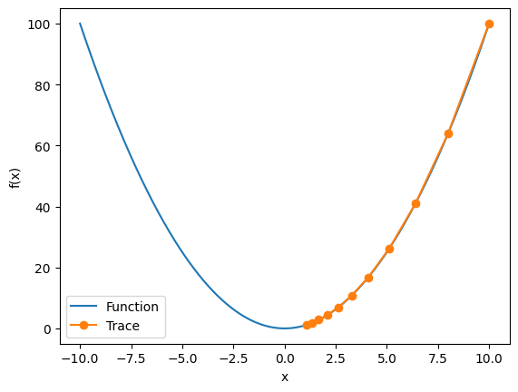
    


```python
get_test(eta=0.01, f_grad=f_grad, f=f)
```

    epoch 10, x: 8.170728


    
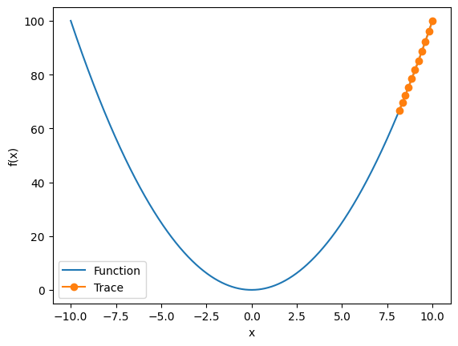
    


```python
get_test(eta=0.05, f_grad=f_grad, f=f)
```

    epoch 10, x: 3.486784


    
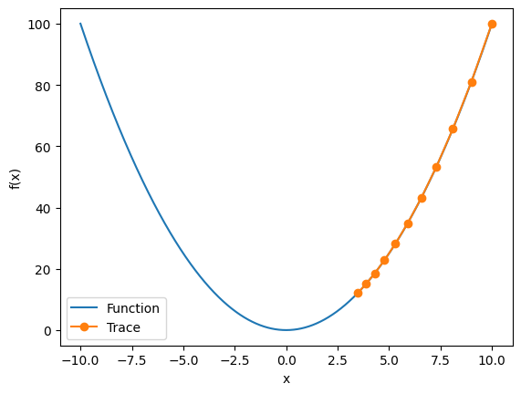
    


为了演示非凸函数的梯度下降，考虑函数$f(x) = x \cdot \cos(cx)$，其中$c$为某常数。
这个函数有无穷多个局部最小值。
根据我们选择的学习率，我们最终可能只会得到许多解的一个。
下面的例子说明了（不切实际的）高学习率如何导致较差的局部最小值。


```python
import torch
c = torch.tensor(0.15 * np.pi)

def f2(x):  # 目标函数
    return x * torch.cos(c * x)

def f_grad2(x):  # 目标函数的梯度
    return torch.cos(c * x) - c * x * torch.sin(c * x)
```


```python
get_test(eta=0.05, f_grad=f_grad2, f=f2)
```

    epoch 10, x: 8.284779


    
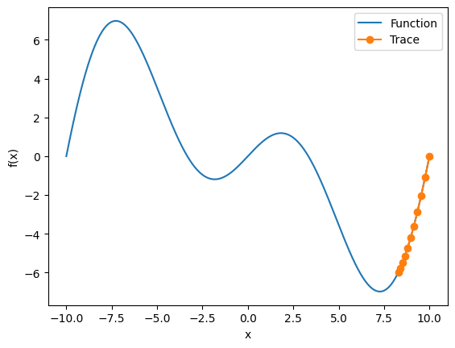
    


```python
c = torch.tensor(0.5)

def f(x):  # O目标函数
    return torch.cosh(c * x)

def f_grad(x):  # 目标函数的梯度
    return c * torch.sinh(c * x)

def f_hess(x):  # 目标函数的Hessian
    return c**2 * torch.cosh(c * x)

def newton(eta=1):
    x = 10.0
    results = [x]
    for i in range(10):
        x -= eta * f_grad(x) / f_hess(x)
        results.append(float(x))
    print('epoch 10, x:', x)
    return results

```


```python
show_trace(newton(), f)
```

    epoch 10, x: tensor(0.)


    

    


现在让我们考虑一个非凸函数，比如$f(x) = x \cos(c x)$，$c$为某些常数。
请注意在牛顿法中，我们最终将除以Hessian。
这意味着如果二阶导数是负的，$f$的值可能会趋于增加。
这是这个算法的致命缺陷！


```python
c = torch.tensor(0.15 * np.pi)

def f(x):  # 目标函数
    return x * torch.cos(c * x)

def f_grad(x):  # 目标函数的梯度
    return torch.cos(c * x) - c * x * torch.sin(c * x)

def f_hess(x):  # 目标函数的Hessian
    return - 2 * c * torch.sin(c * x) - x * c**2 * torch.cos(c * x)

```


```python
show_trace(newton(), f)
```

    epoch 10, x: tensor(26.8341)


    
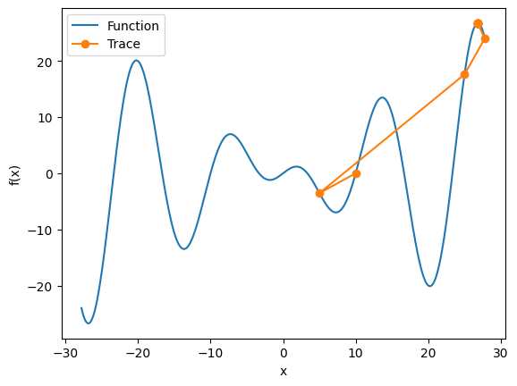
    


### 练习11.3.2
 2.在区间$[a, b]$中实现线搜索以最小化凸函数。

  1. 是否需要导数来进行二分搜索，即决定选择$[a, (a+b)/2]$还是$[(a+b)/2, b]$。
  1. 算法的收敛速度有多快？
  1. 实现该算法，并将其应用于求$\log (\exp(x) + \exp(-2x -3))$的最小值。

**解答：**

（1）在进行线搜索时，通常不需要导数来进行二分搜索。二分搜索可以通过选择区间的中点来进行迭代，即选择 [a, (a+b)/2] 或者 [(a+b)/2, b]。通过比较函数在两个点的取值，可以确定下一步的搜索方向。这种方法不需要导数信息，而是通过比较函数值来判断搜索的方向。

（2）收敛速度取决于函数的性质以及选择的搜索策略。对于凸函数，线搜索算法通常具有较好的收敛性能。但是具体的收敛速度还会受到函数的形状、初始搜索区间和采取的搜索策略等因素的影响。

（3）代码实现如下：


```python
import numpy as np
import matplotlib.pyplot as plt

def convex_function(x):
    return np.log(np.exp(x) + np.exp(-2*x-3))

def line_search(a, b, f, epsilon=1e-6):
    results = []
    while abs(b - a) > epsilon:
        x1 = a + (b - a) / 4
        x2 = b - (b - a) / 4
        if f(x1) < f(x2):
            b = x2
        else:
            a = x1
        results.append((a, b))
    return results


def plot_trace(x,y,result):
  # 可视化搜索过程

  plt.plot(x, y, label='Function')
  for i, (a, b) in enumerate(results[::3]):
      plt.plot([a, b], [convex_function(a), convex_function(b)], '-o', label=f'Step {i*3}')
  plt.xlabel('x')
  plt.ylabel('f(x)')
  plt.legend(bbox_to_anchor=(1.05, 1), loc='upper left')
  plt.show()

# 在区间 [-5, 5] 上进行线搜索
a, b = -5, 5
results = line_search(a, b, convex_function)
x = np.linspace(-5, 5, 100)
y = convex_function(x)
plot_trace(x,y,results)
```


    
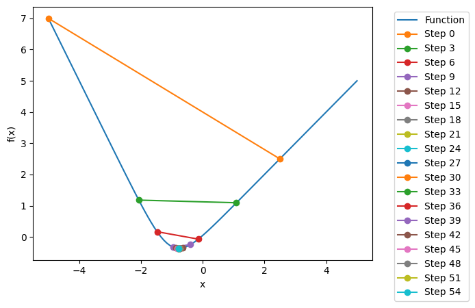
    


### 练习11.3.3
设计一个定义在$\mathbb{R}^2$上的目标函数，它的梯度下降非常缓慢。提示：不同坐标的缩放方式不同。

**解答：**


```python
import numpy as np
import matplotlib.pyplot as plt

def train_2d(trainer, steps=20, f_grad=None):
    x1, x2, s1, s2 = -5, -2, 0, 0
    results = [(x1, x2)]
    for i in range(steps):
        if f_grad:
            x1, x2, s1, s2 = trainer(x1, x2, s1, s2, f_grad)
        else:
            x1, x2, s1, s2 = trainer(x1, x2, s1, s2)
        results.append((x1, x2))
    print(f'epoch {i + 1}, x1: {float(x1):f}, x2: {float(x2):f}')
    return results

def show_trace_2d(f, results):
    x1, x2 = zip(*results)
    plt.plot(x1, x2, '-o', color='#ff7f0e')
    x1_range = np.arange(-5.5, 1.0, 0.1)
    x2_range = np.arange(-3.0, 1.0, 0.1)
    x1, x2 = np.meshgrid(x1_range, x2_range)
    plt.contour(x1, x2, f(x1, x2), colors='#1f77b4')
    plt.xlabel('x1')
    plt.ylabel('x2')
    plt.show()

def f_2d(x1, x2):
    return x1 ** 2 + 2 * x2 ** 2

def f_2d_grad(x1, x2):
    return (2 * x1, 4 * x2)

def gd_2d(x1, x2, s1, s2, f_grad):
    g1, g2 = f_grad(x1, x2)
    return (x1 - eta * g1, x2 - eta * g2, 0, 0)

eta = 0.1
results = train_2d(gd_2d, f_grad=f_2d_grad)
show_trace_2d(f_2d, results)
```

    epoch 20, x1: -0.057646, x2: -0.000073


    
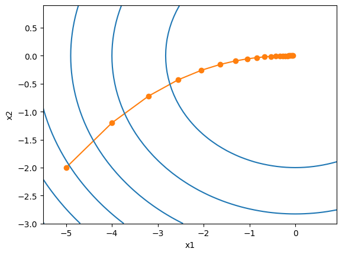
    


```python
# a 和 b为放缩因子
def slow_f_2d(x1, x2, a=0.1, b=1):
    return  a*x1 ** 2 +  b*2 * x2 ** 2

def slow_f_2d_grad(x1, x2, a=0.01, b=1):
    return (a * 2 * x1, b * 4 * x2)

eta = 0.1
results = train_2d(gd_2d, steps=100,f_grad=slow_f_2d_grad)
show_trace_2d(slow_f_2d, results)
```

    epoch 100, x1: -4.092834, x2: -0.000000


    
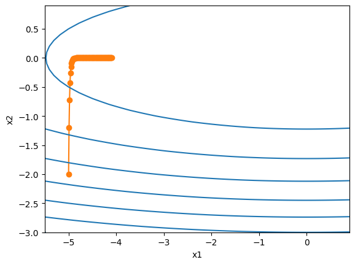
    


### 练习11.3.4
使用预处理实现牛顿方法的轻量版本。
使用对角Hessian作为预条件子。
使用它的绝对值，而不是实际值（可能有符号）。
将此应用于上述问题。
将上述算法应用于多个目标函数（凸或非凸）。如果把坐标旋转 45 度会怎么样？

**解答：**

预处理：计算和存储完整的Hessian非常昂贵，而改善这个问题的一种方法是“预处理”。
它回避了计算整个Hessian，而只计算“对角线”项，即如下的算法更新：

$$\mathbf{x} \leftarrow \mathbf{x} - \eta \mathrm{diag}(\mathbf{H})^{-1} \nabla f(\mathbf{x}).$$


```python
def newton_preconditioned(eta=1):
    x = 10.0
    results = [x]
    for i in range(10):
        preconditioner = torch.abs(f_hess(x))  # 预条件子为Hessian的绝对值
        x -= eta * f_grad(x) / preconditioner
        results.append(float(x))
    print('epoch 10, x:', x)
    return results
```


```python
import torch

c = torch.tensor(0.5)

def f(x):  # 目标函数
    return torch.cosh(c * x)

def f_grad(x):  # 目标函数的梯度
    return c * torch.sinh(c * x)

def f_hess(x):  # 目标函数的Hessian
    return c**2 * torch.cosh(c * x)

results = newton_preconditioned()
show_trace(results, f)
```

    epoch 10, x: tensor(0.)


    
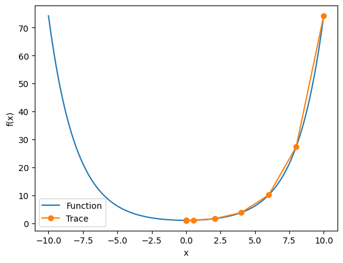
    


```python
c = torch.tensor(0.15 * np.pi)

def f(x):  # 目标函数
    return x * torch.cos(c * x)

def f_grad(x):  # 目标函数的梯度
    return torch.cos(c * x) - c * x * torch.sin(c * x)

def f_hess(x):  # 目标函数的Hessian
    return - 2 * c * torch.sin(c * x) - x * c**2 * torch.cos(c * x)

results = newton_preconditioned()
show_trace(results, f)
```

    epoch 10, x: tensor(20.2219)


    
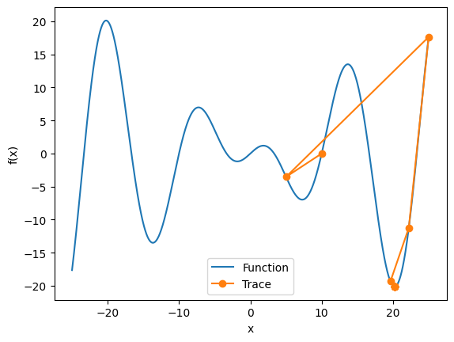
    


```python
import numpy as np
import matplotlib.pyplot as plt

def train_2d(trainer, steps=20, f_grad=None):
    x1, x2, s1, s2 = -5, -2, 0, 0
    results = [(x1, x2)]
    for i in range(steps):
        if f_grad:
            x1, x2, s1, s2 = trainer(x1, x2, s1, s2, f_grad)
        else:
            x1, x2, s1, s2 = trainer(x1, x2, s1, s2)
        results.append((x1, x2))
    print(f'epoch {i + 1}, x1: {float(x1):f}, x2: {float(x2):f}')
    return results

def show_trace_2d(f, results):
    x1, x2 = zip(*results)
    plt.plot(x1, x2, '-o', color='#ff7f0e')
    x1_range = np.arange(-5.5, 1.0, 0.1)
    x2_range = np.arange(-3.0, 1.0, 0.1)
    x1, x2 = np.meshgrid(x1_range, x2_range)
    plt.contour(x1, x2, f(x1, x2), colors='#1f77b4')
    plt.xlabel('x1')
    plt.ylabel('x2')
    plt.show()

def f_2d(x1, x2):
    return 3 * x1 ** 2 + 2 * x2 ** 2

def f_2d_grad(x1, x2):
    return (6 * x1, 4 * x2)

def gd_2d(x1, x2, s1, s2, f_grad):
    g1, g2 = f_grad(x1, x2)
    return (x1 - eta * g1, x2 - eta * g2, 0, 0)

eta = 0.1
results = train_2d(gd_2d, f_grad=f_2d_grad)
show_trace_2d(f_2d, results)
```

    epoch 20, x1: -0.000000, x2: -0.000073


    
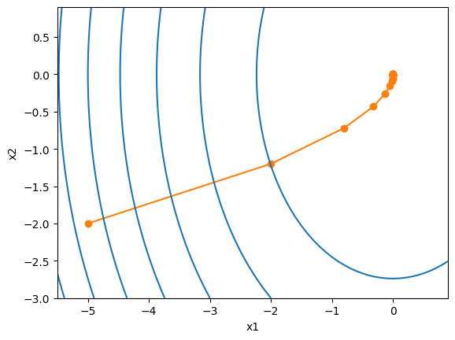
    


```python
import math

def rotation(x1, x2):
    xa = (x1 + x2) / math.sqrt(2)
    xb = (x2 - x1) / math.sqrt(2)
    return xa, xb

def newton_2d(x1, x2, s1, s2, f_grad, f_hessian):
    g1, g2 = f_grad(x1, x2)
    h11, h12, h21, h22 = f_hessian(x1, x2)

    # 计算预处理的牛顿法步长
    det_hessian = h11 * h22 - h12 * h21
    inv_hessian = (h22 / det_hessian, -h12 / det_hessian, -h21 / det_hessian, h11 / det_hessian)

    # 计算更新后的位置
    delta_x1 = inv_hessian[0] * g1 + inv_hessian[1] * g2
    delta_x2 = inv_hessian[2] * g1 + inv_hessian[3] * g2

    return (x1 - delta_x1, x2 - delta_x2, 0, 0)

def f_hessian(x1, x2):
    h11 = 6
    h12 = 0
    h21 = 0
    h22 = 4
    return h11, h12, h21, h22

def train_2d_hessian(trainer, steps=20, f_grad=None, f_hessian=f_hessian, is_rotation=True):
    x1, x2, s1, s2 = -5, -2, 0, 0
    if is_rotation:
      x1, x2 = rotation(x1, x2)
    results = [(x1, x2)]
    for i in range(steps):
        if f_grad:
            x1, x2, s1, s2 = trainer(x1, x2, s1, s2, f_grad, f_hessian)
        else:
            x1, x2, s1, s2 = trainer(x1, x2, s1, s2, f_hessian)
        results.append((x1, x2))
    print(f'epoch {i + 1}, x1: {float(x1):f}, x2: {float(x2):f}')
    return results


results = train_2d_hessian(newton_2d, f_grad=f_2d_grad,is_rotation=False)
show_trace_2d(f_2d, results)
```

    epoch 20, x1: 0.000000, x2: 0.000000


    
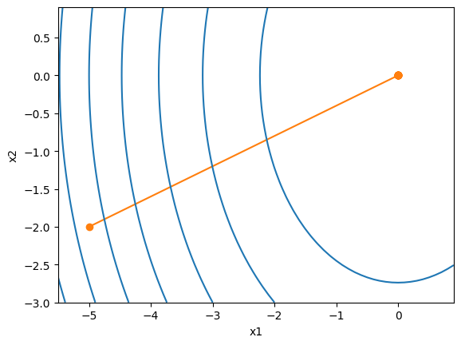
    


```python
eta = 0.1
results = train_2d_hessian(newton_2d, f_grad=f_2d_grad,is_rotation=True)
show_trace_2d(f_2d, results)
```

    epoch 20, x1: 0.000000, x2: 0.000000


    
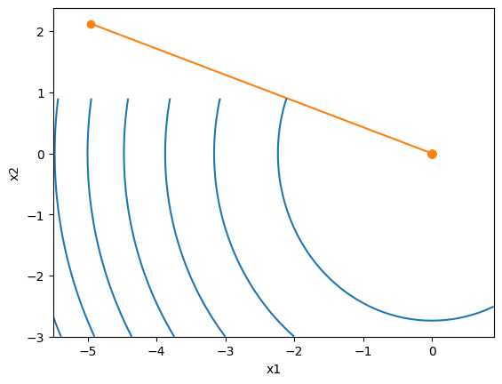
    


## 11.4 随机梯度下降

### 练习11.4.1
1.尝试不同的随机梯度下降学习率计划和不同的迭代次数进行实验。特别是，根据迭代次数的函数来绘制与最优解(0,0)的距离。

**解答：**


```python
def f(x1, x2):  # 目标函数
    return x1 ** 2 + 2 * x2 ** 2

def f_grad(x1, x2):  # 目标函数的梯度
    return 2 * x1, 4 * x2

def sgd(x1, x2, s1, s2, f_grad):
    g1, g2 = f_grad(x1, x2)
    # 模拟有噪声的梯度
    g1 += torch.normal(0.0, 1, (1,)).item()
    g2 += torch.normal(0.0, 1, (1,)).item()
    eta_t = eta * lr()
    return (x1 - eta_t * g1, x2 - eta_t * g2, 0, 0)

def constant_lr():
    return 1

eta = 0.1
lr = constant_lr  # 常数学习速度
show_trace_2d(f, train_2d(sgd, steps=50, f_grad=f_grad))
```

    epoch 50, x1: -0.060110, x2: -0.022708


    
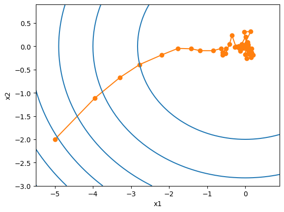
    


```python
def exponential_lr():
    # 在函数外部定义，而在内部更新的全局变量
    global t
    t += 1
    return math.exp(-0.1 * t)

t = 1
lr = exponential_lr
show_trace_2d(f, train_2d(sgd, steps=1000, f_grad=f_grad))
```

    epoch 1000, x1: -0.720066, x2: -0.101066


    
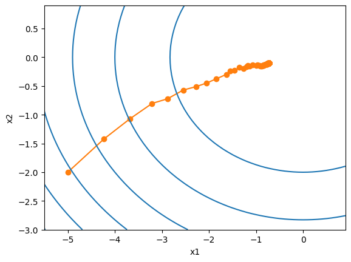
    


```python
def polynomial_lr():
    # 在函数外部定义，而在内部更新的全局变量
    global t
    t += 1
    return (1 + 0.1 * t) ** (-0.5)

t = 1
lr = polynomial_lr
show_trace_2d(f, train_2d(sgd, steps=50, f_grad=f_grad))
```

    epoch 50, x1: -0.049334, x2: 0.046992


    
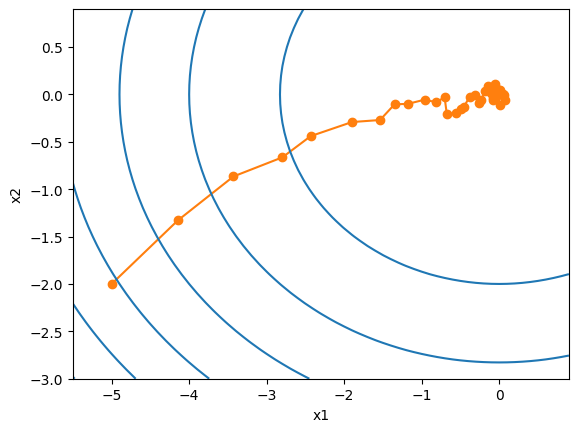
    


### 练习11.4.2
证明对于函数$f(x_1, x_2) = x_1^2 + 2 x_2^2$而言，向梯度添加正态噪声等同于最小化损失函数$f(\mathbf{x}, \mathbf{w}) = (x_1 - w_1)^2 + 2 (x_2 - w_2)^2$，其中$\mathbf{x}$是从正态分布中提取的

**解答：**

证明过程如下：

1. 首先，计算函数$f(x_1, x_2)$的梯度。根据链式法则，我们有：

   $$\frac{\partial f}{\partial x_1} = 2x_1$$
   $$\frac{\partial f}{\partial x_2} = 4x_2$$

2. 然后，计算损失函数$f(\mathbf{x}, \mathbf{w})$的梯度。根据链式法则，我们有：

   $$\frac{\partial f}{\partial w_1} = 2(x_1 - w_1)$$
   $$\frac{\partial f}{\partial w_2} = 4(x_2 - w_2)$$

3. 接下来，我们将向梯度添加正态噪声。设正态噪声为$\mathbf{n} = (n_1, n_2)$，其中$n_1$和$n_2$是从正态分布中提取的随机数。我们可以将梯度添加噪声的操作表示为：

   $$\mathbf{g} = \left(\frac{\partial f}{\partial x_1} + n_1, \frac{\partial f}{\partial x_2} + n_2\right)$$

4. 最后，我们需要证明向梯度添加正态噪声等同于最小化损失函数。我们将证明两种方法的期望值相等。

   首先计算向梯度添加噪声的期望值：

   $$\mathbb{E}[\mathbf{g}] = \left(\mathbb{E}\left[\frac{\partial f}{\partial x_1}\right] + \mathbb{E}[n_1], \mathbb{E}\left[\frac{\partial f}{\partial x_2}\right] + \mathbb{E}[n_2]\right)$$

   由于正态分布的期望值为0，我们有$\mathbb{E}[n_1] = \mathbb{E}[n_2] = 0$。因此，上式可以简化为：

   $$\mathbb{E}[\mathbf{g}] = \left(\mathbb{E}\left[\frac{\partial f}{\partial x_1}\right], \mathbb{E}\left[\frac{\partial f}{\partial x_2}\right]\right)$$

   接下来计算损失函数的梯度的期望值：

   $$\mathbb{E}\left[\frac{\partial f}{\partial w_1}\right] = \mathbb{E}\left[2(x_1 - w_1)\right] = 2\mathbb{E}[x_1] - 2w_1$$
   $$\mathbb{E}\left[\frac{\partial f}{\partial w_2}\right] = \mathbb{E}\left[4(x_2 - w_2)\right] = 4\mathbb{E}[x_2] - 4w_2$$

   最后，我们需要证明$\mathbb{E}[\mathbf{g}] = \left(\mathbb{E}\left[\frac{\partial f}{\partial x_1}\right], \mathbb{E}\left[\frac{\partial f}{\partial x_2}\right]\right) = \left(2\mathbb{E}[x_1] - 2w_1, 4\mathbb{E}[x_2] - 4w_2\right)$。

   由于$x_1$和$x_2$是从正态分布中提取的随机数，其期望值等于其均值。因此，我们有$\mathbb{E}[x_1] = \mathbb{E}[x_2] = 0$。代入上式，我们得到：

   $$\mathbb{E}[\mathbf{g}] = \left(2\mathbb{E}[x_1] - 2w_1, 4\mathbb{E}[x_2] - 4w_2\right) = (0 - 2w_1, 0 - 4w_2) = (-2w_1, -4w_2)$$

   这与损失函数的梯度$\left(\frac{\partial f}{\partial w_1}, \frac{\partial f}{\partial w_2}\right) = (2(x_1 - w_1), 4(x_2 - w_2))$相等。

   因此，我们证明了向梯度添加正态噪声等同于最小化损失函数。

### 练习11.4.3
3. 从$\{(x_1, y_1), \ldots, (x_n, y_n)\}$分别使用替换方法以及不替换方法进行采样时，比较随机梯度下降的收敛性。

**解答：**

在随机梯度下降算法中，替换方法和不替换方法是两种不同的采样方式，对于每一次迭代，都会从样本集中随机选择一个样本进行梯度计算和参数更新。

- 在替换方法中，每次选择的样本都是独立随机选择的，即每次选择的样本都可能是之前已经选择过的样本。这种方法的优点是可以更快地收敛，因为每次迭代都会使用更多的样本信息进行参数更新。然而，由于每次选择的样本都是独立的，可能会导致某些样本被选择多次，而其他样本则很少被选择到，从而导致样本的分布不均匀，可能会影响算法的收敛性和泛化性能。

- 在不替换方法中，每次选择的样本都是不重复的，即每次选择的样本都不会是之前已经选择过的样本。这种方法的优点是可以保证每个样本都被使用到，从而可以更好地保证样本的分布均匀性。然而，由于每次迭代都只使用一个样本进行参数更新，可能会导致参数更新的方向不够准确，从而影响算法的收敛速度。

因此，替换方法和不替换方法在随机梯度下降算法的收敛性上存在一定的差异。替换方法收敛速度较快，但可能会导致样本分布不均匀；不替换方法可以保证样本分布均匀，但收敛速度较慢。在实际应用中，可以根据具体的问题和需求选择合适的采样方法。

### 练习11.4.4
4.如果某些梯度（或者更确切地说与之相关的某些坐标）始终比所有其他梯度都大，将如何更改随机梯度下降求解器？

**解答：**

如果某些梯度（或者与之相关的某些坐标）始终比所有其他梯度都大，这可能意味着这些参数的更新过程非常不稳定，可能导致训练过程无法收敛或者收敛非常缓慢。在这种情况下，以下步骤来改进随机梯度下降（SGD）求解器：

1. 梯度截断：首先，可以尝试使用梯度截断技术来限制梯度的大小。通过设置一个阈值，当梯度超过该阈值时，将其缩小到阈值范围内。这样可以避免梯度爆炸的问题。

2. 学习率调整：如果某些梯度始终比其他梯度大，可能意味着学习率过大。尝试减小学习率，可以通过手动设置较小的学习率或者使用自适应学习率算法（如Adam、Adagrad等）来自动调整学习率。

3. 批量规范化：考虑使用批量规范化（Batch Normalization）技术来调整梯度。批量规范化可以通过对每个批次的输入进行归一化来减少梯度的变化范围，从而提高训练的稳定性。

4. 参数初始化：检查参数的初始化方式。如果某些参数初始值较大，可能导致初始梯度也很大，进而影响训练过程。尝试使用较小的初始值或者使用一些特定的参数初始化方法（如Xavier初始化）来减小梯度的大小。

5. 梯度下降变体：考虑使用其他的梯度下降变体。例如，可以尝试使用带动量的随机梯度下降（SGD with Momentum）或者自适应学习率的优化算法（如Adam、Adagrad等），这些算法可以更好地处理不稳定的梯度。

6. 调整网络架构：如果上述方法仍然无法解决问题，可以考虑调整网络架构。可能需要重新设计网络结构，调整层数、神经元数目或者激活函数等，以便更好地处理梯度的不稳定性。


### 练习11.4.5
5.假设$f(x) = x^2 (1 + \sin x)$。$f$有多少局部最小值？请试着改变$f$以尽量减少它需要评估所有局部最小值的方式。

**解答：**

要确定函数$f(x) = x^2 (1 + \sin x)$的局部最小值的数量，我们需要找到函数的导数，并找到导数为零的点。在这些点上，函数可能具有局部最小值。

首先，我们计算函数$f(x)$的导数：
$$
f'(x) = 2x(1 + \sin x) + x^2 \cos x
$$

要找到导数为零的点，我们解方程$f'(x) = 0$：
$$
2x(1 + \sin x) + x^2 \cos x = 0
$$

这是一个非线性方程，很难通过解析方法找到其解。因此，我们可以通过数值方法来近似解。

为了尽量减少需要评估所有局部最小值的方式，我们可以使用以下策略：
1. 观察函数图像：首先，我们可以绘制函数$f(x)$的图像，观察函数的形状和曲线。这可以帮助我们获得关于函数局部最小值的直观理解，并指导我们在哪些区域进行进一步的分析。
2. 初始点选择：根据观察到的函数图像，我们可以选择一些可能的初始点，这些点可能是导数为零的点。这样可以帮助我们避免评估所有可能的局部最小值。
3. 迭代优化算法：使用迭代优化算法（如梯度下降、牛顿法、拟牛顿法等）来搜索函数的最小值。通过选择适当的初始点和合适的优化算法，我们可以在较少的迭代次数内找到局部最小值。

请注意，由于函数$f(x)$的非线性性质，可能存在多个局部最小值。因此，找到所有局部最小值可能需要一定的计算成本。通过上述策略，我们可以尽量减少评估所有局部最小值的方式，并更有效地搜索函数的最小值。


```python
import numpy as np

def f(x):
    return x**2 * (1 + np.sin(x))

def f_prime(x):
    return 2*x*(1 + np.sin(x)) + x**2 * np.cos(x)


def sgd(eta=0.1, f_grad=None):
    x = torch.tensor(10.0)
    results = [x]
    for i in range(10):
        g = f_grad(x)
        g += torch.normal(0.0, 1, (1,)).item()
        eta = eta * lr()
        x -= eta * g
        results.append(float(x))
    print(f'epoch 10, x: {x:f}')
    return results

def constant_lr():
    return 0.8

eta = 0.1
lr = constant_lr  # 常数学习速度
# lr = exponential_lr
show_trace(sgd(eta, f_grad),f)
```

    <ipython-input-129-4e17c7a29cae>:7: UserWarning: To copy construct from a tensor, it is recommended to use sourceTensor.clone().detach() or sourceTensor.clone().detach().requires_grad_(True), rather than torch.tensor(sourceTensor).
      x = torch.tensor(x, requires_grad=True)  # 将x转换为torch张量，并设置requires_grad=True以计算导数


    epoch 10, x: 10.993654


    
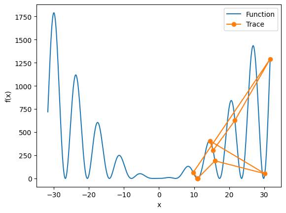
    


## 11.5 小批量随机梯度下降

### 练习11.5.1
1.修改批量大小和学习率，并观察目标函数值的下降率以及每个迭代轮数消耗的时间

**解答：**


```python
%matplotlib inline
import numpy as np
import torch
from torch import nn
from d2l import torch as d2l
```


```python
d2l.DATA_HUB['airfoil'] = (d2l.DATA_URL + 'airfoil_self_noise.dat','76e5be1548fd8222e5074cf0faae75edff8cf93f')


def get_data_ch11(batch_size=10, n=1500):
    data = np.genfromtxt(d2l.download('airfoil'),dtype=np.float32, delimiter='\t')
    data = torch.from_numpy((data - data.mean(axis=0)) / data.std(axis=0))
    # print(data.shape)
    data_iter = d2l.load_array((data[:n, :-1], data[:n, -1]),
                               batch_size, is_train=True)
    return data_iter, data.shape[1]-1
```


```python
def sgd(params, states, hyperparams):
    for p in params:
        p.data.sub_(hyperparams['lr'] * p.grad)
        p.grad.data.zero_()
```


```python
def train_ch11(trainer_fn, states, hyperparams, data_iter,
               feature_dim, num_epochs=2):
    # 初始化模型
    w = torch.normal(mean=0.0, std=0.01, size=(feature_dim, 1),
                     requires_grad=True)
    b = torch.zeros((1), requires_grad=True)
    net, loss = lambda X: d2l.linreg(X, w, b), d2l.squared_loss
    # 训练模型
    animator = d2l.Animator(xlabel='epoch', ylabel='loss',
                            xlim=[0, num_epochs], ylim=[0.22, 0.35])
    n, timer = 0, d2l.Timer()
    for _ in range(num_epochs):
        for X, y in data_iter:
            l = loss(net(X), y).mean()
            l.backward()
            trainer_fn([w, b], states, hyperparams)
            n += X.shape[0]
            if n % 200 == 0:
                timer.stop()
                animator.add(n/X.shape[0]/len(data_iter),
                             (d2l.evaluate_loss(net, data_iter, loss),))
                timer.start()
    print(f'loss: {animator.Y[0][-1]:.3f}, {timer.avg():.3f} sec/epoch')
    return timer.cumsum(), animator.Y[0]
```


```python
def train_sgd(lr, batch_size, num_epochs=2):
    data_iter, feature_dim = get_data_ch11(batch_size)
    return train_ch11(
        sgd, None, {'lr': lr}, data_iter, feature_dim, num_epochs)

```


```python
gd_res = train_sgd(lr=1, batch_size=1500, num_epochs=10)
```

    loss: 0.258, 0.109 sec/epoch


    
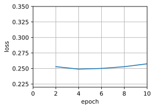
    


```python
sgd_res = train_sgd(lr=0.005, batch_size=1, num_epochs=10)
```

    loss: 0.243, 0.121 sec/epoch


    
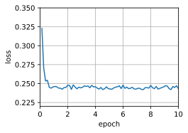
    


```python
mini1_res = train_sgd(lr=0.05, batch_size=10 ,num_epochs=10)
```

    loss: 0.249, 0.022 sec/epoch


    
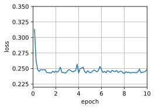
    


```python
mini2_res = train_sgd(lr=0.05, batch_size=50 ,num_epochs=10)
```

    loss: 0.242, 0.012 sec/epoch


    
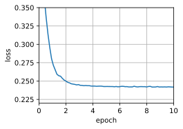
    


```python
# 对比4种优化方式
d2l.set_figsize([6, 3])
d2l.plot(*list(map(list, zip(gd_res, sgd_res, mini1_res, mini2_res))),
         'time (sec)', 'loss', xlim=[1e-2, 10],
         legend=['gd', 'sgd', 'batch size=100', 'batch size=10'])
d2l.plt.gca().set_xscale('log')
```


    
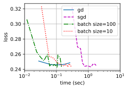
    


### 练习11.5.2
2.将小批量随机梯度下降与实际从训练集中取样替换的变体进行比较。会看出什么？

**解答：**

小批量随机梯度下降（mini-batch stochastic gradient descent）是梯度下降的一种变体，它在每次迭代中随机选择一小批训练样本来计算梯度并更新模型参数。

实际从训练集中取样替换的变体（actual sampling with replacement variant）是指每次迭代中从训练集中随机选择一个样本计算梯度并更新模型参数。

比较两者可以得出以下观察：

1. 计算效率：小批量随机梯度下降通常比实际取样替换的变体更高效。因为小批量随机梯度下降每次迭代计算一小批样本的梯度，可以充分利用矩阵运算的并行性，加快计算速度。而实际取样替换的变体需要每次迭代计算一个样本的梯度，计算效率较低。

2. 收敛速度：小批量随机梯度下降通常比实际取样替换的变体更快收敛。因为小批量随机梯度下降每次迭代使用多个样本的梯度更新模型参数，可以更准确地指导模型向最优解收敛。而实际取样替换的变体每次迭代只使用一个样本的梯度，可能会受到单个样本噪声的干扰，导致收敛速度较慢。

3. 模型稳定性：小批量随机梯度下降通常比实际取样替换的变体更稳定。因为小批量随机梯度下降使用多个样本的梯度进行更新，可以减少单个样本的噪声对模型参数的影响，提高模型的稳定性。而实际取样替换的变体每次迭代只使用一个样本的梯度，容易受到噪声的干扰，导致模型参数波动较大。

综上所述，小批量随机梯度下降相对于实际取样替换的变体在计算效率、收敛速度和模型稳定性上都有优势。因此，在实际应用中，小批量随机梯度下降更常用和推荐。

### 练习11.5.3
一个邪恶的精灵在没通知你的情况下复制了你的数据集（即每个观测发生两次，数据集增加到原始大小的两倍，但没有人告诉你）。随机梯度下降、小批量随机梯度下降和梯度下降的表现将如何变化？

**解答：**


```python
def get_data_ch11_duplicate(batch_size=10, n=1500):
    data = np.genfromtxt(d2l.download('airfoil'),dtype=np.float32, delimiter='\t')
    data = torch.from_numpy((data - data.mean(axis=0)) / data.std(axis=0))
    # data = torch.cat((data, data), dim=0) # duplicate the data
    data_iter = d2l.load_array((data[:n, :-1], data[:n, -1]),batch_size, is_train=True)
    return data_iter, data.shape[1]-1

def train_sgd_duplicate(lr, batch_size, num_epochs=2):
    data_iter, feature_dim = get_data_ch11_duplicate(batch_size)
    return train_ch11(
        sgd, None, {'lr': lr}, data_iter, feature_dim, num_epochs)
```


```python
mini_sgd = train_sgd_duplicate(lr=0.05, batch_size=50 ,num_epochs=10)
```

    loss: 0.242, 0.012 sec/epoch


    
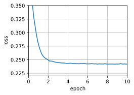
    


```python
sgd1 = train_sgd_duplicate(lr=0.05, batch_size=1 ,num_epochs=10)
```

    loss: 0.317, 0.150 sec/epoch


    
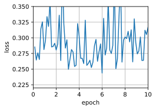
    


```python
sgd = train_sgd_duplicate(lr=0.005, batch_size=1 ,num_epochs=10)
```

    loss: 0.244, 0.113 sec/epoch


    
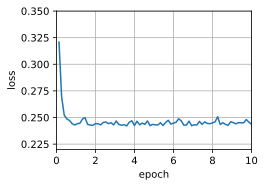
    


```python
gd = train_sgd_duplicate(lr=1, batch_size=1500, num_epochs=10)
```

    loss: 0.247, 0.047 sec/epoch


    
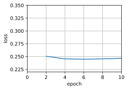
    


## 11.6 动量法

### 练习11.6.1
使用动量超参数和学习率的其他组合，观察和分析不同的实验结果。


**解答：**


```python
def init_momentum_states(feature_dim):
    v_w = torch.zeros((feature_dim, 1))
    v_b = torch.zeros(1)
    return (v_w, v_b)

def sgd_momentum(params, states, hyperparams):
    for p, v in zip(params, states):
        with torch.no_grad():
            v[:] = hyperparams['momentum'] * v + p.grad
            p[:] -= hyperparams['lr'] * v
        p.grad.data.zero_()

def train_momentum(lr, momentum, num_epochs=2):
    d2l.train_ch11(sgd_momentum, init_momentum_states(feature_dim),
                   {'lr': lr, 'momentum': momentum}, data_iter,
                   feature_dim, num_epochs)

data_iter, feature_dim = d2l.get_data_ch11(batch_size=10)
```


```python
train_momentum(lr=0.02, momentum=0.5)
```

    loss: 0.243, 0.196 sec/epoch


    

    


```python
train_momentum(lr=0.01, momentum=0.9)
```

    loss: 0.247, 0.165 sec/epoch


    
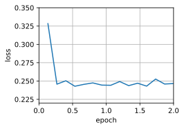
    


### 练习11.6.2
试试梯度下降和动量法来解决一个二次问题，其中有多个特征值，即$f(x) = \frac{1}{2} \sum_i \lambda_i x_i^2$，例如$\lambda_i = 2^{-i}$。绘制出$x$的值在初始化$x_i = 1$时如何下降。

**解答：**


```python
import torch
import matplotlib.pyplot as plt

def quadratic_function(x):
    feature_dim = x.shape[0]
    lambdas = torch.tensor([2**(-i) for i in range(1, feature_dim+1)])
    return 0.5 * torch.sum(lambdas * x**2)

def compute_gradient(x):
    feature_dim = x.shape[0]
    lambdas = torch.tensor([2**(-i) for i in range(1, feature_dim+1)])
    return lambdas * x

def sgd(params, states, hyperparams):
    lr = hyperparams['lr']
    with torch.no_grad():
        params -= lr * compute_gradient(params)

def init_momentum_states(feature_dim):
    v = torch.zeros(feature_dim)
    return v

def sgd_momentum(params, states, hyperparams):
    lr = hyperparams['lr']
    momentum = hyperparams['momentum']
    with torch.no_grad():
        states[:] = momentum * states + compute_gradient(params)
        params -= lr * states

def train(optimizer, lr, momentum, num_epochs=10, mom=True):
    feature_dim = 10  # 设置特征维度为10，可以根据实际情况进行调整
    params = torch.ones(feature_dim, requires_grad=True)
    if mom:
        states = init_momentum_states(feature_dim)
    else:
        states = torch.zeros_like(params)

    x_values = []

    for epoch in range(num_epochs):
        loss = quadratic_function(params)
        loss.backward()
        optimizer(params, states, {'lr': lr, 'momentum': momentum})
        params.grad.data.zero_()

        x_values.append(params.clone().detach().numpy())

    return x_values

# 使用SGD进行训练
lr = 0.1
momentum = 0.9
x_values_sgd = train(sgd, lr, momentum)

# 使用带动量的SGD进行训练
x_values_momentum = train(sgd_momentum, lr, momentum)


```


```python
import seaborn as sns
sns.set(style="whitegrid")
# 绘制x值的下降情况
plt.figure(figsize=(10, 6))
plt.plot(x_values_sgd, label='SGD', color='blue')
plt.plot(x_values_momentum, label='SGD with Momentum', color='red')
plt.xlabel('Epoch')
plt.ylabel('x value')
plt.title('Descent of x values')
plt.legend()
plt.show()
```


    
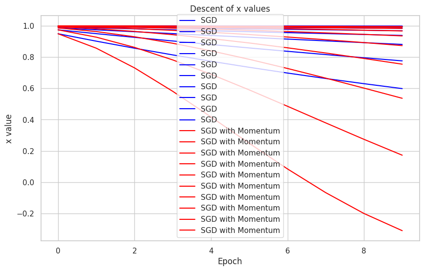
    


### 练习11.6.3
推导$h(\mathbf{x}) = \frac{1}{2} \mathbf{x}^\top \mathbf{Q} \mathbf{x} + \mathbf{x}^\top \mathbf{c} + b$的最小值和最小化器。

**解答：**

$$h(\mathbf{x}) = \frac{1}{2} \mathbf{x}^\top \mathbf{Q} \mathbf{x} + \mathbf{x}^\top \mathbf{c} + b.$$

这是一个普通的二次函数。
对于正定矩阵$\mathbf{Q} \succ 0$，即对于具有正特征值的矩阵，有

最小化器为$\mathbf{x}^* = -\mathbf{Q}^{-1} \mathbf{c}$，最小值为$b - \frac{1}{2} \mathbf{c}^\top \mathbf{Q}^{-1} \mathbf{c}$。

证明如下：
给定函数：

$$h(\mathbf{x}) = \frac{1}{2} \mathbf{x}^\top \mathbf{Q} \mathbf{x} + \mathbf{x}^\top \mathbf{c} + b$$

其中，$\mathbf{x} \in \mathbb{R}^n$, $\mathbf{Q}$ 是一个 $n \times n$ 的正定矩阵，$\mathbf{c} \in \mathbb{R}^n$, $b$ 是一个实数。

求解步骤：

**Step 1: 求梯度**

首先计算 $h(\mathbf{x})$ 对 $\mathbf{x}$ 的梯度：

$$
\nabla h(\mathbf{x}) = \nabla \left( \frac{1}{2} \mathbf{x}^\top \mathbf{Q} \mathbf{x} + \mathbf{x}^\top \mathbf{c} + b \right)
= \frac{1}{2} (\mathbf{Q} + \mathbf{Q}^\top) \mathbf{x} + \mathbf{c}.
$$

由于 $\mathbf{Q}$ 是对称矩阵，所以 $\mathbf{Q} + \mathbf{Q}^\top = 2\mathbf{Q}$。

因此，梯度可以简化为：

$$
\nabla h(\mathbf{x}) = \mathbf{Qx} + \mathbf{c}.
$$

**Step 2: 解析解**

要找到使梯度为零的 $\mathbf{x}$，我们解以下方程：

$$
\mathbf{Qx} + \mathbf{c} = 0.
$$

解得最小化器为：

$$
\mathbf{x}^* = -\mathbf{Q}^{-1} \mathbf{c}.
$$

这给出了使 $h(\mathbf{x})$ 取得最小值的临界点。

**Step 3: 计算最小值**

将临界点 $\mathbf{x}^* = -\mathbf{Q}^{-1} \mathbf{c}$ 代入 $h(\mathbf{x})$：

$$
h(\mathbf{x}^*) = \frac{1}{2} \left( -\mathbf{Q}^{-1} \mathbf{c} \right)^\top \mathbf{Q} \left( -\mathbf{Q}^{-1} \mathbf{c} \right) + \left( -\mathbf{Q}^{-1} \mathbf{c} \right)^\top \mathbf{c} + b.
$$

经过推导和化简，我们得到最小值为：

$$
h(\mathbf{x}^*) = b - \frac{1}{2} \mathbf{c}^\top \mathbf{Q}^{-1} \mathbf{c}.
$$

以上是对给定函数中最小化器和最小值的证明。

### 练习11.6.4
当我们执行带动量法的随机梯度下降时会有什么变化？当我们使用带动量法的小批量随机梯度下降时会发生什么？试验参数如何？

**解答：**


```python
def train_sgd(lr, batch_size, num_epochs=2):
    data_iter, feature_dim = get_data_ch11(batch_size)
    return train_ch11(
        sgd, None, {'lr': lr}, data_iter, feature_dim, num_epochs)

def train_momentum(lr, momentum, num_epochs=2):
    d2l.train_ch11(sgd_momentum, init_momentum_states(feature_dim),
                   {'lr': lr, 'momentum': momentum}, data_iter,
                   feature_dim, num_epochs)

def train_momentum_mini_sgd(lr, batch_size, momentum, num_epochs=2):
    data_iter, feature_dim = get_data_ch11(batch_size)
    return train_ch11(sgd_momentum, init_momentum_states(feature_dim),
                   {'lr': lr, 'momentum': momentum}, data_iter,
                   feature_dim, num_epochs)

```


```python
train_momentum_mini_sgd(lr=0.05, batch_size=50, momentum=0.9 ,num_epochs=10)
```

    loss: 0.256, 0.010 sec/epoch


    ([0.009358644485473633,
      0.018602371215820312,
      0.033394813537597656,
      0.046602725982666016,
      0.05589103698730469,
      0.06343984603881836,
      0.07286882400512695,
      0.0819542407989502,
      0.0899808406829834,
      0.1012260913848877,
      0.10823273658752441,
      0.11756467819213867,
      0.12543272972106934,
      0.13646173477172852,
      0.14547348022460938,
      0.16164088249206543,
      0.16751933097839355,
      0.17676424980163574,
      0.1831367015838623,
      0.19231414794921875,
      0.19889307022094727,
      0.20941829681396484,
      0.22132658958435059,
      0.23333287239074707,
      0.24092578887939453,
      0.255115270614624,
      0.2617835998535156,
      0.26881861686706543,
      0.28046107292175293,
      0.2882564067840576,
      0.29537439346313477,
      0.312119722366333,
      0.32276248931884766,
      0.33200669288635254,
      0.3423175811767578,
      0.3501245975494385,
      0.35841798782348633,
      0.37256574630737305,
      0.3837928771972656,
      0.39443349838256836,
      0.4036686420440674,
      0.4134087562561035,
      0.42447924613952637,
      0.4357783794403076,
      0.44672155380249023,
      0.46033191680908203,
      0.4698967933654785,
      0.4780442714691162,
      0.4852755069732666,
      0.4953904151916504,
      0.5065402984619141,
      0.5198330879211426,
      0.5311398506164551,
      0.5434770584106445,
      0.5589005947113037,
      0.5658104419708252,
      0.5733516216278076,
      0.5833685398101807,
      0.5928308963775635,
      0.6005630493164062,
      0.6070787906646729,
      0.6146812438964844,
      0.6297750473022461,
      0.6401479244232178,
      0.647824764251709,
      0.6550576686859131,
      0.662858247756958,
      0.6741726398468018,
      0.6813902854919434,
      0.6884579658508301,
      0.6955902576446533,
      0.7028961181640625,
      0.7094995975494385,
      0.7167482376098633,
      0.7242491245269775],
     [0.3974764544169108,
      0.2725127175649007,
      0.2528282658259074,
      0.2785123583475749,
      0.27809609826405846,
      0.2535492318471273,
      0.24598347314198812,
      0.24931845156351726,
      0.26698224767049156,
      0.25247500546773277,
      0.2546057071685791,
      0.24426489384969075,
      0.24444231796264648,
      0.24503566646575928,
      0.2445207373301188,
      0.25663725852966307,
      0.25084531688690187,
      0.24612022908528647,
      0.26928609625498456,
      0.25394261614481606,
      0.2530341294606527,
      0.26565273984273274,
      0.2493351879119873,
      0.2496158889134725,
      0.2568613115946452,
      0.25462852414449055,
      0.24943667538960776,
      0.25554658444722494,
      0.257337074915568,
      0.25179729493459063,
      0.24987802982330323,
      0.2575841337839762,
      0.24449276542663576,
      0.2586565481821696,
      0.25465552202860514,
      0.24685403060913086,
      0.2508957430521647,
      0.2500980275472005,
      0.2459493989944458,
      0.24759188842773439,
      0.2516881062189738,
      0.24578703180948894,
      0.2524076124827067,
      0.2485795955657959,
      0.2514031136830648,
      0.24766394233703612,
      0.26300604693094887,
      0.24668835322062174,
      0.2517896172205607,
      0.25997326310475666,
      0.2616598523457845,
      0.2500342502593994,
      0.24844182936350503,
      0.24852244249979655,
      0.2565685421625773,
      0.24900156593322753,
      0.25331158002217613,
      0.2582071320215861,
      0.2454735590616862,
      0.2615393489201864,
      0.2531545317967733,
      0.24621759796142578,
      0.24984279123942058,
      0.25137666257222496,
      0.24336035919189453,
      0.246310879389445,
      0.24855825265248616,
      0.24608558495839436,
      0.25479423332214357,
      0.24780901940663655,
      0.246378111521403,
      0.25880028247833253,
      0.24822867806752522,
      0.24953290049235027,
      0.25573611036936444])


    
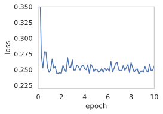
    


```python
train_momentum_mini_sgd(lr=0.001, batch_size=1, momentum=0.9 ,num_epochs=10)
```

    loss: 0.247, 0.121 sec/epoch


    ([0.1437983512878418,
      0.23876953125,
      0.3465588092803955,
      0.4689216613769531,
      0.5945520401000977,
      0.6977694034576416,
      0.7939465045928955,
      0.8971412181854248,
      1.0060510635375977,
      1.1108214855194092,
      1.2186241149902344,
      1.3186967372894287,
      1.4275116920471191,
      1.541830062866211,
      1.6460797786712646,
      1.7679290771484375,
      1.9159116744995117,
      2.107617139816284,
      2.2708587646484375,
      2.3700742721557617,
      2.4778153896331787,
      2.600879430770874,
      2.716142177581787,
      2.8188159465789795,
      2.9307990074157715,
      3.0386407375335693,
      3.139930009841919,
      3.244142770767212,
      3.349316358566284,
      3.4544832706451416,
      3.55359148979187,
      3.6574454307556152,
      3.756129026412964,
      3.8823087215423584,
      4.006078243255615,
      4.142263412475586,
      4.329652786254883,
      4.504828453063965,
      4.681985855102539,
      4.8113853931427,
      4.931288957595825,
      5.035146474838257,
      5.144930839538574,
      5.270723342895508,
      5.3815460205078125,
      5.501541614532471,
      5.614099502563477,
      5.725754261016846,
      5.834448337554932,
      5.9411046504974365,
      6.046403646469116,
      6.164094924926758,
      6.309192657470703,
      6.44723916053772,
      6.617693901062012,
      6.774671316146851,
      6.926396608352661,
      7.028913497924805,
      7.135705232620239,
      7.242016315460205,
      7.357810974121094,
      7.4768359661102295,
      7.58343505859375,
      7.708967447280884,
      7.8075830936431885,
      7.9178478717803955,
      8.038088083267212,
      8.141481399536133,
      8.241400957107544,
      8.344741344451904,
      8.44347596168518,
      8.57492184638977,
      8.730757236480713,
      8.879141092300415,
      9.043273210525513],
     [0.26351944593764853,
      0.25744831538712865,
      0.2547714674251154,
      0.24555723982692299,
      0.24830448408830158,
      0.25225604008439284,
      0.2507579025293263,
      0.26344057983656055,
      0.2432194465350743,
      0.24305821061955082,
      0.24753501967596003,
      0.24369537239232644,
      0.24663906080932557,
      0.2458394198807981,
      0.24651032202922613,
      0.24914990866541326,
      0.256028353498533,
      0.24326733626826982,
      0.2515419778360968,
      0.24751185537618964,
      0.25789616690435807,
      0.2598427818085834,
      0.24979477707876027,
      0.24833421818372753,
      0.2525945635835756,
      0.24606020263176262,
      0.24757738642838792,
      0.24802533763249834,
      0.24417312240890401,
      0.24354536420871198,
      0.24306986984423284,
      0.25256286450428805,
      0.2452697582489815,
      0.2498070247037054,
      0.2477416425259465,
      0.24696074724659692,
      0.24767021993421426,
      0.24867795867149733,
      0.2459862888233667,
      0.2504661845744592,
      0.2469240744031162,
      0.259249572535984,
      0.24475855154850523,
      0.24498729424860213,
      0.25325031320416175,
      0.2555435604985836,
      0.24239871102465743,
      0.25511556658843454,
      0.2562415500064476,
      0.25311547449938104,
      0.24503556964262574,
      0.24343617042611024,
      0.2449727825322109,
      0.2434668858061311,
      0.2502309588126848,
      0.2475542082262777,
      0.25012593984859516,
      0.2464409174058081,
      0.24533545937558096,
      0.24491058229468793,
      0.251677157485663,
      0.24796266144135878,
      0.25056295511015014,
      0.2456515950089087,
      0.24879644469594578,
      0.2483955076197434,
      0.25112281626624555,
      0.25395571238755293,
      0.24491300892982668,
      0.24256010347193377,
      0.24472533344275849,
      0.2478103319378337,
      0.24274485204660504,
      0.24522362426683034,
      0.24676793082665607])


    
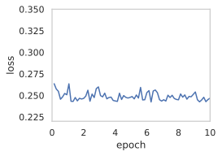
    


## 11.7 AdaGrad算法

### 练习11.7.1

证明对于正交矩阵$\mathbf{U}$和向量$\mathbf{c}$，以下等式成立：$\|\mathbf{c} - \mathbf{\delta}\|_2 = \|\mathbf{U} \mathbf{c} - \mathbf{U} \mathbf{\delta}\|_2$。为什么这意味着在变量的正交变化之后，扰动的程度不会改变？

**解答：**

首先证明该等式成立：

等式左侧可以展开为：

$$||c - \delta\|^2 = (c - \delta)^T(c - \delta) = c^Tc - 2c^T\delta + \delta^T\delta$$

等式右侧可以展开为：

$$\|Uc - U\delta\|^2 = (Uc - U\delta)^T(Uc - U\delta) = c^TU^TUc - 2c^TU^TU\delta + \delta^TU^TU\delta$$

由于 $\mathbf{U}$ 为正交矩阵，即：

$$U^TU = I$$

所以可得：

$$c^TU^TUc = c^Tc, c^TU^TU\delta = c^T\delta, \delta^TU^TU\delta = \delta^T\delta$$

带入以上展开式可证：

$$\|\mathbf{c} - \mathbf{\delta}\|_2 = \|\mathbf{U} \mathbf{c} - \mathbf{U} \mathbf{\delta}\|_2$$

为什么这意味着在变量的正交变化之后，扰动的程度不会改变：

我们可以将扰动的程度理解为变换之后的向量与原向量的距离，即假设我们有扰动变量 $\delta$，那么扰动的程度即为原变量 $x$ 与扰动后变量 $x+\delta$ 的距离，即 $||x - (x+\delta)||_2$，而我们已经证明，乘以正交矩阵之后该距离没有变化，因此扰动的程度没有改变。

### 练习11.7.2

尝试对函数$f(\mathbf{x}) = 0.1 x_1^2 + 2 x_2^2$、以及它旋转45度后的函数即$f(\mathbf{x}) = 0.1 (x_1 + x_2)^2 + 2 (x_1 - x_2)^2$使用AdaGrad算法。它的表现会不同吗？

**解答：**

我们首先对 $f(x) = 0.1x_1^2 + 2x_2^2$ 使用 AdaGrad 算法：


```python
%matplotlib inline
import math
import torch
from d2l import torch as d2l

def adagrad_2d(x1, x2, s1, s2):
    eps = 1e-6
    g1, g2 = 0.2 * x1, 4 * x2
    s1 += g1 ** 2
    s2 += g2 ** 2
    x1 -= eta / math.sqrt(s1 + eps) * g1
    x2 -= eta / math.sqrt(s2 + eps) * g2
    return x1, x2, s1, s2

def f_2d(x1, x2):
    return 0.1 * x1 ** 2 + 2 * x2 ** 2

eta = 0.4
d2l.show_trace_2d(f_2d, d2l.train_2d(adagrad_2d))
```

    epoch 20, x1: -2.382563, x2: -0.158591


    
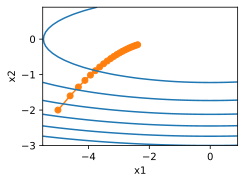
    


接着对旋转后的函数 $f(\mathbf{x}) = 0.1 (x_1 + x_2)^2 + 2 (x_1 - x_2)^2$ 使用 AdaGrad 算法：


```python
%matplotlib inline
import math
import torch
from d2l import torch as d2l

def adagrad_2d(x1, x2, s1, s2):
    eps = 1e-6
    g1, g2 = 4.2 * x1 - 3.8 * x2, 4.2 * x2 - 3.8 * x1
    s1 += g1 ** 2
    s2 += g2 ** 2
    x1 -= eta / math.sqrt(s1 + eps) * g1
    x2 -= eta / math.sqrt(s2 + eps) * g2
    return x1, x2, s1, s2

def f_2d_2(x1, x2):
    return 0.1 * (x1 + x2) ** 2 + 2 * (x1 - x2) ** 2

eta = 0.4
d2l.show_trace_2d(f_2d, d2l.train_2d(adagrad_2d))
```

    epoch 20, x1: -3.180865, x2: -3.062780


    
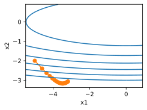
    


可以看到，两者的步长都是逐渐衰减的。

### 练习11.7.3

证明[格什戈林圆盘定理](https://en.wikipedia.org/wiki/Gershgorin_circle_theorem)，其中提到，矩阵$\mathbf{M}$的特征值$\lambda_i$在至少一个$j$的选项中满足$|\lambda_i - \mathbf{M}_{jj}| \leq \sum_{k \neq j} |\mathbf{M}_{jk}|$的要求。

**解答：**

我们假设 $\zeta$ 是 $M$ 对应特征值 $\lambda_i$ 的特征向量，即：

$$ \lambda_i M = \zeta \lambda_i $$

将上式改写为线性方程组形式：

$$
\begin{cases}
M_{11}x_1 + M_{12}x_2 + ... + M_{1n}x_n = \lambda_ix_1\\
M_{21}x_1 + M_{22}x_2 + ... + M_{2n}x_n = \lambda_ix_2\\
...\\
M_{n1}x_1 + M_{n2}x_2 + ... + M_{nn}x_n = \lambda_ix_n
\end{cases}
$$

我们假设：

$$argmax |x_n| = j $$

则根据上式变化可得：

$$(\lambda_i - M_{jj})x_j = M_{j1}x_1 + M_{j2}x_2 + ... + M_{jn}x_n$$

则

$$|\lambda_i - M_{jj}||x_j| \leq |M_{j1}||x_1| + |M_{j2}||x_2| + ... + |M_{jn}||x_n| $$

$$|\lambda_i - M_{jj}||x_j| \leq ({M_{j1}} + ... M_{jn})|x_j|$$

则证得：

$$|\lambda_i - M_{jj}| \leq \sum_{k != j}|M_{jk}|$$

### 练习11.7.4

关于对角线预处理矩阵$\mathrm{diag}^{-\frac{1}{2}}(\mathbf{M}) \mathbf{M} \mathrm{diag}^{-\frac{1}{2}}(\mathbf{M})$的特征值，格什戈林的定理告诉了我们什么？

**解答：**

格什戈林定理可用于估计对角线预处理矩阵的特征值：

当我们需要求解矩阵 $M$ 的特征值和特征向量，即对：

$$Mx = \lambda x$$

其中 x 是非零特征向量，$\lambda$ 是对应的特征值。对角线预处理矩阵 $D$ 通常是 $M$ 的对角线元素的逆构成的对角矩阵，即

$$D = diag^{-\frac{1}{2}}(M)Mdiag^{-\frac{1}{2}}$$

则经过对角线预处理之后，我们需要求解的特征值问题为：

$$Dz = \mu z$$

其中，$z = diag^{-\frac{1}{2}}(x)$，$\mu = \lambda$。

再根据格舍高林定理可得，对角线预处理后的矩阵 $M$ 的特征值 $\mu$ 落在以 $M$ 的对角线元素为中心、以各行非对角线元素绝对值之和为半径的圆盘内。换句话说，对角线预处理后的特征值分布在一些以对角线元素为中心的圆盘内。

### 练习11.7.5

尝试对适当的深度网络使用AdaGrad算法，例如，6.6节中应用于Fashion-MNIST的深度网络。

**解答：**


```python
import torch
from torch import nn
from d2l import torch as d2l

net = nn.Sequential(
    nn.Conv2d(1, 6, kernel_size=5, padding=2), nn.Sigmoid(),
    nn.AvgPool2d(kernel_size=2, stride=2),
    nn.Conv2d(6, 16, kernel_size=5), nn.Sigmoid(),
    nn.AvgPool2d(kernel_size=2, stride=2),
    nn.Flatten(),
    nn.Linear(16 * 5 * 5, 120), nn.Sigmoid(),
    nn.Linear(120, 84), nn.Sigmoid(),
    nn.Linear(84, 10))

batch_size = 256
train_iter, test_iter = d2l.load_data_fashion_mnist(batch_size=batch_size)

def evaluate_accuracy_gpu(net, data_iter, device=None):
    """使用GPU计算模型在数据集上的精度"""
    if isinstance(net, nn.Module):
        net.eval()  # 设置为评估模式
        if not device:
            device = next(iter(net.parameters())).device
    # 正确预测的数量，总预测的数量
    metric = d2l.Accumulator(2)
    with torch.no_grad():
        for X, y in data_iter:
            if isinstance(X, list):
                # BERT微调所需的（之后将介绍）
                X = [x.to(device) for x in X]
            else:
                X = X.to(device)
            y = y.to(device)
            metric.add(d2l.accuracy(net(X), y), y.numel())
    return metric[0] / metric[1]


def train_ch6(net, train_iter, test_iter, num_epochs, lr, device):
    """用GPU训练模型(在第六章定义)"""
    def init_weights(m):
        if type(m) == nn.Linear or type(m) == nn.Conv2d:
            nn.init.xavier_uniform_(m.weight)
    net.apply(init_weights)
    print('training on', device)
    net.to(device)
    optimizer = torch.optim.SGD(net.parameters(), lr=lr)
    loss = nn.CrossEntropyLoss()
    animator = d2l.Animator(xlabel='epoch', xlim=[1, num_epochs],
                            legend=['train loss', 'train acc', 'test acc'])
    timer, num_batches = d2l.Timer(), len(train_iter)
    for epoch in range(num_epochs):
        # 训练损失之和，训练准确率之和，样本数
        metric = d2l.Accumulator(3)
        net.train()
        for i, (X, y) in enumerate(train_iter):
            timer.start()
            optimizer.zero_grad()
            X, y = X.to(device), y.to(device)
            y_hat = net(X)
            l = loss(y_hat, y)
            l.backward()
            optimizer.step()
            with torch.no_grad():
                metric.add(l * X.shape[0], d2l.accuracy(y_hat, y), X.shape[0])
            timer.stop()
            train_l = metric[0] / metric[2]
            train_acc = metric[1] / metric[2]
            if (i + 1) % (num_batches // 5) == 0 or i == num_batches - 1:
                animator.add(epoch + (i + 1) / num_batches,
                             (train_l, train_acc, None))
        test_acc = evaluate_accuracy_gpu(net, test_iter)
        animator.add(epoch + 1, (None, None, test_acc))
    print(f'loss {train_l:.3f}, train acc {train_acc:.3f}, '
          f'test acc {test_acc:.3f}')
    print(f'{metric[2] * num_epochs / timer.sum():.1f} examples/sec '
          f'on {str(device)}')
```


```python
lr, num_epochs = 0.9, 20
train_ch6(net, train_iter, test_iter, num_epochs, lr, d2l.try_gpu())
```

接着，我们将 SGD 优化器替换为 AdaGrad 优化器：


```python
def evaluate_accuracy_gpu(net, data_iter, device=None): #@save
    """使用GPU计算模型在数据集上的精度"""
    if isinstance(net, nn.Module):
        net.eval()  # 设置为评估模式
        if not device:
            device = next(iter(net.parameters())).device
    # 正确预测的数量，总预测的数量
    metric = d2l.Accumulator(2)
    with torch.no_grad():
        for X, y in data_iter:
            if isinstance(X, list):
                # BERT微调所需的（之后将介绍）
                X = [x.to(device) for x in X]
            else:
                X = X.to(device)
            y = y.to(device)
            metric.add(d2l.accuracy(net(X), y), y.numel())
    return metric[0] / metric[1]

#@save
def train_ch6(net, train_iter, test_iter, num_epochs, lr, device):
    """用GPU训练模型(在第六章定义)"""
    def init_weights(m):
        if type(m) == nn.Linear or type(m) == nn.Conv2d:
            nn.init.xavier_uniform_(m.weight)
    net.apply(init_weights)
    print('training on', device)
    net.to(device)
    optimizer = torch.optim.Adagrad(net.parameters())
    loss = nn.CrossEntropyLoss()
    animator = d2l.Animator(xlabel='epoch', xlim=[1, num_epochs],
                            legend=['train loss', 'train acc', 'test acc'])
    timer, num_batches = d2l.Timer(), len(train_iter)
    for epoch in range(num_epochs):
        # 训练损失之和，训练准确率之和，样本数
        metric = d2l.Accumulator(3)
        net.train()
        for i, (X, y) in enumerate(train_iter):
            timer.start()
            optimizer.zero_grad()
            X, y = X.to(device), y.to(device)
            y_hat = net(X)
            l = loss(y_hat, y)
            l.backward()
            optimizer.step()
            with torch.no_grad():
                metric.add(l * X.shape[0], d2l.accuracy(y_hat, y), X.shape[0])
            timer.stop()
            train_l = metric[0] / metric[2]
            train_acc = metric[1] / metric[2]
            if (i + 1) % (num_batches // 5) == 0 or i == num_batches - 1:
                animator.add(epoch + (i + 1) / num_batches,
                             (train_l, train_acc, None))
        test_acc = evaluate_accuracy_gpu(net, test_iter)
        animator.add(epoch + 1, (None, None, test_acc))
    print(f'loss {train_l:.3f}, train acc {train_acc:.3f}, '
          f'test acc {test_acc:.3f}')
    print(f'{metric[2] * num_epochs / timer.sum():.1f} examples/sec '
          f'on {str(device)}')
```


```python
lr, num_epochs = 0.9, 20
train_ch6(net, train_iter, test_iter, num_epochs, lr, d2l.try_gpu())
```

可以看出，使用 AdaGrad 算法在一开始 loss 下降得更陡峭、迅速，但随后 loss 下降速度开始衰减，显著慢于使用 SGD 算法，以及 20 个 epoch 迭代之后我们对比发现，虽然 AdaGrad 算法在前3个 epoch 就实现了 loss 的骤降，但最终并没能实现稳定的收敛。

### 练习11.7.6        
        
要如何修改AdaGrad算法，才能使其在学习率方面的衰减不那么剧烈？

**解答：**

AdaGrad 算法之所以在学习率方面的衰减会越发激进，是因为 AdaGrad 算法会累积历史梯度，造成后续学习率很小，权值无法得到有效更新。

为改进这一问题，有学者提出了 RMSProp 算法，该算法增加了一个衰减系数来控制历史信息的获取，即我们在下一章将要学习的算法。

## 11.8 RMSProp算法

### 练习11.8.1
如果我们设置$\gamma = 1$，实验会发生什么？为什么？

**解答：**

如果我们设置 $\gamma$ 为1，则状态矢量 $s_t$ 的更新函数变为：

$$s_t \leftarrow s_{t-1} = s_0 = 0$$

也就是状态矢量将保持不变为0，则自变量更新函数变为：

$$x_t \leftarrow x_{t-1} - \frac{\eta}{\sqrt{\epsilon}}\odot g(t)$$

因此，步长将不会发生改变，将变成确定步长优化。

### 练习11.8.2
旋转优化问题以最小化$f(\mathbf{x}) = 0.1 (x_1 + x_2)^2 + 2 (x_1 - x_2)^2$。收敛会发生什么？

**解答：**

我们首先观察原优化问题：


```python
import math
import torch
from d2l import torch as d2l

def rmsprop_2d(x1, x2, s1, s2):
    g1, g2, eps = 0.2 * x1, 4 * x2, 1e-6
    s1 = gamma * s1 + (1 - gamma) * g1 ** 2
    s2 = gamma * s2 + (1 - gamma) * g2 ** 2
    x1 -= eta / math.sqrt(s1 + eps) * g1
    x2 -= eta / math.sqrt(s2 + eps) * g2
    return x1, x2, s1, s2

def f_2d(x1, x2):
    return 0.1 * x1 ** 2 + 2 * x2 ** 2

eta, gamma = 0.4, 0.9
d2l.show_trace_2d(f_2d, d2l.train_2d(rmsprop_2d))
```

    epoch 20, x1: -0.010599, x2: 0.000000


    
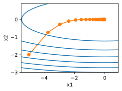
    


再关注旋转后的优化问题


```python
def rmsprop_2d(x1, x2, s1, s2):
    g1, g2, eps = 4.2 * x1 - 3.8 * x2, 4.2 * x2 - 3.8 * x1, 1e-6
    s1 = gamma * s1 + (1 - gamma) * g1 ** 2
    s2 = gamma * s2 + (1 - gamma) * g2 ** 2
    x1 -= eta / math.sqrt(s1 + eps) * g1
    x2 -= eta / math.sqrt(s2 + eps) * g2
    return x1, x2, s1, s2

def f_2d(x1, x2):
    return 0.1 * (x1 + x2) ** 2 + 2 * (x1 - x2) ** 2

eta, gamma = 0.4, 0.9
d2l.show_trace_2d(f_2d, d2l.train_2d(rmsprop_2d))
```

    epoch 20, x1: -0.927150, x2: -0.914018


    
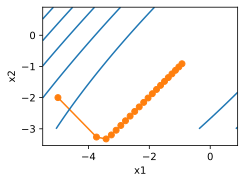
    


可见，旋转之后的优化问题收敛效果显著变差。

### 练习11.8.3
尝试在真正的机器学习问题上应用RMSProp算法会发生什么，例如在Fashion-MNIST上的训练。试验不同的取值来调整学习率。

**解答：**


```python
import torch
from torch import nn
from d2l import torch as d2l

net = nn.Sequential(
    nn.Conv2d(1, 6, kernel_size=5, padding=2), nn.Sigmoid(),
    nn.AvgPool2d(kernel_size=2, stride=2),
    nn.Conv2d(6, 16, kernel_size=5), nn.Sigmoid(),
    nn.AvgPool2d(kernel_size=2, stride=2),
    nn.Flatten(),
    nn.Linear(16 * 5 * 5, 120), nn.Sigmoid(),
    nn.Linear(120, 84), nn.Sigmoid(),
    nn.Linear(84, 10))

batch_size = 256
train_iter, test_iter = d2l.load_data_fashion_mnist(batch_size=batch_size)

def evaluate_accuracy_gpu(net, data_iter, device=None):
    """使用GPU计算模型在数据集上的精度"""
    if isinstance(net, nn.Module):
        net.eval()  # 设置为评估模式
        if not device:
            device = next(iter(net.parameters())).device
    # 正确预测的数量，总预测的数量
    metric = d2l.Accumulator(2)
    with torch.no_grad():
        for X, y in data_iter:
            if isinstance(X, list):
                # BERT微调所需的（之后将介绍）
                X = [x.to(device) for x in X]
            else:
                X = X.to(device)
            y = y.to(device)
            metric.add(d2l.accuracy(net(X), y), y.numel())
    return metric[0] / metric[1]


def train_ch6(net, train_iter, test_iter, num_epochs,device):
    """用GPU训练模型(在第六章定义)"""
    def init_weights(m):
        if type(m) == nn.Linear or type(m) == nn.Conv2d:
            nn.init.xavier_uniform_(m.weight)
    net.apply(init_weights)
    print('training on', device)
    net.to(device)
    optimizer = torch.optim.RMSprop(net.parameters(), alpha= 0.9)
    loss = nn.CrossEntropyLoss()
    animator = d2l.Animator(xlabel='epoch', xlim=[1, num_epochs],
                            legend=['train loss', 'train acc', 'test acc'])
    timer, num_batches = d2l.Timer(), len(train_iter)
    for epoch in range(num_epochs):
        # 训练损失之和，训练准确率之和，样本数
        metric = d2l.Accumulator(3)
        net.train()
        for i, (X, y) in enumerate(train_iter):
            timer.start()
            optimizer.zero_grad()
            X, y = X.to(device), y.to(device)
            y_hat = net(X)
            l = loss(y_hat, y)
            l.backward()
            optimizer.step()
            with torch.no_grad():
                metric.add(l * X.shape[0], d2l.accuracy(y_hat, y), X.shape[0])
            timer.stop()
            train_l = metric[0] / metric[2]
            train_acc = metric[1] / metric[2]
            if (i + 1) % (num_batches // 5) == 0 or i == num_batches - 1:
                animator.add(epoch + (i + 1) / num_batches,
                             (train_l, train_acc, None))
        test_acc = evaluate_accuracy_gpu(net, test_iter)
        animator.add(epoch + 1, (None, None, test_acc))
    print(f'loss {train_l:.3f}, train acc {train_acc:.3f}, '
          f'test acc {test_acc:.3f}')
    print(f'{metric[2] * num_epochs / timer.sum():.1f} examples/sec '
          f'on {str(device)}')
```

    Downloading http://fashion-mnist.s3-website.eu-central-1.amazonaws.com/train-images-idx3-ubyte.gz
    Downloading http://fashion-mnist.s3-website.eu-central-1.amazonaws.com/train-images-idx3-ubyte.gz to ../data/FashionMNIST/raw/train-images-idx3-ubyte.gz


    100%|██████████| 26421880/26421880 [00:01<00:00, 19463394.71it/s]


    Extracting ../data/FashionMNIST/raw/train-images-idx3-ubyte.gz to ../data/FashionMNIST/raw
    
    Downloading http://fashion-mnist.s3-website.eu-central-1.amazonaws.com/train-labels-idx1-ubyte.gz
    Downloading http://fashion-mnist.s3-website.eu-central-1.amazonaws.com/train-labels-idx1-ubyte.gz to ../data/FashionMNIST/raw/train-labels-idx1-ubyte.gz


    100%|██████████| 29515/29515 [00:00<00:00, 301472.56it/s]


    Extracting ../data/FashionMNIST/raw/train-labels-idx1-ubyte.gz to ../data/FashionMNIST/raw
    
    Downloading http://fashion-mnist.s3-website.eu-central-1.amazonaws.com/t10k-images-idx3-ubyte.gz
    Downloading http://fashion-mnist.s3-website.eu-central-1.amazonaws.com/t10k-images-idx3-ubyte.gz to ../data/FashionMNIST/raw/t10k-images-idx3-ubyte.gz


    100%|██████████| 4422102/4422102 [00:00<00:00, 5532661.80it/s]


    Extracting ../data/FashionMNIST/raw/t10k-images-idx3-ubyte.gz to ../data/FashionMNIST/raw
    
    Downloading http://fashion-mnist.s3-website.eu-central-1.amazonaws.com/t10k-labels-idx1-ubyte.gz
    Downloading http://fashion-mnist.s3-website.eu-central-1.amazonaws.com/t10k-labels-idx1-ubyte.gz to ../data/FashionMNIST/raw/t10k-labels-idx1-ubyte.gz


    100%|██████████| 5148/5148 [00:00<00:00, 14860479.69it/s]

    Extracting ../data/FashionMNIST/raw/t10k-labels-idx1-ubyte.gz to ../data/FashionMNIST/raw
    


    
    /usr/local/lib/python3.10/dist-packages/torch/utils/data/dataloader.py:560: UserWarning: This DataLoader will create 4 worker processes in total. Our suggested max number of worker in current system is 2, which is smaller than what this DataLoader is going to create. Please be aware that excessive worker creation might get DataLoader running slow or even freeze, lower the worker number to avoid potential slowness/freeze if necessary.
      warnings.warn(_create_warning_msg(


```python
num_epochs = 10
train_ch6(net, train_iter, test_iter, num_epochs, d2l.try_gpu())
```


    ---------------------------------------------------------------------------

    KeyboardInterrupt                         Traceback (most recent call last)

    <ipython-input-27-bc163efaccea> in <cell line: 2>()
          1 num_epochs = 10
    ----> 2 train_ch6(net, train_iter, test_iter, num_epochs, d2l.try_gpu())
    

    <ipython-input-26-5fba167c60a8> in train_ch6(net, train_iter, test_iter, num_epochs, device)
         59             y_hat = net(X)
         60             l = loss(y_hat, y)
    ---> 61             l.backward()
         62             optimizer.step()
         63             with torch.no_grad():


    /usr/local/lib/python3.10/dist-packages/torch/_tensor.py in backward(self, gradient, retain_graph, create_graph, inputs)
        485                 inputs=inputs,
        486             )
    --> 487         torch.autograd.backward(
        488             self, gradient, retain_graph, create_graph, inputs=inputs
        489         )


    /usr/local/lib/python3.10/dist-packages/torch/autograd/__init__.py in backward(tensors, grad_tensors, retain_graph, create_graph, grad_variables, inputs)
        198     # some Python versions print out the first line of a multi-line function
        199     # calls in the traceback and some print out the last line
    --> 200     Variable._execution_engine.run_backward(  # Calls into the C++ engine to run the backward pass
        201         tensors, grad_tensors_, retain_graph, create_graph, inputs,
        202         allow_unreachable=True, accumulate_grad=True)  # Calls into the C++ engine to run the backward pass


    KeyboardInterrupt: 


    
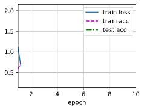
    


### 练习11.8.4

随着优化的进展，需要调整$\gamma$吗？RMSProp算法对此的敏感程度如何？

**解答：**

RMSProp 算法对 $\gamma$ 是比较敏感的，其取值对最终优化结果有较大影响；例如，在上一题应用 RMSProp 算法来优化 Mnist 数据集上的分类问题时，我们会发现使用默认的 $\gamma = 0.99$ 优化效果很不好，loss 几乎不下降；设置 $\gamma = 0.9$ 时，loss 得到了快速的下降。

由于 $\gamma$ 决定了在调整每坐标比例时历史记录的时长，当其值越大，步长衰减的速度就越慢；因此，我们应该在优化的初期设置较大的 $\gamma$ 值，在优化的后期设置较小的 $\gamma$ 值。

## 11.9 Adadelta

### 练习11.9.1
调整$\rho$的值，会发生什么？


**解答：**


```python
def init_adadelta_states(feature_dim):
    s_w, s_b = torch.zeros((feature_dim, 1)), torch.zeros(1)
    delta_w, delta_b = torch.zeros((feature_dim, 1)), torch.zeros(1)
    return ((s_w, delta_w), (s_b, delta_b))

def adadelta(params, states, hyperparams):
    rho, eps = hyperparams['rho'], 1e-5
    for p, (s, delta) in zip(params, states):
        with torch.no_grad():
            # In-placeupdatesvia[:]
            s[:] = rho * s + (1 - rho) * torch.square(p.grad)
            g = (torch.sqrt(delta + eps) / torch.sqrt(s + eps)) * p.grad
            p[:] -= g
            delta[:] = rho * delta + (1 - rho) * g * g
        p.grad.data.zero_()

```


```python
data_iter, feature_dim = d2l.get_data_ch11(batch_size=10)
d2l.train_ch11(adadelta,
        init_adadelta_states(feature_dim),
        {'rho': 0.9},
        data_iter, feature_dim, num_epochs=10);

# 直接调用torch的api
# trainer = torch.optim.Adadelta
# d2l.train_concise_ch11(trainer, {'rho': 0.5}, data_iter)
```

    loss: 0.246, 0.277 sec/epoch


    
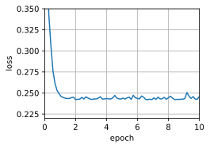
    


```python
d2l.train_ch11(adadelta,
        init_adadelta_states(feature_dim),
        {'rho': 0.6},
        data_iter, feature_dim, num_epochs=10);
```

    loss: 0.243, 0.190 sec/epoch


    
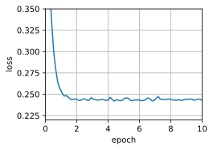
    


```python
d2l.train_ch11(adadelta,
        init_adadelta_states(feature_dim),
        {'rho': 0.3},
        data_iter, feature_dim, num_epochs=10);
```

    loss: 0.245, 0.196 sec/epoch


    
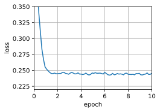
    


- 在这个数据集上参数$\rho$的影响不大，loss均收敛。

$\rho$ 实则控制了优化时当前梯度和历史梯度的比例，当 $\rho$ 值越大，调整后梯度会更多地倾向于历史梯度；当 $\rho$ 值越小，调整后梯度会更多地倾向于当前梯度。

事实上，当 $\rho$ 越大，变化量衰减的速度就越慢；当 $\rho$ 越小，变化率衰减的速度就越快。

### 练习11.9.2
展示如何在不使用$\mathbf{g}_t'$的情况下实现算法。为什么这是个好主意？


**解答：**

暂时没做出来，不使用g的话，梯度无法更新，

### 练习11.9.3

Adadelta真的是学习率为0吗？能找到Adadelta无法解决的优化问题吗？


**解答：**

- Adadelta算法中的学习率并不是固定为0。对于Adadelta算法，学习率是动态调整的，并且不需要手动设置一个固定的学习率值。

Adadelta算法维护一个状态变量来存储这个指数移动平均值，并使用该变量来计算每个参数更新的学习率。


Adadelta 不能解决的优化问题包括：

1. 高度非凸问题:
Adadelta是基于梯度信息的自适应学习率算法。在高度非凸的优化问题中，梯度可能会变化非常剧烈，导致Adadelta难以适应这种剧烈变化。相比之下，一些更复杂的优化算法，如具有动量的随机梯度下降（SGD with momentum）或Adam可能能更好地处理这种情况。

2. 离散优化问题:
Adadelta假设参数的连续更新，而在离散优化问题中，参数可能只能取离散的值。这种情况下，Adadelta可能不是最适合的选择。在离散优化问题中，特定的优化算法，如遗传算法或模拟退火等可能更适合。

3. 奇异性质的问题:
一些优化问题可能具有奇异性质，即梯度在某些点上可能不存在或变得非常大。这种情况下，Adadelta可能会遇到数值稳定性的问题，因为它涉及梯度的平方根。其他一些优化算法可能会采取特殊的处理方式来处理奇异点。


### 练习11.9.4

将Adadelta的收敛行为与AdaGrad和RMSProp进行比较。

**解答：**

- AdaGrad 会自适应地调整学习率，使稀疏特征对应的参数具有较大的学习率，但是可能会在后期过早停止学习，因为梯度的平方和随时间增加，导致学习率变得很小，减缓了参数更新的速度；

- 而RMSProp 就是针对这一问题做出了优化，引入指数加权移动平均来平滑梯度的历史平方和，减缓了学习率的衰减，对学习率的适应性更好，能够更稳定地收敛到最优解；

- AdaDelta 则是在 RMSProp 上做出进一步改进，避免了手动设置学习率，通常能更稳定地收敛到最优解，而且避免了手动调整学习率可能导致的参数不正确带来的不收敛。

## 11.10 Adam算法

### 练习11.10.1
调节学习率，观察并分析实验结果。

**解答：**


```python
%matplotlib inline
import torch
from d2l import torch as d2l


def init_adam_states(feature_dim):
    v_w, v_b = torch.zeros((feature_dim, 1)), torch.zeros(1)
    s_w, s_b = torch.zeros((feature_dim, 1)), torch.zeros(1)
    return ((v_w, s_w), (v_b, s_b))

def adam(params, states, hyperparams):
    beta1, beta2, eps = 0.9, 0.999, 1e-6
    for p, (v, s) in zip(params, states):
        with torch.no_grad():
            v[:] = beta1 * v + (1 - beta1) * p.grad
            s[:] = beta2 * s + (1 - beta2) * torch.square(p.grad)
            v_bias_corr = v / (1 - beta1 ** hyperparams['t'])
            s_bias_corr = s / (1 - beta2 ** hyperparams['t'])
            p[:] -= hyperparams['lr'] * v_bias_corr / (torch.sqrt(s_bias_corr)
                                                       + eps)
        p.grad.data.zero_()
    hyperparams['t'] += 1

data_iter, feature_dim = d2l.get_data_ch11(batch_size=10)
d2l.train_ch11(adam, init_adam_states(feature_dim),
               {'lr': 0.01, 't': 1}, data_iter, feature_dim, num_epochs=10);
```

    loss: 0.244, 0.196 sec/epoch


    
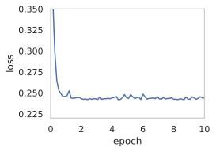
    


```python
d2l.train_ch11(adam, init_adam_states(feature_dim),
               {'lr': 0.05, 't': 1}, data_iter, feature_dim, num_epochs=10);
```

    loss: 0.250, 0.261 sec/epoch


    

    


```python
d2l.train_ch11(adam, init_adam_states(feature_dim),
               {'lr': 0.1, 't': 1}, data_iter, feature_dim, num_epochs=10);
```

    loss: 0.265, 0.193 sec/epoch


    
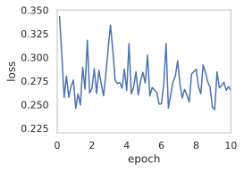
    


### 练习11.10.2
试着重写动量和二次矩更新，从而使其不需要偏差校正

**解答：**


```python
def init_adam_states_update(feature_dim):
    v_w, v_b = torch.zeros((feature_dim, 1)), torch.zeros(1)
    s_w, s_b = torch.zeros((feature_dim, 1)), torch.zeros(1)
    return ((v_w, s_w), (v_b, s_b))

def adam_update(params, states, hyperparams):
    beta1, beta2, eps = 0.9, 0.999, 1e-6
    hyperparams['t'] += 1  # 先增加 t 的值
    for p, (v, s) in zip(params, states):
        with torch.no_grad():
            v[:] = beta1 * v + (1 - beta1) * p.grad
            s[:] = beta2 * s + (1 - beta2) * torch.square(p.grad)
            v_bias_corr = v / (1 - beta1 ** hyperparams['t'])  # 去除偏差校正
            s_bias_corr = s / (1 - beta2 ** hyperparams['t'])  # 去除偏差校正
            p[:] -= hyperparams['lr'] * v_bias_corr / (torch.sqrt(s_bias_corr) + eps)
        p.grad.data.zero_()
```


```python
d2l.train_ch11(adam_update, init_adam_states(feature_dim),
               {'lr': 0.01, 't': 1}, data_iter, feature_dim, num_epochs=10);
```


    
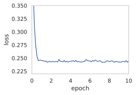
    


```python
d2l.train_ch11(adam_update, init_adam_states(feature_dim),
               {'lr': 0.1, 't': 1}, data_iter, feature_dim, num_epochs=10);
```

    loss: 0.303, 0.225 sec/epoch


    
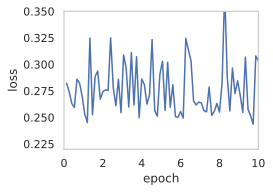
    


### 练习11.10.3
收敛时为什么需要降低学习率$\eta$?

**解答：**

在Adam算法中，有两个关键的超参数：学习率$\eta$和指数衰减率$\beta_1$、$\beta_2$。

当Adam算法收敛时，降低学习率$\eta$的原因如下：

1. **动量的影响**：
   Adam算法利用动量来加速梯度下降过程，动量可以帮助算法跳出局部极小值并加速在平坦区域的移动。然而，在接近收敛时，我们希望算法逐渐减缓速度，以避免在极小值附近来回震荡。

2. **过大的学习率会导致震荡**：
   如果学习率$\eta$过大，那么在收敛阶段，更新步长可能会过大，使得算法在极小值附近来回震荡，而无法稳定地收敛。

3. **稳定性和精度**：
   当接近最优解时，我们希望算法收敛得更加精确和稳定。通过降低学习率，我们可以确保算法在接近最优解时，以更小的步长进行微调，从而更加精确地找到最优解。

4. **避免“振荡”**：
   在接近最优解时，如果学习率$\eta$过大，可能会导致优化过程在最优解附近来回震荡，而无法稳定地收敛。通过降低学习率，可以减缓更新的速度，避免这种振荡现象。

所以，当Adam算法接近收敛时，逐步降低学习率$\eta$是为了保证优化过程的稳定性和精确性，避免在最优解附近震荡，并最终找到一个满足要求的最优解。

### 练习11.10.4
尝试构造一个使用Adam算法会发散而Yogi会收敛的例子。

**解答：**


```python
def init_adam_states(feature_dim):
    v_w, v_b = torch.zeros((feature_dim, 1)), torch.zeros(1)
    s_w, s_b = torch.zeros((feature_dim, 1)), torch.zeros(1)
    return ((v_w, s_w), (v_b, s_b))

def adam(params, states, hyperparams):
    beta1, beta2, eps = 0.9, 0.999, 1e-1 # adam的eps调大
    for p, (v, s) in zip(params, states):
        with torch.no_grad():
            v[:] = beta1 * v + (1 - beta1) * p.grad
            s[:] = beta2 * s + (1 - beta2) * torch.square(p.grad)
            v_bias_corr = v / (1 - beta1 ** hyperparams['t'])
            s_bias_corr = s / (1 - beta2 ** hyperparams['t'])
            p[:] -= hyperparams['lr'] * v_bias_corr / (torch.sqrt(s_bias_corr)+ eps)
        p.grad.data.zero_()
    hyperparams['t'] += 1

```


```python
def yogi(params, states, hyperparams):
    beta1, beta2, eps = 0.9, 0.999, 1e-6 #yogi的eps调小
    for p, (v, s) in zip(params, states):
        with torch.no_grad():
            v[:] = beta1 * v + (1 - beta1) * p.grad
            s[:] = s + (1 - beta2) * torch.sign(
                torch.square(p.grad) - s) * torch.square(p.grad)
            v_bias_corr = v / (1 - beta1 ** hyperparams['t'])
            s_bias_corr = s / (1 - beta2 ** hyperparams['t'])
            p[:] -= hyperparams['lr'] * v_bias_corr / (torch.sqrt(s_bias_corr)+ eps)
        p.grad.data.zero_()
    hyperparams['t'] += 1

```


```python
data_iter, feature_dim = d2l.get_data_ch11(batch_size=10)
d2l.train_ch11(adam, init_adam_states(feature_dim), {'lr': 0.1, 't': 1}, data_iter, feature_dim)
```

    loss: 0.286, 0.254 sec/epoch


    ([0.02502727508544922,
      0.05432486534118652,
      0.07659363746643066,
      0.09993433952331543,
      0.12483882904052734,
      0.1624300479888916,
      0.2031557559967041,
      0.23590397834777832,
      0.2621176242828369,
      0.29068803787231445,
      0.31475114822387695,
      0.33946847915649414,
      0.3629024028778076,
      0.4381234645843506,
      0.5079770088195801],
     [0.2802133682370186,
      0.24929887652397156,
      0.25547001020113624,
      0.2572503798007965,
      0.25765814197063447,
      0.25446937972307204,
      0.24969262937704723,
      0.2474356138308843,
      0.2543005377848943,
      0.26428999155759814,
      0.26891206375757853,
      0.2554288481871287,
      0.25635744649171827,
      0.27924392398198444,
      0.28562702345848084])


    
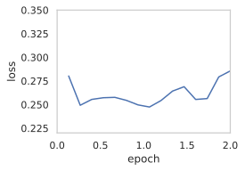
    


```python
data_iter, feature_dim = d2l.get_data_ch11(batch_size=10)
d2l.train_ch11(yogi, init_adam_states(feature_dim),
               {'lr': 0.01, 't': 1}, data_iter, feature_dim);
```

    loss: 0.245, 0.198 sec/epoch


    
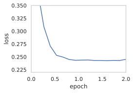
    


## 11.11 学习率调度器

### 练习11.11.1
试验给定固定学习率的优化行为。这种情况下可以获得的最佳模型是什么？

**解答：**


```python
%matplotlib inline
import math
import torch
from torch import nn
from torch.optim import lr_scheduler
from d2l import torch as d2l


def net_fn():
    model = nn.Sequential(
        nn.Conv2d(1, 6, kernel_size=5, padding=2), nn.ReLU(),
        nn.MaxPool2d(kernel_size=2, stride=2),
        nn.Conv2d(6, 16, kernel_size=5), nn.ReLU(),
        nn.MaxPool2d(kernel_size=2, stride=2),
        nn.Flatten(),
        nn.Linear(16 * 5 * 5, 120), nn.ReLU(),
        nn.Linear(120, 84), nn.ReLU(),
        nn.Linear(84, 10))

    return model

loss = nn.CrossEntropyLoss()
device = d2l.try_gpu()

batch_size = 256
train_iter, test_iter = d2l.load_data_fashion_mnist(batch_size=batch_size)

# 代码几乎与d2l.train_ch6定义在卷积神经网络一章LeNet一节中的相同
def train(net, train_iter, test_iter, num_epochs, loss, trainer, device,
          scheduler=None):
    net.to(device)
    animator = d2l.Animator(xlabel='epoch', xlim=[0, num_epochs],
                            legend=['train loss', 'train acc', 'test acc'])

    for epoch in range(num_epochs):
        metric = d2l.Accumulator(3)  # train_loss,train_acc,num_examples
        for i, (X, y) in enumerate(train_iter):
            net.train()
            trainer.zero_grad()
            X, y = X.to(device), y.to(device)
            y_hat = net(X)
            l = loss(y_hat, y)
            l.backward()
            trainer.step()
            with torch.no_grad():
                metric.add(l * X.shape[0], d2l.accuracy(y_hat, y), X.shape[0])
            train_loss = metric[0] / metric[2]
            train_acc = metric[1] / metric[2]
            if (i + 1) % 50 == 0:
                animator.add(epoch + i / len(train_iter),
                             (train_loss, train_acc, None))

        test_acc = d2l.evaluate_accuracy_gpu(net, test_iter)
        animator.add(epoch+1, (None, None, test_acc))

        if scheduler:
            if scheduler.__module__ == lr_scheduler.__name__:
                # UsingPyTorchIn-Builtscheduler
                scheduler.step()
            else:
                # Usingcustomdefinedscheduler
                for param_group in trainer.param_groups:
                    param_group['lr'] = scheduler(epoch)

    print(f'train loss {train_loss:.3f}, train acc {train_acc:.3f}, '
          f'test acc {test_acc:.3f}')

lr, num_epochs = 0.3, 30
net = net_fn()
trainer = torch.optim.SGD(net.parameters(), lr=lr)
train(net, train_iter, test_iter, num_epochs, loss, trainer, device)

```


    ---------------------------------------------------------------------------

    KeyboardInterrupt                         Traceback (most recent call last)

    <ipython-input-64-7c88355f57f7> in <cell line: 71>()
         69 net = net_fn()
         70 trainer = torch.optim.SGD(net.parameters(), lr=lr)
    ---> 71 train(net, train_iter, test_iter, num_epochs, loss, trainer, device)
    

    <ipython-input-64-7c88355f57f7> in train(net, train_iter, test_iter, num_epochs, loss, trainer, device, scheduler)
         39             trainer.zero_grad()
         40             X, y = X.to(device), y.to(device)
    ---> 41             y_hat = net(X)
         42             l = loss(y_hat, y)
         43             l.backward()


    /usr/local/lib/python3.10/dist-packages/torch/nn/modules/module.py in _call_impl(self, *args, **kwargs)
       1499                 or _global_backward_pre_hooks or _global_backward_hooks
       1500                 or _global_forward_hooks or _global_forward_pre_hooks):
    -> 1501             return forward_call(*args, **kwargs)
       1502         # Do not call functions when jit is used
       1503         full_backward_hooks, non_full_backward_hooks = [], []


    /usr/local/lib/python3.10/dist-packages/torch/nn/modules/container.py in forward(self, input)
        215     def forward(self, input):
        216         for module in self:
    --> 217             input = module(input)
        218         return input
        219 


    /usr/local/lib/python3.10/dist-packages/torch/nn/modules/module.py in _call_impl(self, *args, **kwargs)
       1499                 or _global_backward_pre_hooks or _global_backward_hooks
       1500                 or _global_forward_hooks or _global_forward_pre_hooks):
    -> 1501             return forward_call(*args, **kwargs)
       1502         # Do not call functions when jit is used
       1503         full_backward_hooks, non_full_backward_hooks = [], []


    /usr/local/lib/python3.10/dist-packages/torch/nn/modules/pooling.py in forward(self, input)
        164 
        165     def forward(self, input: Tensor):
    --> 166         return F.max_pool2d(input, self.kernel_size, self.stride,
        167                             self.padding, self.dilation, ceil_mode=self.ceil_mode,
        168                             return_indices=self.return_indices)


    /usr/local/lib/python3.10/dist-packages/torch/_jit_internal.py in fn(*args, **kwargs)
        482             return if_true(*args, **kwargs)
        483         else:
    --> 484             return if_false(*args, **kwargs)
        485 
        486     if if_true.__doc__ is None and if_false.__doc__ is not None:


    /usr/local/lib/python3.10/dist-packages/torch/nn/functional.py in _max_pool2d(input, kernel_size, stride, padding, dilation, ceil_mode, return_indices)
        780     if stride is None:
        781         stride = torch.jit.annotate(List[int], [])
    --> 782     return torch.max_pool2d(input, kernel_size, stride, padding, dilation, ceil_mode)
        783 
        784 


    KeyboardInterrupt: 


    
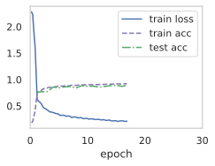
    


```python
lr = 0.1
trainer.param_groups[0]["lr"] = lr
print(f'learning rate is now {trainer.param_groups[0]["lr"]:.2f}')

```


```python
class SquareRootScheduler:
    def __init__(self, lr=0.1):
        self.lr = lr

    def __call__(self, num_update):
        return self.lr * pow(num_update + 1.0, -0.5)

class CosineScheduler:
    def __init__(self, max_update, base_lr=0.01, final_lr=0,
               warmup_steps=0, warmup_begin_lr=0):
        self.base_lr_orig = base_lr
        self.max_update = max_update
        self.final_lr = final_lr
        self.warmup_steps = warmup_steps
        self.warmup_begin_lr = warmup_begin_lr
        self.max_steps = self.max_update - self.warmup_steps

    def get_warmup_lr(self, epoch):
        increase = (self.base_lr_orig - self.warmup_begin_lr) \
                       * float(epoch) / float(self.warmup_steps)
        return self.warmup_begin_lr + increase

    def __call__(self, epoch):
        if epoch < self.warmup_steps:
            return self.get_warmup_lr(epoch)
        if epoch <= self.max_update:
            self.base_lr = self.final_lr + (
                self.base_lr_orig - self.final_lr) * (1 + math.cos(
                math.pi * (epoch - self.warmup_steps) / self.max_steps)) / 2
        return self.base_lr


```


```python
scheduler = CosineScheduler(max_update=20, base_lr=0.3, final_lr=0.01)
d2l.plot(torch.arange(num_epochs), [scheduler(t) for t in range(num_epochs)])

scheduler = SquareRootScheduler(lr=0.1)
d2l.plot(torch.arange(num_epochs), [scheduler(t) for t in range(num_epochs)])
```


```python
net = net_fn()
trainer = torch.optim.SGD(net.parameters(), lr)
train(net, train_iter, test_iter, num_epochs, loss, trainer, device, scheduler)
```

### 练习11.11.2
如果改变学习率下降的指数，收敛性会如何改变？在实验中方便起见，使用`PolyScheduler`。


**解答：**


```python
import torch
import torch.optim as optim
from torch.optim.lr_scheduler import PolynomialLR

net = net_fn()
trainer = torch.optim.SGD(net.parameters(), lr)
# 定义PolyScheduler并设置参数
scheduler = PolynomialLR(trainer, total_iters=10, power=0.9)
train(net, train_iter, test_iter, num_epochs, loss, trainer, device, scheduler)
```


```python

```

### 练习11.11.3
将余弦调度器应用于大型计算机视觉问题，例如训练ImageNet数据集。与其他调度器相比，它如何影响性能？


**解答：**

与其他调度器相比，余弦调度器在性能方面有一些独特的影响。

1. 初始学习率设置：余弦调度器要求设置一个初始学习率。通常情况下，较大的学习率可以加快模型的收敛速度，但同时也可能导致训练过程中的不稳定性。因此，选择一个合适的初始学习率对于获得较好的性能至关重要。

2. 学习率下降：余弦调度器通过在训练过程中逐渐降低学习率来优化模型的训练。它使用了余弦函数的形式来调整学习率，使其在训练的不同阶段按照一种平滑的方式进行下降。这种方式相对于其他调度器（如固定学习率或按照一定步长进行衰减的调度器）可以更好地平衡模型的收敛速度和稳定性。

3. 阶段划分：余弦调度器将整个训练过程划分为多个阶段，每个阶段具有不同的学习率。这些阶段的划分可以根据训练数据的大小和复杂性进行调整。通常情况下，初始阶段使用较大的学习率以加快模型的收敛，后续阶段逐渐降低学习率以确保模型更好地拟合数据。

4. 平滑下降：余弦调度器的学习率下降过程相对平滑，不像其他调度器那样存在突然的学习率变化。这种平滑的下降可以帮助模型避免陷入局部极小值，并且在优化过程中更容易跳出局部极小值并找到全局最优解。

余弦调度器在大型计算机视觉问题中的应用可以通过逐渐降低学习率、平滑下降以及合理的阶段划分来提升性能。它可以帮助模型更好地收敛，避免过拟合，并在训练过程中更好地平衡收敛速度和稳定性。

### 练习11.11.4
预热应该持续多长时间？


**解答：**

预热时间的选择可以基于以下几个因素进行考虑：

- 模型的复杂性：复杂的模型可能需要更长的预热时间来帮助模型更好地收敛。较简单的模型可能在较短的预热时间内就能达到较好的性能。

- 数据集的大小：大型数据集通常需要更长的预热时间，因为模型需要更多的迭代次数来适应数据集的复杂性。相反，小型数据集可能在较短的预热时间内就能够达到较好的性能。

- 训练时间和计算资源：预热时间的选择还应考虑到可用的训练时间和计算资源。如果时间和资源有限，可能需要选择较短的预热时间来加快模型的训练速度。

一种常见的做法是通过观察模型的训练曲线和验证集的性能来确定预热时间。可以尝试不同的预热时间，并观察模型在训练过程中的性能变化。如果模型在预热阶段表现不稳定或训练损失仍然很高，可能需要增加预热时间。相反，如果模型在较短的预热时间内就能达到较好的性能，可以考虑减少预热时间以加快训练速度。


```python
scheduler = CosineScheduler(20, warmup_steps=5, base_lr=0.3, final_lr=0.01)
d2l.plot(torch.arange(num_epochs), [scheduler(t) for t in range(num_epochs)])
```


    
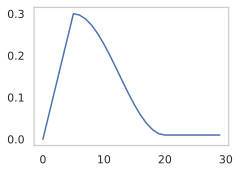
    


### 练习11.11.5
可以试着把优化和采样联系起来吗？首先，在随机梯度朗之万动力学上使用 :cite:`Welling.Teh.2011`的结果。

**解答：**

- 随机梯度下降（SGD）：在优化神经网络中，随机梯度下降是一种常用的优化算法。它通过使用每个训练样本的随机梯度来更新模型的参数。SGD的主要思想是沿着梯度方向更新参数，以最小化损失函数。

- 朗之万动力学（Langevin Dynamics）：朗之万动力学是一种物理学中的模型，用于描述粒子在势能场中的随机运动。将朗之万动力学引入优化中，可以通过在参数更新中添加随机扰动来模拟参数的随机变化。这种随机性可以帮助模型跳出局部极小值，并在优化过程中探索更广阔的参数空间。

结合SGD和朗之万动力学的特点，于是有了SGLD算法

**SGLD算法**：SGLD算法结合了随机梯度下降和朗之万动力学。它在每次参数更新时，使用随机梯度下降的步骤进行参数更新，并添加一个朗之万动力学的随机扰动项。这个随机扰动项是由高斯噪声和学习率控制的。通过这种方式，SGLD算法可以在优化过程中进行采样，从而估计参数的后验分布。
