# 第13章 计算机视觉 

## 13.1 图像增广

### 练习13.1.1

在不使用图像增广的情况下训练模型：`train_with_data_aug(no_aug, no_aug)`。比较使用和不使用图像增广的训练结果和测试精度。这个对比实验能支持图像增广可以减轻过拟合的论点吗？为什么？

**解答：**

&emsp;&emsp;分别对采用图像增广和不采用图像增广的训练样本进行训练并测试精度，实验结果表明左右翻转这一图像增广方式可以减轻过拟合程度。
  
&emsp;&emsp;以下使用torch编程，通过改变`train_with_data_aug(train_augs, test_augs, net)`的参数分别进行实验，其中`train_augs`采用了左右翻转这一图像增广方式。


```python
%matplotlib inline
import torch
import torchvision
from torch import nn
from d2l import torch as d2l
```

    d:\python38\lib\site-packages\numpy\_distributor_init.py:30: UserWarning: loaded more than 1 DLL from .libs:
    d:\python38\lib\site-packages\numpy\.libs\libopenblas.4SP5SUA7CBGXUEOC35YP2ASOICYYEQZZ.gfortran-win_amd64.dll
    d:\python38\lib\site-packages\numpy\.libs\libopenblas.EL2C6PLE4ZYW3ECEVIV3OXXGRN2NRFM2.gfortran-win_amd64.dll
      warnings.warn("loaded more than 1 DLL from .libs:"
    


```python
#下载数据
all_images = torchvision.datasets.CIFAR10(train=True, root="../data",
                                          download=True)
#图像增广的方法
train_augs = torchvision.transforms.Compose([
     torchvision.transforms.RandomHorizontalFlip(),#水平翻转
     torchvision.transforms.ToTensor()])
test_augs = torchvision.transforms.Compose([
     torchvision.transforms.ToTensor()])
```

    Files already downloaded and verified
    


```python
#辅助函数：此函数在输入图像上多次运行图像增广方法并显示所有结果
def apply(img, aug, num_rows=2, num_cols=4, scale=1.5):
    Y = [aug(img) for _ in range(num_rows * num_cols)]
    d2l.show_images(Y, num_rows, num_cols, scale=scale)
    
#辅助函数：读取图像和应用图像增广
def load_cifar10(is_train, augs, batch_size):
    dataset = torchvision.datasets.CIFAR10(root="../data", train=is_train,
                                           transform=augs, download=True)
    dataloader = torch.utils.data.DataLoader(dataset, batch_size=batch_size,
                    shuffle=is_train, num_workers=d2l.get_dataloader_workers())
    return dataloader
```


```python
#训练函数
def train_batch_ch13(net, X, y, loss, trainer, devices):
    """用多GPU进行小批量训练"""
    if isinstance(X, list):
        # 微调BERT中所需（稍后讨论）
        X = [x.to(devices[0]) for x in X]
    else:
        X = X.to(devices[0])
    y = y.to(devices[0])
    net.train()
    trainer.zero_grad()
    pred = net(X)
    l = loss(pred, y)
    l.sum().backward()
    trainer.step()
    train_loss_sum = l.sum()
    train_acc_sum = d2l.accuracy(pred, y)
    return train_loss_sum, train_acc_sum

def train_ch13(net, train_iter, test_iter, loss, trainer, num_epochs,
               devices=d2l.try_all_gpus()):
    """用多GPU进行模型训练"""
    timer, num_batches = d2l.Timer(), len(train_iter)
    animator = d2l.Animator(xlabel='epoch', xlim=[1, num_epochs], ylim=[0, 1],
                            legend=['train loss', 'train acc', 'test acc'])
    net = nn.DataParallel(net, device_ids=devices).to(devices[0])
    for epoch in range(num_epochs):
        # 4个维度：储存训练损失，训练准确度，实例数，特点数
        metric = d2l.Accumulator(4)
        for i, (features, labels) in enumerate(train_iter):
            timer.start()
            l, acc = train_batch_ch13(
                net, features, labels, loss, trainer, devices)
            metric.add(l, acc, labels.shape[0], labels.numel())
            timer.stop()
            if (i + 1) % (num_batches // 5) == 0 or i == num_batches - 1:
                animator.add(epoch + (i + 1) / num_batches,
                             (metric[0] / metric[2], metric[1] / metric[3],
                              None))
        test_acc = d2l.evaluate_accuracy_gpu(net, test_iter)
        animator.add(epoch + 1, (None, None, test_acc))
    print(f'loss {metric[0] / metric[2]:.3f}, train acc '
          f'{metric[1] / metric[3]:.3f}, test acc {test_acc:.3f}')
    print(f'{metric[2] * num_epochs / timer.sum():.1f} examples/sec on '
          f'{str(devices)}')
```


```python
batch_size, devices, net = 256, d2l.try_all_gpus(), d2l.resnet18(10, 3)

#初始化权重
def init_weights(m):
    if type(m) in [nn.Linear, nn.Conv2d]:
        nn.init.xavier_uniform_(m.weight)
net.apply(init_weights)

#使用图像增广来训练模型
def train_with_data_aug(train_augs, test_augs, net, lr=0.001):
    train_iter = load_cifar10(True, train_augs, batch_size)
    test_iter = load_cifar10(False, test_augs, batch_size)
    loss = nn.CrossEntropyLoss(reduction="none")
    trainer = torch.optim.Adam(net.parameters(), lr=lr)
    train_ch13(net, train_iter, test_iter, loss, trainer, 10, devices)
```


```python
#不使用图像增广
train_with_data_aug(test_augs, test_augs, net)
```

    loss 0.066, train acc 0.977, test acc 0.792
    33.6 examples/sec on [device(type='cpu')]
    


    
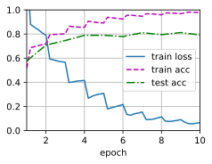
    


```python
#使用图像增广
train_with_data_aug(train_augs, test_augs, net)
```

    loss 0.062, train acc 0.979, test acc 0.855
    28.2 examples/sec on [device(type='cpu')]
    


    
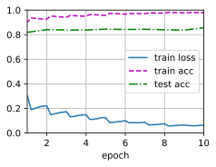
    


### 练习13.1.2

在基于CIFAR-10数据集的模型训练中结合多种不同的图像增广方法。它能提高测试准确性吗？

**解答：**

&emsp;&emsp;在基于CIFAR-10数据集的模型训练中使用多种不同的图像增强方法可以显著提高测试准确性。因为当加入了噪音或者反转,模型的训练会有更好的泛化能力,我们加入了噪音对于没有本身没有噪音的图像反而更容易进行识别。


```python
augs = torchvision.transforms.Compose([
    torchvision.transforms.RandomRotation(degrees=(-10, 10)),   # 随机旋转，-10到10度之间随机选
    torchvision.transforms.RandomHorizontalFlip(p=0.5),         # 随机水平翻转 选择一个概率概率
    torchvision.transforms.RandomVerticalFlip(p=0.5),           # 随机垂直翻转
    torchvision.transforms.ToTensor(),          # 将PIL Image或numpy.ndarray转换为tensor，并归一化到[0,1]之间
])
train_with_data_aug(augs, test_augs, net)
```

    loss 0.447, train acc 0.843, test acc 0.804
    33.6 examples/sec on [device(type='cpu')]
    


    
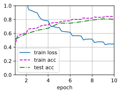
    


### 练习13.1.3

参阅深度学习框架的在线文档。它还提供了哪些其他的图像增广方法？

**解答：**

&emsp;&emsp;下面列举了部分常见的图像增广的方法：裁剪、翻转和旋转、图像变化等。
- 裁剪（Crop）
    - 中心裁剪：transforms.CenterCrop 
    - 随机裁剪：transforms.RandomCrop 
    - 随机长宽比裁剪：transforms.RandomResizedCrop 
    - 上下左右中心裁剪：transforms.FiveCrop 
    - 上下左右中心裁剪后翻转（默认水平翻转）：transforms.TenCrop

- 翻转和旋转（Flip and Rotation） 
    - 依概率p(默认p=0.5) 水平翻转：transforms.RandomHorizontalFlip
    - 依概率p(默认p=0.5) 垂直翻转：transforms.RandomVerticalFlip
    - 随机旋转：transforms.RandomRotation

- 图像变换（resize） 
    - 标准化：transforms.Normalize 
    - 转为tensor，并归一化至[0-1]：transforms.ToTensor 
    - 填充：transforms.Pad 
    - 修改亮度、对比度和饱和度：transforms.ColorJitter 
    - 转灰度图：transforms.Grayscale 
    - 线性变换：transforms.LinearTransformation
    - 仿射变换：transforms.RandomAffine 
    - 依概率p转为灰度图：transforms.RandomGrayscale 
    - 将数据转换为PILImage：transforms.ToPILImage

详细内容见参考资料：

1. PyTorch官方文档：[https://pytorch.org/vision/stable/transforms.html#auto-augmentation](https://pytorch.org/vision/stable/transforms.html#auto-augmentation)

2. imgug库（提供了多种图片增强的方法并进行了可视化）：[https://github.com/aleju/imgaug#documentation](https://github.com/aleju/imgaug#documentation)：

3. 数据增强应用：[https://zhuanlan.zhihu.com/p/398245376](https://zhuanlan.zhihu.com/p/398245376)

## 13.2 微调

### 练习13.2.1

继续提高`finetune_net`的学习率，模型的准确性如何变化？

**解答：**

&emsp;&emsp;将`finetune_net`模型的学习率分别设为$5\times10^{-5}$、$5\times10^{-4}$和$5\times10^{-3}$，通过对比发现当模型的学习率较大时，可能导致训练过程中的震荡或发散，从而使模型无法收敛或收敛到不理想的解决方案。


```python
%matplotlib inline
import os
import torch
import torchvision
from torch import nn
from d2l import torch as d2l
```


```python
#获取并读取数据集
d2l.DATA_HUB['hotdog'] = (d2l.DATA_URL + 'hotdog.zip',
                         'fba480ffa8aa7e0febbb511d181409f899b9baa5')

data_dir = d2l.download_extract('hotdog')
train_imgs = torchvision.datasets.ImageFolder(os.path.join(data_dir, 'train'))
test_imgs = torchvision.datasets.ImageFolder(os.path.join(data_dir, 'test'))
```


```python
# 使用三个RGB通道的均值和标准偏差，以标准化每个通道
normalize = torchvision.transforms.Normalize(
    [0.485, 0.456, 0.406], [0.229, 0.224, 0.225])

train_augs = torchvision.transforms.Compose([
    torchvision.transforms.RandomResizedCrop(224),
    torchvision.transforms.RandomHorizontalFlip(),
    torchvision.transforms.ToTensor(),
    normalize])

test_augs = torchvision.transforms.Compose([
    torchvision.transforms.Resize(256),
    torchvision.transforms.CenterCrop(224),
    torchvision.transforms.ToTensor(),
    normalize])
```


```python
# 定义初始模型并微调
pretrained_net = torchvision.models.resnet18(pretrained=True)
def train_fine_tuning(net, learning_rate, batch_size=128, num_epochs=5,
                      param_group=True):
    train_iter = torch.utils.data.DataLoader(torchvision.datasets.ImageFolder(
        os.path.join(data_dir, 'train'), transform=train_augs),
        batch_size=batch_size, shuffle=True)
    test_iter = torch.utils.data.DataLoader(torchvision.datasets.ImageFolder(
        os.path.join(data_dir, 'test'), transform=test_augs),
        batch_size=batch_size)
    devices = d2l.try_all_gpus()
    loss = nn.CrossEntropyLoss(reduction="none")
    if param_group: # 如果 `param_group=True`，输出层中的模型参数将使用十倍的学习率
        params_1x = [param for name, param in net.named_parameters()
             if name not in ["fc.weight", "fc.bias"]]
        trainer = torch.optim.SGD([{'params': params_1x},
                                   {'params': net.fc.parameters(),
                                    'lr': learning_rate * 10}],
                                lr=learning_rate, weight_decay=0.001)
    else:
        trainer = torch.optim.SGD(net.parameters(), lr=learning_rate,
                                  weight_decay=0.001)
    d2l.train_ch13(net, train_iter, test_iter, loss, trainer, num_epochs,
                   devices)
```


```python
#学习率5e-5
finetune_net = torchvision.models.resnet18(pretrained=True)
finetune_net.fc = nn.Linear(finetune_net.fc.in_features, 2)
nn.init.xavier_uniform_(finetune_net.fc.weight);

train_fine_tuning(finetune_net, 5e-5)
```

    loss 0.197, train acc 0.929, test acc 0.936
    5.7 examples/sec on [device(type='cpu')]
    


    
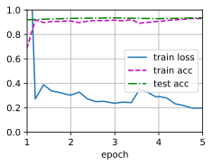
    


```python
#学习率5e-4
finetune_net = torchvision.models.resnet18(pretrained=True)
finetune_net.fc = nn.Linear(finetune_net.fc.in_features, 2)
nn.init.xavier_uniform_(finetune_net.fc.weight);

train_fine_tuning(finetune_net, 5e-4)
```

    loss 0.969, train acc 0.562, test acc 0.614
    5.5 examples/sec on [device(type='cpu')]
    


    
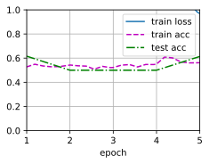
    


```python
#学习率5e-3
finetune_net = torchvision.models.resnet18(pretrained=True)
finetune_net.fc = nn.Linear(finetune_net.fc.in_features, 2)
nn.init.xavier_uniform_(finetune_net.fc.weight);

train_fine_tuning(finetune_net, 5e-3)
```

    loss 0.584, train acc 0.765, test acc 0.781
    5.3 examples/sec on [device(type='cpu')]
    


    
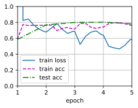
    


### 练习13.2.2

在比较实验中进一步调整`finetune_net`和`scratch_net`的超参数。它们的准确性还有不同吗？

**解答：**

&emsp;&emsp;模型中有多个超参数，我们这里仅探究`param_group`参数的影响，`param_group`参数将输出层的学习率设置为原先的10倍。

&emsp;&emsp;在其它超参数相同的情况下，将`finetune_net`模型或`scratch_net`模型的超参数`param_group`设置为True，模型在训练集和测试集上的精度均有所下降。


```python
#微调分类层：原先的
finetune_net = torchvision.models.resnet18(pretrained=True)
finetune_net.fc = nn.Linear(finetune_net.fc.in_features, 2)
nn.init.xavier_uniform_(finetune_net.fc.weight);

train_fine_tuning(finetune_net, 5e-5, param_group=False)
```

    loss 0.189, train acc 0.931, test acc 0.936
    7.2 examples/sec on [device(type='cpu')]
    


    
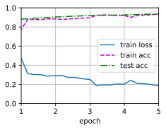
    


```python
#微调分类层：param_group设置为True
finetune_net = torchvision.models.resnet18(pretrained=True)
finetune_net.fc = nn.Linear(finetune_net.fc.in_features, 2)
nn.init.xavier_uniform_(finetune_net.fc.weight);

train_fine_tuning(finetune_net, 5e-5, param_group=True)
```

    loss 0.187, train acc 0.925, test acc 0.927
    7.3 examples/sec on [device(type='cpu')]
    


    
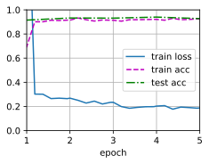
    


```python
#微调全部层：原先的
scratch_net = torchvision.models.resnet18()
scratch_net.fc = nn.Linear(scratch_net.fc.in_features, 2)
train_fine_tuning(scratch_net, 5e-4)
```

    loss 0.451, train acc 0.802, test acc 0.802
    7.3 examples/sec on [device(type='cpu')]
    


    
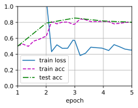
    


```python
#微调全部层：param_group=False
scratch_net = torchvision.models.resnet18()
scratch_net.fc = nn.Linear(scratch_net.fc.in_features, 2)
train_fine_tuning(scratch_net, 5e-4, param_group=False)
```

    loss 0.373, train acc 0.838, test acc 0.839
    7.3 examples/sec on [device(type='cpu')]
    


    
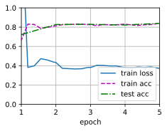
    


### 练习13.2.3

将输出层`finetune_net`之前的参数设置为源模型的参数，在训练期间不要更新它们。模型的准确性如何变化？提示：可以使用以下代码。

```python
for param in finetune_net.parameters():
    param.requires_grad = False
```

**解答：**

&emsp;&emsp;通过将输出层之前的参数设置为源模型的参数，并在训练期间不更新它们，可以实现迁移学习中的参数冻结。这样做的目的是保持源模型的知识，并在新任务上利用这些已经学习到的特征。

&emsp;&emsp;提示代码可以将`finetune_net`模型中输出层之前的所有参数的`requires_grad`属性设置为`False`，从而禁用它们的梯度计算和更新。这意味着在训练过程中，这些参数将保持不变，这样可以更好地保留源模型的知识，同时允许新模型专注于学习目标任务的特定特征。


```python
def train_fine_tuning(net, learning_rate, batch_size=128, num_epochs=5,
                      param_group=True):
    train_iter = torch.utils.data.DataLoader(torchvision.datasets.ImageFolder(
        os.path.join(data_dir, 'train'), transform=train_augs),
        batch_size=batch_size, shuffle=True)
    test_iter = torch.utils.data.DataLoader(torchvision.datasets.ImageFolder(
        os.path.join(data_dir, 'test'), transform=test_augs),
        batch_size=batch_size)
    devices = d2l.try_all_gpus()
    loss = nn.CrossEntropyLoss(reduction="none")
    if param_group:
        params_lx = []
        for name, param in net.named_parameters():
            if name not in ["fc.weight", "fc.bias"]:
                params_lx.append(param)
                param.requires_grad = False #不更新参数  
        trainer = torch.optim.SGD([{'params': params_lx},
                                   {'params': net.fc.parameters(),
                                    'lr': learning_rate * 10}],
                                lr=learning_rate, weight_decay=0.001)
    else:
        trainer = torch.optim.SGD(net.parameters(), lr=learning_rate,
                                  weight_decay=0.001)
    d2l.train_ch13(net, train_iter, test_iter, loss, trainer, num_epochs,devices)
```


```python
#微调分类层
finetune_net = torchvision.models.resnet18(pretrained=True)
finetune_net.fc = nn.Linear(finetune_net.fc.in_features, 2)
nn.init.xavier_uniform_(finetune_net.fc.weight);

train_fine_tuning(finetune_net, 5e-5)
```

    loss 0.287, train acc 0.903, test acc 0.922
    20.2 examples/sec on [device(type='cpu')]
    


    
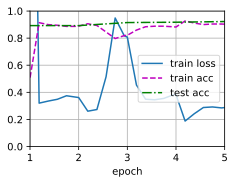
    


### 练习13.2.4

事实上，`ImageNet`数据集中有一个“热狗”类别。我们可以通过以下代码获取其输出层中的相应权重参数，但是我们怎样才能利用这个权重参数？

```python
weight = pretrained_net.fc.weight
hotdog_w = torch.split(weight.data, 1, dim=0)[934]
hotdog_w.shape
```

**解答：**

由题目可知`hotdog_w`是`resnet18`模型的输出层中预测类别为“热狗”的权重参数，`finetuning_net`模型输出层中预测类别为“热狗”的权重参数可以复用`hotdog_w`，具体代码如下：


```python
#获取预训练模型“热狗”类别输出层的参数
pretrained_net = torchvision.models.resnet18(pretrained=True)
weight = pretrained_net.fc.weight
hotdog_w = torch.split(weight.data, 1, dim=0)[934]

finetune_net = torchvision.models.resnet18(pretrained=True)

finetune_net.fc = nn.Linear(finetune_net.fc.in_features, 2)
nn.init.xavier_uniform_(finetune_net.fc.weight)
finetuning_net.fc.weight.data[0]= hotdogs_w.data.reshape(-1)#关键代码

train_fine_tuning(finetune_net, 5e-5)
```

## 13.3 目标检测和边界框

### 练习13.3.1

找到另一张图像，然后尝试标记包含该对象的边界框。比较标注边界框和标注类别哪个需要更长的时间？

**解答：**

&emsp;&emsp;标注边界框需要更长的时间。下面给出标记另一图像边界框的代码：


```python
import torch
from d2l import torch as d2l
d2l.set_figsize()
img = d2l.plt.imread('../img/cat2.jpg')
cat_bbox= [552.0, 335.0, 848.0, 1076.0]
boxes = torch.tensor([cat_bbox])#增加一个维度，批量大小为1
d2l.box_center_to_corner(d2l.box_corner_to_center(boxes)) == boxes
```


    tensor([[True, True, True, True]])


```python
fig = d2l.plt.imshow(img)
fig.axes.add_patch(d2l.bbox_to_rect(cat_bbox, 'blue'))
```


    <matplotlib.patches.Rectangle at 0x2718f06bfd0>


    
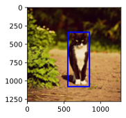
    


### 练习13.3.2

为什么`box_corner_to_center`和`box_center_to_corner`的输入参数的最内层维度总是4？

**解答：**

&emsp;&emsp;`box_corner_to_center`和`box_center_to_corner`是目标检测中常用的边界框坐标转换函数，用于在边界框的表示形式之间进行转换。这两个函数的输入参数的最内层维度总是4，是因为通常使用的边界框表示形式是基于矩形框的四个角点或中心点来定义的。

&emsp;&emsp;具体来说，这里的4代表了一个矩形框的四个坐标或尺寸信息，通常按照以下顺序排列：

- 对于`box_corner_to_center`函数，输入的边界框表示形式是基于四个角点（左上、右上、右下、左下）的坐标来定义的。因此，输入参数的最内层维度为[左上x，左上y，右下x，右下y]，其中x和y表示坐标轴的位置。

- 对于`box_center_to_corner`函数，输入的边界框表示形式是基于中心点坐标和边界框的宽度和高度来定义的。因此，输入参数的最内层维度为[中心点x，中心点y，宽度，高度]，其中x和y表示中心点的位置。

&emsp;&emsp;在具体的实现中，应该根据所使用的边界框表示形式来确定输入参数的维度和顺序。

## 13.4 锚框

### 练习13.4.1

在`multibox_prior`函数中更改`sizes`和`ratios`的值。生成的锚框有什么变化？

**解答：**

&emsp;&emsp;假设输入图像的高度为$h$，宽度为$w$。
我们以图像的每个像素为中心生成不同形状的锚框：*比例*为$s\in (0, 1]$，*宽高比*（宽高比）为$r > 0$。
那么**锚框的宽度和高度分别是$ws\sqrt{r}$和$hs/\sqrt{r}$。**

&emsp;&emsp;`multibox_prior`函数是目标检测中用于生成锚框（anchor boxes）的常用函数之一。通过更改`sizes`和`ratios`的值，可以影响生成的锚框的尺寸$s$和宽高比$r$。

- `sizes`参数控制生成的锚框的尺寸。它是一个包含多个正数的列表或数组，每个正数表示一个锚框的尺寸。更改`sizes`的值将导致生成的锚框在尺寸上发生变化。较大的尺寸值将生成更大的锚框，而较小的尺寸值将生成更小的锚框。

- `ratios`参数控制生成的锚框的宽高比。它是一个包含多个正数的列表或数组，每个正数表示一个锚框的宽高比。更改`ratios`的值将影响生成的锚框在宽高比上的分布。较高的比率值将生成更窄的锚框，而较低的比率值将生成更宽的锚框。

&emsp;&emsp;生成的锚框通常以一组默认的锚点（anchor points）为中心进行平移和缩放。这些默认的锚点通常是在图像网格中均匀分布的固定点。通过调整`sizes`和`ratios`，可以控制生成的锚框在不同尺度和宽高比上的分布，以适应不同大小和形状的目标。

### 练习13.4.2

构建并可视化两个IoU为0.5的边界框。它们是怎样重叠的？

**解答：**


```python
import matplotlib.pyplot as plt
import matplotlib.patches as patches
import warnings
warnings.filterwarnings("ignore")
def plot_boxes(boxes1, boxes2):
    fig, ax = plt.subplots()
    # 绘制第一个边界框
    rect1 = patches.Rectangle((boxes1[:,0], boxes1[:,1]), boxes1[:,2]-boxes1[:,0], boxes1[:,3]-boxes1[:,1], linewidth=2, edgecolor='r', facecolor='r',alpha=0.5)
    ax.add_patch(rect1)
    # 绘制第二个边界框
    rect2 = patches.Rectangle((boxes2[:,0], boxes2[:,1]), boxes2[:,2]-boxes2[:,0], boxes2[:,3]-boxes2[:,1], linewidth=2, edgecolor='b', facecolor='b',alpha=0.5)
    ax.add_patch(rect2)

    ax.set_xlim(0, 7)
    ax.set_ylim(0, 7)

    ax.set_xticks([0, 2, 4, 6])
    ax.set_yticks([0, 2, 4, 6])
    ax.set_xlabel('X')
    ax.set_ylabel('Y')
    ax.grid(True)
    plt.show()
def box_iou(boxes1, boxes2):
    """计算两个锚框或边界框列表中成对的交并比。"""
    box_area = lambda boxes: ((boxes[:, 2] - boxes[:, 0]) *
                              (boxes[:, 3] - boxes[:, 1]))
    # `boxes1`, `boxes2`, `areas1`, `areas2`的形状:
    # `boxes1`：(boxes1的数量, 4),
    # `boxes2`：(boxes2的数量, 4),
    # `areas1`：(boxes1的数量,),
    # `areas2`：(boxes2的数量,)
    areas1 = box_area(boxes1)
    areas2 = box_area(boxes2)
    #  `inter_upperlefts`, `inter_lowerrights`, `inters`的形状:
    # (boxes1的数量, boxes2的数量, 2)
    inter_upperlefts = torch.max(boxes1[:, None, :2], boxes2[:, :2])
    inter_lowerrights = torch.min(boxes1[:, None, 2:], boxes2[:, 2:])
    inters = (inter_lowerrights - inter_upperlefts).clamp(min=0)
    # `inter_areas` and `union_areas`的形状: (boxes1的数量, boxes2的数量)
    inter_areas = inters[:, :, 0] * inters[:, :, 1]
    union_areas = areas1[:, None] + areas2 - inter_areas
    return inter_areas / union_areas
```


```python
# 定义两个边界框列表并绘图
boxes1 = torch.tensor([[1,1,4,4]])
boxes2 = torch.tensor([[1.4,1,5,5]])
plot_boxes(boxes1, boxes2)
# 计算IoU
iou = box_iou(boxes1, boxes2)
print(iou)
```


    
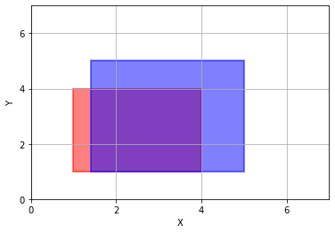
    


    tensor([[0.5000]])
    

### 练习13.4.3

在13.4.3节和13.4.4节中修改变量`anchors`，结果如何变化？

**解答：**

&emsp;&emsp;针对13.4.3节所用的算法，我们修改`anchors`的值，结果如下：


```python
%matplotlib inline
import torch
from d2l import torch as d2l
torch.set_printoptions(2)  # 精简打印精度

img = d2l.plt.imread('../img/catdog.jpg')
h, w = img.shape[:2]

X = torch.rand(size=(1, 3, h, w))
Y = d2l.multibox_prior(X, sizes=[0.75, 0.5, 0.25], ratios=[1, 2, 0.5])#生成多个锚框（批量大小，锚框的数量，4）
boxes = Y.reshape(h, w, 5, 4)

d2l.set_figsize()
bbox_scale = torch.tensor((w, h, w, h))#用于恢复原始坐标值
```


```python
#使用原始anchor参数的结果
ground_truth = torch.tensor([[0, 0.1, 0.08, 0.52, 0.92],
                         [1, 0.55, 0.2, 0.9, 0.88]])
anchors = torch.tensor([[0, 0.1, 0.2, 0.3], [0.15, 0.2, 0.4, 0.4],
                    [0.63, 0.05, 0.88, 0.98], [0.66, 0.45, 0.8, 0.8],
                    [0.57, 0.3, 0.92, 0.9]])

fig = d2l.plt.imshow(img)
d2l.show_bboxes(fig.axes, ground_truth[:, 1:] * bbox_scale, ['dog', 'cat'], 'k')
d2l.show_bboxes(fig.axes, anchors * bbox_scale, ['0', '1', '2', '3', '4']);
labels = d2l.multibox_target(anchors.unsqueeze(dim=0),
                         ground_truth.unsqueeze(dim=0))#根据狗和猫的真实边界框，标注这些锚框的分类和偏移量
print(labels[2])#第三个元素包含标记的输入锚框的类别，背景、狗和猫的类索引分别为0、1和2
```

    tensor([[0, 1, 2, 0, 2]])
    


    
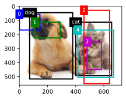
    


```python
#修改anchor参数的结果
ground_truth = torch.tensor([[0, 0.1, 0.08, 0.52, 0.92],
                         [1, 0.55, 0.2, 0.9, 0.88]])
anchors = torch.tensor([[0, 0.2, 0.3, 0.9], [0.15, 0.2, 0.4, 0.4],
                    [0.43, 0.25, 0.78, 0.88], [0.56, 0.35, 0.7, 0.7],
                    [0.47, 0.2, 0.82, 0.8]])

fig = d2l.plt.imshow(img)
d2l.show_bboxes(fig.axes, ground_truth[:, 1:] * bbox_scale, ['dog', 'cat'], 'k')
d2l.show_bboxes(fig.axes, anchors * bbox_scale, ['0', '1', '2', '3', '4']);
labels = d2l.multibox_target(anchors.unsqueeze(dim=0),
                         ground_truth.unsqueeze(dim=0))#根据狗和猫的真实边界框，标注这些锚框的分类和偏移量
print(labels[2])#第三个元素包含标记的输入锚框的类别，背景、狗和猫的类索引分别为0、1和2
```

    tensor([[1, 0, 0, 0, 2]])
    


    
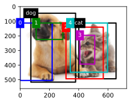
    


&emsp;&emsp;针对13.4.4节所用的算法，我们修改`anchors`的值，结果如下：


```python
anchors = torch.tensor([[0.1, 0.08, 0.52, 0.92], [0.08, 0.2, 0.56, 0.95],
                      [0.15, 0.3, 0.62, 0.91], [0.55, 0.2, 0.9, 0.88]])
offset_preds = torch.tensor([0] * anchors.numel())
cls_probs = torch.tensor([[0] * 4,  # 背景的预测概率
                      [0.9, 0.8, 0.7, 0.1],  # 狗的预测概率
                      [0.1, 0.2, 0.3, 0.9]])  # 猫的预测概率
output = d2l.multibox_detection(cls_probs.unsqueeze(dim=0),
                            offset_preds.unsqueeze(dim=0),
                            anchors.unsqueeze(dim=0),
                            nms_threshold=0.5)
fig = d2l.plt.imshow(img)
for i in output[0].detach().numpy():
    if i[0] == -1:
        continue
    label = ('dog=', 'cat=')[int(i[0])] + str(i[1])
    d2l.show_bboxes(fig.axes, [torch.tensor(i[2:]) * bbox_scale], label)
```


    
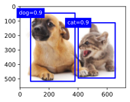
    


```python
anchors = torch.tensor([[0.1, 0.08, 0.52, 0.72], [0.18, 0.25, 0.56, 0.85],
                      [0.15, 0.3, 0.62, 0.91], [0.65, 0.2, 0.9, 0.88]])
offset_preds = torch.tensor([0] * anchors.numel())
cls_probs = torch.tensor([[0] * 4,  # 背景的预测概率
                      [0.9, 0.8, 0.7, 0.1],  # 狗的预测概率
                      [0.1, 0.2, 0.3, 0.9]])  # 猫的预测概率
output = d2l.multibox_detection(cls_probs.unsqueeze(dim=0),
                            offset_preds.unsqueeze(dim=0),
                            anchors.unsqueeze(dim=0),
                            nms_threshold=0.5)
fig = d2l.plt.imshow(img)
for i in output[0].detach().numpy():
    if i[0] == -1:
        continue
    label = ('dog=', 'cat=')[int(i[0])] + str(i[1])
    d2l.show_bboxes(fig.axes, [torch.tensor(i[2:]) * bbox_scale], label)
```


    
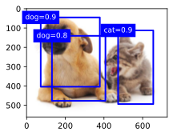
    


### 练习13.4.4                
                
非极大值抑制是一种贪心算法，它通过*移除*来抑制预测的边界框。是否存在一种可能，被移除的一些框实际上是有用的？如何修改这个算法来柔和地抑制？可以参考Soft-NMS。

**解答：**

&emsp;&emsp;非极大值抑制（Non-Maximum Suppression，NMS），它是一种常用于目标检测中的后处理技术，用于去除冗余的边界框。NMS的目标是选择具有最高置信度的边界框，并消除与其高度重叠的其他边界框。但确实存在一种情况，即一些被移除的边界框实际上可能是有用的。例如，在目标密集的场景中，一些预测可能被错误地视为冗余，但实际上代表了不同的目标实例。这可能导致漏检（missed detections）问题。

&emsp;&emsp;为了解决这个问题，提出了一种叫做Soft-NMS的改进版本。Soft-NMS旨在通过减小与高置信度边界框重叠的其他边界框的置信度来柔和地抑制它们，而不是完全移除它们。这样可以保留一些被抑制的边界框，以更好地捕捉目标检测中的细微变化。

&emsp;&emsp;Soft-NMS的主要思想是通过引入一个衰减函数，降低与高置信度边界框重叠的其他边界框的置信度。这样，即使边界框之间存在一定的重叠，仍然有机会保留一些低置信度的边界框。

&emsp;&emsp;在Soft-NMS中，算法的步骤如下：
1. 对所有的边界框按照置信度进行排序，选取置信度最高的边界框作为当前最佳边界框。
2. 对于与当前最佳边界框重叠超过一定阈值的其他边界框，使用衰减函数降低它们的置信度。
3. 重复步骤1和2，直到所有的边界框被处理完毕或达到停止条件。

&emsp;&emsp;通过**引入衰减函数**，Soft-NMS能够在一定程度上保留一些被抑制的边界框，从而提高对密集目标的检测能力。

### 练习13.4.5
        
如果非手动，非最大限度的抑制可以被学习吗？

**解答：**

&emsp;&emsp;非手动和非最大值抑制（Non-Maximum Suppression，NMS）可以通过机器学习方法进行学习。传统的NMS是一种手动设计的算法，它使用固定的阈值和规则来抑制冗余的边界框。一种常见的方法是将非最大值抑制作为一个模块嵌入到目标检测网络中，并与目标检测任务一起进行训练。这样，网络可以学习如何根据置信度、重叠度等因素来选择保留或抑制边界框。

&emsp;&emsp;可以使用以下方法之一来实现学习非最大值抑制：

1. End-to-End方法：将非最大值抑制集成到整个目标检测网络的训练过程中。在网络的输出中，除了目标类别和边界框的预测之外，还可以增加一个分支用于预测每个边界框的抑制得分。这样，网络可以通过端到端的训练来学习如何进行抑制，使得保留的边界框更加准确。

2. Two-Stage方法：这种方法包括两个阶段，首先进行候选框生成，然后应用非最大值抑制来筛选候选框。在第一个阶段，通过一个候选框生成网络生成大量的候选框。然后，在第二个阶段，通过训练一个辅助网络来学习非最大值抑制的策略，从候选框中选择最佳的边界框。

&emsp;&emsp;这些方法将非最大值抑制问题形式化为一个可以通过反向传播进行优化的学习任务。通过在目标检测网络中嵌入非最大值抑制的学习，可以根据具体任务和数据集的特点来自适应地选择保留或抑制边界框，从而提高目标检测的性能。学习非最大值抑制的方法需要足够的训练数据和计算资源，并且可能需要进行一定的调试和优化来获得最佳的结果。

## 13.5 多尺度目标检测

### 练习13.5.1

根据我们在7.1节中的讨论，深度神经网络学习图像特征级别抽象层次，随网络深度的增加而升级。在多尺度目标检测中，不同尺度的特征映射是否对应于不同的抽象层次？为什么？

**解答：**

&emsp;&emsp;在多尺度目标检测中，不同尺度的特征映射通常对应于不同的抽象层次。这是因为不同尺度的特征提取器在网络中的位置不同，而网络的层数会影响到特征提取器的感受野（receptive field）大小。

&emsp;&emsp;浅层的特征提取器通常具有较小的感受野，能够提取出图像的低级特征，如边缘、纹理等。随着网络的深入，特征提取器的感受野逐渐增大，能够捕捉更大范围的图像结构和语义信息，从而提取出更高级的特征，如物体的形状、部件等。

&emsp;&emsp;因此，在多尺度目标检测中，较浅层的特征映射通常对应于较低级的抽象层次，而较深层的特征映射对应于较高级的抽象层次。这种多尺度的特征映射组合可以有效地捕捉目标在不同尺度上的表征和上下文信息，提高目标检测的性能。

### 练习13.5.2

在13.5.1节中的实验里的第一个尺度（`fmap_w=4, fmap_h=4`）下，生成可能重叠的均匀分布的锚框。

**解答：**

&emsp;&emsp;我们通过调整`display_anchors`中的`s`参数实现：


```python
%matplotlib inline
import torch
from d2l import torch as d2l
def display_anchors(fmap_w, fmap_h, s):
    d2l.set_figsize()
    # 前两个维度上的值不影响输出
    fmap = torch.zeros((1, 10, fmap_h, fmap_w))
    anchors = d2l.multibox_prior(fmap, sizes=s, ratios=[1, 2, 0.5])
    bbox_scale = torch.tensor((w, h, w, h))
    d2l.show_bboxes(d2l.plt.imshow(img).axes,
                    anchors[0] * bbox_scale)
img = d2l.plt.imread('../img/catdog.jpg')
h, w = img.shape[:2]
display_anchors(fmap_w=4, fmap_h=4, s=[0.25])
```


    
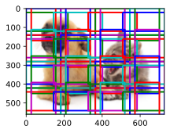
    


### 练习13.5.3

给定形状为$1 \times c \times h \times w$的特征图变量，其中$c$、$h$和$w$分别是特征图的通道数、高度和宽度。怎样才能将这个变量转换为锚框类别和偏移量？输出的形状是什么？

**解答：**

&emsp;&emsp;设每个像素生成$a$个锚框。目标类别的数量为$q$，则锚框类别数量为$q+1$，其中0类是背景。每个锚框对应四个偏移量。

锚框类别：首先通过卷积将特征图通道数变为$a \times  (q+1)$，后续输出维度的变换过程如下：
$$(1,a \times  (q+1),c,h)\longrightarrow(1,c\times h \times a \times  (q+1)) \longrightarrow (1,c \times h \times a,q+1)$$

偏移量：首先通过卷积将特征图通道数变为$4×a$，后续输出维度的变换过程如下：
$$(1,4 \times a,c,h)\longrightarrow(1,c\times h \times a)$$


```python
%matplotlib inline
import torch
import torchvision
from torch import nn
from torch.nn import functional as F
from d2l import torch as d2l
def cls_predictor(num_inputs, num_anchors, num_classes):
    return nn.Conv2d(num_inputs, num_anchors * (num_classes + 1),
                     kernel_size=1)
def bbox_predictor(num_inputs, num_anchors):
    return nn.Conv2d(num_inputs, num_anchors * 4, kernel_size=1)
def forward(x, block):
    return block(x)
def flatten_pred(pred):
    return torch.flatten(pred.permute(0, 2, 3, 1), start_dim=1)

X = torch.zeros((1, 8, 20, 20))
num_classes = 10
size = [0.2, 0.272, 0.37]
ratio = [1, 2, 0.5]
num_anchors = len(sizes) + len(ratios) - 1


cls_preds = forward(X,cls_predictor(8, num_anchors, num_classes))#输入通道数为8，输出通道为55（锚框数为5，类别数为10+1）
bbox_preds = forward(X,bbox_predictor(8, num_anchors))

cls_preds = flatten_pred(cls_preds)
cls_preds = cls_preds.reshape(
    cls_preds.shape[0], -1, num_classes + 1)
bbox_preds = flatten_pred(bbox_preds)
print(cls_preds.shape)
print(bbox_preds.shape)


```

    torch.Size([1, 2000, 11])
    torch.Size([1, 8000])
    

## 13.6 目标检测数据集

### 练习13.6.1

在香蕉检测数据集中演示其他带有真实边界框的图像。它们在边界框和目标方面有什么不同？

**解答：**

&emsp;&emsp;边界框的宽高比、缩放比和位置有所不同；目标图像中香蕉的旋转角度、大小和位置、光照等都有所不同。


```python
import torch
import torchvision
from torch import nn
from torch.nn import functional as F
from d2l import torch as d2l

batch_size, edge_size = 32, 256
train_iter, _ = d2l.load_data_bananas(batch_size)
batch = next(iter(train_iter))
batch[0].shape, batch[1].shape

imgs = (batch[0][11:21].permute(0, 2, 3, 1)) / 255
axes = d2l.show_images(imgs, 2, 5, scale=2)
for ax, label in zip(axes, batch[1][11:21]):
    d2l.show_bboxes(ax, [label[0][1:5] * edge_size], colors=['w'])
```

    read 1000 training examples
    read 100 validation examples
    


    
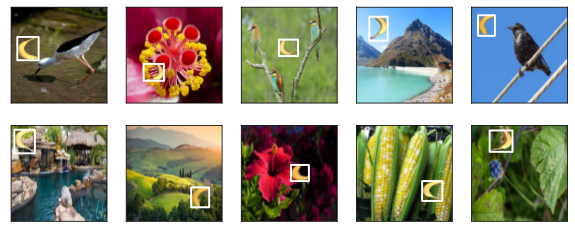
    


### 练习13.6.2

假设我们想要将数据增强（例如随机裁剪）应用于目标检测。它与图像分类中的有什么不同？提示：如果裁剪的图像只包含物体的一小部分会怎样？

**解答：**

当将数据增强技术应用于目标检测任务时，与图像分类任务相比，存在一些重要的区别。

- 目标完整性：在目标检测中，物体的完整性对于正确的目标定位和识别至关重要。如果随机裁剪的图像只包含物体的一小部分，可能会导致目标部分遗漏或缺失。这对目标检测算法的性能会产生负面影响，因为算法可能无法准确地定位和识别不完整的目标。

- 边界框更新：在图像分类中，数据增强通常只需要在图像上应用相同的变换，而不会修改类别标签。然而，在目标检测中，当应用裁剪等数据增强操作时，需要相应地更新目标的边界框。裁剪操作会改变目标在图像中的位置和大小，因此需要更新目标的边界框坐标以准确地反映裁剪后的图像。

- 多对象处理：目标检测通常涉及同时检测和识别图像中的多个对象。因此，在数据增强过程中，需要确保所有目标的完整性和可见性。随机裁剪等操作应考虑到所有目标的位置和大小，以确保不会遮挡或分割目标

## 13.7 单发多框检测（SSD）

### 练习13.7.1

能通过改进损失函数来改进单发多框检测吗？例如，将预测偏移量用到的$L_1$范数损失替换为平滑$L_1$范数损失。它在零点附近使用平方函数从而更加平滑，这是通过一个超参数$\sigma$来控制平滑区域的：

$$
f(x) =
    \begin{cases}
    (\sigma x)^2/2,& \text{if }|x| < 1/\sigma^2\\
    |x|-0.5/\sigma^2,& \text{otherwise}
    \end{cases}
$$

当$\sigma$非常大时，这种损失类似于$L_1$范数损失。当它的值较小时，损失函数较平滑。


```python
def smooth_l1(data, scalar):
    out = []
    for i in data:
        if abs(i) < 1 / (scalar ** 2):
            out.append(((scalar * i) ** 2) / 2)
        else:
            out.append(abs(i) - 0.5 / (scalar ** 2))
    return torch.tensor(out)

sigmas = [10, 1, 0.5]
lines = ['-', '--', '-.']
x = torch.arange(-2, 2, 0.1)
d2l.set_figsize()

for l, s in zip(lines, sigmas):
    y = smooth_l1(x, scalar=s)
    d2l.plt.plot(x, y, l, label='sigma=%.1f' % s)
d2l.plt.legend();
```


    
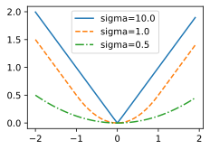
    


此外，在类别预测时，实验中使用了交叉熵损失：设真实类别$j$的预测概率是$p_j$，交叉熵损失为$-\log p_j$。我们还可以使用焦点损失。给定超参数$\gamma > 0$和$\alpha > 0$，此损失的定义为：

$$ - \alpha (1-p_j)^{\gamma} \log p_j.$$

可以看到，增大$\gamma$可以有效地减少正类预测概率较大时（例如$p_j > 0.5$）的相对损失，因此训练可以更集中在那些错误分类的困难示例上。


```python
def focal_loss(gamma, x):
    return -(1 - x) ** gamma * torch.log(x)

x = torch.arange(0.01, 1, 0.01)
for l, gamma in zip(lines, [0, 1, 5]):
    y = d2l.plt.plot(x, focal_loss(gamma, x), l, label='gamma=%.1f' % gamma)
d2l.plt.legend();
```


    
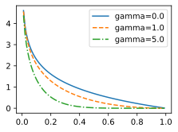
    


**解答：**

&emsp;&emsp;将预测偏移量用到的$L_1$范数损失替换为平滑$L_1$范数损失，将类别预测用到的交叉熵损失替换为焦点损失。

&emsp;&emsp;设置平滑$L_1$范数的参数$\sigma$为2；焦点损失的参数$\alpha$为0.25，$\gamma$为2进行
实验如下：


```python
%matplotlib inline
import torch
import torchvision
from torch import nn
from torch.nn import functional as F
from d2l import torch as d2l
```


```python
#类别预测层
def cls_predictor(num_inputs, num_anchors, num_classes):
    return nn.Conv2d(num_inputs, num_anchors * (num_classes + 1),
                     kernel_size=3, padding=1)
#边框预测层
def bbox_predictor(num_inputs, num_anchors):
    return nn.Conv2d(num_inputs, num_anchors * 4, kernel_size=3, padding=1)
#连结多尺度的预测
def flatten_pred(pred):
    return torch.flatten(pred.permute(0, 2, 3, 1), start_dim=1)
def concat_preds(preds):
    return torch.cat([flatten_pred(p) for p in preds], dim=1)
#高和宽减半块
def down_sample_blk(in_channels, out_channels):
    blk = []
    for _ in range(2):
        blk.append(nn.Conv2d(in_channels, out_channels,
                             kernel_size=3, padding=1))
        blk.append(nn.BatchNorm2d(out_channels))
        blk.append(nn.ReLU())
        in_channels = out_channels
    blk.append(nn.MaxPool2d(2))
    return nn.Sequential(*blk)

#基本网络块
def base_net():
    blk = []
    num_filters = [3, 16, 32, 64]
    for i in range(len(num_filters) - 1):
        blk.append(down_sample_blk(num_filters[i], num_filters[i+1]))
    return nn.Sequential(*blk)


#完整的单发多框检测模型由五个模块组成
def get_blk(i):
    if i == 0:
        blk = base_net()
    elif i == 1:
        blk = down_sample_blk(64, 128)
    elif i == 4:
        blk = nn.AdaptiveMaxPool2d((1,1))
    else:
        blk = down_sample_blk(128, 128)
    return blk
#为每个块定义前向传播
def blk_forward(X, blk, size, ratio, cls_predictor, bbox_predictor):
    Y = blk(X)
    anchors = d2l.multibox_prior(Y, sizes=size, ratios=ratio)
    cls_preds = cls_predictor(Y)
    bbox_preds = bbox_predictor(Y)
    return (Y, anchors, cls_preds, bbox_preds)
#超参数
sizes = [[0.2, 0.272], [0.37, 0.447], [0.54, 0.619], [0.71, 0.79],
         [0.88, 0.961]]
ratios = [[1, 2, 0.5]] * 5
num_anchors = len(sizes[0]) + len(ratios[0]) - 1
#完整模型
class TinySSD(nn.Module):
    def __init__(self, num_classes, **kwargs):
        super(TinySSD, self).__init__(**kwargs)
        self.num_classes = num_classes
        idx_to_in_channels = [64, 128, 128, 128, 128]
        for i in range(5):
            # 即赋值语句 `self.blk_i = get_blk(i)`
            setattr(self, f'blk_{i}', get_blk(i))
            setattr(self, f'cls_{i}', cls_predictor(idx_to_in_channels[i],
                                                    num_anchors, num_classes))
            setattr(self, f'bbox_{i}', bbox_predictor(idx_to_in_channels[i],
                                                      num_anchors))

    def forward(self, X):
        anchors, cls_preds, bbox_preds = [None] * 5, [None] * 5, [None] * 5
        for i in range(5):
            # `getattr(self, 'blk_%d' % i)` 即访问 `self.blk_i`
            X, anchors[i], cls_preds[i], bbox_preds[i] = blk_forward(
                X, getattr(self, f'blk_{i}'), sizes[i], ratios[i],
                getattr(self, f'cls_{i}'), getattr(self, f'bbox_{i}'))
        anchors = torch.cat(anchors, dim=1)
        cls_preds = concat_preds(cls_preds)
        cls_preds = cls_preds.reshape(
            cls_preds.shape[0], -1, self.num_classes + 1)
        bbox_preds = concat_preds(bbox_preds)
        return anchors, cls_preds, bbox_preds
```


```python
## 训练模型
#读取数据集
batch_size = 32
train_iter, _ = d2l.load_data_bananas(batch_size)
#初始化其参数并定义优化算法
device, net = d2l.try_gpu(), TinySSD(num_classes=1)
trainer = torch.optim.SGD(net.parameters(), lr=0.2, weight_decay=5e-4)

#评价函数
def cls_eval(cls_preds, cls_labels):
    # 由于类别预测结果放在最后一维， `argmax` 需要指定最后一维。
    return float((cls_preds.argmax(dim=-1).type(
        cls_labels.dtype) == cls_labels).sum())
def bbox_eval(bbox_preds, bbox_labels, bbox_masks):
    return float((torch.abs((bbox_labels - bbox_preds) * bbox_masks)).sum())
```

    read 1000 training examples
    read 100 validation examples
    


```python
#定义损失函数
import torch
import torch.nn as nn
import torch.nn.functional as F

class FocalLoss(nn.Module):
    def __init__(self, alpha=0.25, gamma=2.0, reduction='mean'):
        super(FocalLoss, self).__init__()
        self.alpha = alpha
        self.gamma = gamma
        self.reduction = reduction

    def forward(self, input, target):
        log_probs = F.log_softmax(input, dim=1)
        probs = torch.exp(log_probs)
        pt = probs.gather(1, target.view(-1, 1))
        focal_weights = (self.alpha * (1 - pt) ** self.gamma).view(-1)
        loss = F.nll_loss(log_probs, target, reduction='none')
        weighted_loss = focal_weights * loss

        if self.reduction == 'mean':
            return weighted_loss.mean()
        elif self.reduction == 'sum':
            return weighted_loss.sum()
        else:
            return weighted_loss

class SmoothL1Loss(nn.Module):
    def __init__(self, sigma=1,reduction='mean'):
        super(SmoothL1Loss, self).__init__()
        self.sigma = sigma
        self.reduction = reduction

    def forward(self, input, target):
        diff = torch.abs(input - target)
        loss = torch.where(diff < 1/self.sigma**2, 0.5 * (self.sigma*diff) ** 2, diff - 0.5/self.sigma**2)
        
        if self.reduction == 'mean':
            return loss.mean()
        elif self.reduction == 'sum':
            return loss.sum()
        else:
            return loss

cls_loss = FocalLoss(alpha=0.25, gamma=2.0, reduction='None')
bbox_loss =SmoothL1Loss(sigma= 2,reduction='None')

def calc_loss(cls_preds, cls_labels, bbox_preds, bbox_labels, bbox_masks):
    batch_size, num_classes = cls_preds.shape[0], cls_preds.shape[2]
    cls = cls_loss(cls_preds.reshape(-1, num_classes),
                   cls_labels.reshape(-1)).reshape(batch_size, -1).mean(dim=1)
    bbox = bbox_loss(bbox_preds * bbox_masks,
                     bbox_labels * bbox_masks).mean(dim=1)
    return cls + bbox
```


```python
#训练函数
num_epochs, timer = 20, d2l.Timer()
animator = d2l.Animator(xlabel='epoch', xlim=[1, num_epochs],
                        legend=['class error', 'bbox mae'])
net = net.to(device)
for epoch in range(num_epochs):
    # 训练精确度的和，训练精确度的和中的示例数
    # 绝对误差的和，绝对误差的和中的示例数
    metric = d2l.Accumulator(4)
    net.train()
    for features, target in train_iter:
        timer.start()
        trainer.zero_grad()
        X, Y = features.to(device), target.to(device)
        # 生成多尺度的锚框，为每个锚框预测类别和偏移量
        anchors, cls_preds, bbox_preds = net(X)
        # 为每个锚框标注类别和偏移量
        bbox_labels, bbox_masks, cls_labels = d2l.multibox_target(anchors, Y)
        # 根据类别和偏移量的预测和标注值计算损失函数
        l = calc_loss(cls_preds, cls_labels, bbox_preds, bbox_labels,
                      bbox_masks)
        l.mean().backward()
        trainer.step()
        metric.add(cls_eval(cls_preds, cls_labels), cls_labels.numel(),
                   bbox_eval(bbox_preds, bbox_labels, bbox_masks),
                   bbox_labels.numel())
    cls_err, bbox_mae = 1 - metric[0] / metric[1], metric[2] / metric[3]
    animator.add(epoch + 1, (cls_err, bbox_mae))
print(f'class err {cls_err:.2e}, bbox mae {bbox_mae:.2e}')
print(f'{len(train_iter.dataset) / timer.stop():.1f} examples/sec on '
      f'{str(device)}')
```

    class err 3.93e-03, bbox mae 3.13e-03
    805.7 examples/sec on cpu
    


    
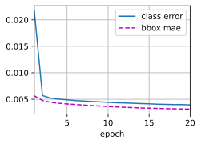
    


```python
X = torchvision.io.read_image('../img/banana.jpg').unsqueeze(0).float()
img = X.squeeze(0).permute(1, 2, 0).long()
#根据锚框及其预测偏移量得到预测边界框。然后，通过非极大值抑制来移除相似的预测边界框
def predict(X):
    net.eval()
    anchors, cls_preds, bbox_preds = net(X.to(device))
    cls_probs = F.softmax(cls_preds, dim=2).permute(0, 2, 1)
    output = d2l.multibox_detection(cls_probs, bbox_preds, anchors)
    idx = [i for i, row in enumerate(output[0]) if row[0] != -1]
    return output[0, idx]

output = predict(X)
#筛选所有置信度不低于0.9的边界框，做为最终输出
def display(img, output, threshold):
    d2l.set_figsize((5, 5))
    fig = d2l.plt.imshow(img)
    for row in output:
        score = float(row[1])
        if score < threshold:
            continue
        h, w = img.shape[0:2]
        bbox = [row[2:6] * torch.tensor((w, h, w, h), device=row.device)]
        d2l.show_bboxes(fig.axes, bbox, '%.2f' % score, 'w')

display(img, output.cpu(), threshold=0.9)
```


    
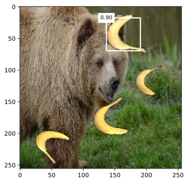
    


### 练习13.7.2

由于篇幅限制，我们在本节中省略了单发多框检测模型的一些实现细节。能否从以下几个方面进一步改进模型：

1. 当目标比图像小得多时，模型可以将输入图像调大；
2. 通常会存在大量的负锚框。为了使类别分布更加平衡，我们可以将负锚框的高和宽减半；
3. 在损失函数中，给类别损失和偏移损失设置不同比重的超参数；
4. 使用其他方法评估目标检测模型，例如单发多框检测论文 :cite:`Liu.Anguelov.Erhan.ea.2016`中的方法。

**解答：**


## 13.8 区域卷积神经网络（R-CNN）系列

### 练习13.8.1

我们能否将目标检测视为回归问题（例如预测边界框和类别的概率）？可以参考YOLO模型的设计。

**解答：**

&emsp;&emsp;目标检测可以被视为回归问题，其中边界框的坐标和目标的类别可以被预测为连续值。这类方法目前主要分为三个系列：YOLO系列、SSD系列和Anchor Free系列。

&emsp;&emsp;YOLO模型将目标检测问题直接视为一个回归问题。YOLO模型将图像划分为网格，并预测每个网格的边界框和类别的概率。对于每个边界框，YOLO模型通过回归预测其坐标和大小。此外，对于每个网格，模型还预测每个类别的置信度得分，表示该网格中是否包含该类别的目标。


### 练习13.8.2        
        
将单发多框检测与本节介绍的方法进行比较。他们的主要区别是什么？可以参考参考文献[195]中的图2。

**解答：**

[Zhao et al., 2019](https://arxiv.org/pdf/1807.05511.pdf&usg=ALkJrhhpApwNJOmg83O8p2Ua76PNh6tR8A)

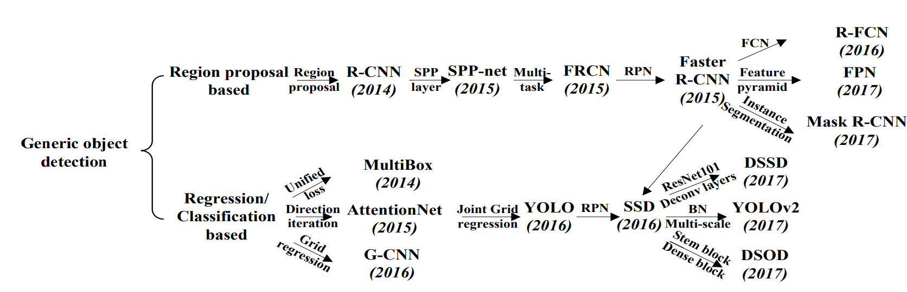

&emsp;&emsp;它们的区别主要体现在检测方式、速度和准确性、训练方式三个方面。
- 检测方式：

    - SSD是一种单阶段（one-stage）目标检测方法，它通过将不同尺度和比例的预定义锚框（anchor boxes）应用于图像的不同位置，直接回归目标的边界框位置和类别信息。
    - RCNN系列是两阶段（two-stage）目标检测方法的代表，其中包括R-CNN、Fast R-CNN、Faster R-CNN和Mask R-CNN等。这些方法首先在图像中生成候选区域（region proposals），然后对这些候选区域进行分类和边界框回归。

- 速度和准确性：

    - SSD是一种高速目标检测方法，因为它是单阶段的，并且在单次前向传播中同时执行分类和边界框回归。这种设计使得SSD在处理速度上相对较快，适用于实时应用和对速度要求较高的场景。然而，相对于RCNN系列，SSD在目标检测的准确性上可能会稍逊一筹。
    - RCNN系列虽然相对较慢，但在准确性上通常优于SSD。它的两阶段设计允许更精细的特征提取和候选区域的筛选，从而提高了目标检测的准确性。尤其是Mask R-CNN在实例分割任务上表现出色。

- 训练方式：

    - SSD使用硬负样本挖掘（Hard Negative Mining）来平衡正负样本的数量，并使用多尺度特征图来检测不同尺度的目标。
    - RCNN系列的训练过程包括候选区域生成和区域分类/边界框回归两个阶段。它们通常使用区域建议网络（Region Proposal Network，RPN）来生成候选区域，并使用RoI池化（Region of Interest pooling）等技术来提取区域特征。

&emsp;&emsp;总的来说，SSD适用于需要快速处理速度的实时应用场景，而RCNN系列则更适合对准确性要求较高的任务。

## 13.9 语义分割和数据集

### 练习13.9.1

如何在自动驾驶和医疗图像诊断中应用语义分割？还能想到其他领域的应用吗？

**解答：**

&emsp;&emsp;语义分割在自动驾驶和医疗图像诊断中有着广泛的应用，以及其他领域也可以采用语义分割技术。

1. 自动驾驶：语义分割可以用于场景理解和障碍物检测。通过将道路、行人、车辆等不同类别分割出来，可以更好地理解驾驶场景，并帮助自动驾驶系统做出相应的决策和规划。例如，可以利用语义分割来区分车道线、交通信号灯、行人等，以实现智能的驾驶行为。

2. 医疗图像诊断：语义分割在医疗图像诊断中扮演着重要的角色。它可以用于分割病变区域，例如肿瘤、病变组织或器官，以帮助医生进行准确的诊断和治疗。通过将医学图像中的不同结构和组织分割出来，医生可以更好地分析和理解病变的位置、大小和形状，以制定有效的治疗计划。

除了自动驾驶和医疗图像诊断，语义分割还有许多其他领域的应用，包括但不限于：

3. 视频分析：语义分割可以用于视频中的对象跟踪、行为分析和场景理解。通过对视频帧进行语义分割，可以更好地理解视频中不同对象的运动和交互关系，为视频分析和智能监控提供支持。

4. 农业和环境监测：语义分割可以帮助农业领域和环境监测中的作物检测、土地利用分类、植被监测等任务。通过对遥感图像或无人机采集的图像进行语义分割，可以获得关于作物类型、土地利用情况和植被覆盖等信息，以支持精细化农业管理和环境保护。

5. 增强现实和虚拟现实：语义分割可以为增强现实和虚拟现实应用提供空间理解和交互性。通过对实时摄像头或虚拟场景中的图像进行语义分割，可以识别和分割出不同的物体、表面和环境元素，从而实现更逼真和交互性的增强现实和虚拟现实体验。

### 练习13.9.2

回想一下13.1节中对数据增强的描述。图像分类中使用的哪种图像增强方法是难以用于语义分割的？

**解答：**

&emsp;&emsp;在图像分类中使用的一种常见的图像增强方法是随机裁剪（Random Crop）。这种方法通过在图像中随机选择一个区域并进行裁剪，从而增加数据的多样性和泛化能力。然而，这种随机裁剪的方法在语义分割中是难以直接应用的。因为在语义分割任务中，我们不仅需要对图像进行裁剪，还需要相应地对标签（分割掩码）进行裁剪，以确保标签与图像保持对应关系。而随机裁剪会导致图像和标签的不对齐，破坏了语义分割的正确性。

## 13.10 转置卷积

### 练习13.10.1

在13.10.3节中，卷积输入`X`和转置的卷积输出`Z`具有相同的形状。他们的数值也相同吗？为什么？

**解答：**

&emsp;&emsp;他们的数值不相同因为卷积操作和转置卷积操作在计算上是不可逆的过程。卷积操作会导致信息的损失和降采样，而转置卷积操作会引入插值和填充过程，导致输出中存在更多的细节和估计。


```python
import torch
from torch import nn
from d2l import torch as d2l
```

    d:\python38\lib\site-packages\numpy\_distributor_init.py:30: UserWarning: loaded more than 1 DLL from .libs:
    d:\python38\lib\site-packages\numpy\.libs\libopenblas.4SP5SUA7CBGXUEOC35YP2ASOICYYEQZZ.gfortran-win_amd64.dll
    d:\python38\lib\site-packages\numpy\.libs\libopenblas.EL2C6PLE4ZYW3ECEVIV3OXXGRN2NRFM2.gfortran-win_amd64.dll
      warnings.warn("loaded more than 1 DLL from .libs:"
    


```python
def trans_conv(X, K):
    h, w = K.shape
    Y = torch.zeros((X.shape[0] + h - 1, X.shape[1] + w - 1))
    for i in range(X.shape[0]):
        for j in range(X.shape[1]):
            Y[i: i + h, j: j + w] += X[i, j] * K
    return Y
```


```python
X = torch.arange(9.0).reshape(3, 3)
K = torch.tensor([[1.0, 2.0], [3.0, 4.0]])
Y = d2l.corr2d(X, K)
Z = trans_conv(Y, K)
Z
```


    tensor([[ 27.,  91.,  74.],
            [138., 400., 282.],
            [171., 429., 268.]])


```python
X
```


    tensor([[0., 1., 2.],
            [3., 4., 5.],
            [6., 7., 8.]])


### 练习13.10.2
        
1. 使用矩阵乘法来实现卷积是否有效率？为什么？

**解答：**

&emsp;&emsp;使用矩阵乘法来实现卷积并不是最有效的方式，因为卷积操作具有稀疏性和权值共享的特点，而矩阵乘法没有充分利用这些特性。

&emsp;&emsp;卷积操作中的卷积核是局部连接的，即每个输出位置仅与输入的局部区域相连。这导致了输入和输出矩阵的稀疏性，因为它们大部分元素是零。在矩阵乘法中，需要对输入矩阵和卷积核矩阵进行完整的乘法运算，而对于稀疏矩阵来说，这将导致大量的冗余计算。

&emsp;&emsp;卷积操作还利用了权值共享的概念，即卷积核的权值在整个输入上是共享的。这意味着在计算卷积操作时，可以重复使用相同的权值，减少了计算量。然而，在矩阵乘法中，每个权值都需要在乘法过程中进行完整计算，没有利用权值共享的优势。

## 13.11 全卷积网络

### 练习13.11.1

如果将转置卷积层改用Xavier随机初始化，结果有什么变化？

**解答：**


```python
%matplotlib inline
import torch
import torchvision
from torch import nn
from torch.nn import functional as F
from d2l import torch as d2l
```


```python
pretrained_net = torchvision.models.resnet18(pretrained=True)
net = nn.Sequential(*list(pretrained_net.children())[:-2])
num_classes = 21
net.add_module('final_conv', nn.Conv2d(512, num_classes, kernel_size=1))#1×1卷积
net.add_module('transpose_conv', nn.ConvTranspose2d(num_classes, num_classes,
                                    kernel_size=64, padding=16, stride=32))#转置卷积
```


```python
def bilinear_kernel(in_channels, out_channels, kernel_size):
    factor = (kernel_size + 1) // 2
    if kernel_size % 2 == 1:
        center = factor - 1
    else:
        center = factor - 0.5
    og = (torch.arange(kernel_size).reshape(-1, 1),
          torch.arange(kernel_size).reshape(1, -1))
    filt = (1 - torch.abs(og[0] - center) / factor) * \
           (1 - torch.abs(og[1] - center) / factor)
    weight = torch.zeros((in_channels, out_channels,
                          kernel_size, kernel_size))
    weight[range(in_channels), range(out_channels), :, :] = filt
    return weight
def loss(inputs, targets):
    return F.cross_entropy(inputs, targets, reduction='none').mean(1).mean(1)
```


```python
conv_trans = nn.ConvTranspose2d(3, 3, kernel_size=4, padding=1, stride=2,
                                bias=False)
nn.init.xavier_uniform_(conv_trans.weight)
#conv_trans.weight.data.copy_(bilinear_kernel(3, 3, 4));

batch_size, crop_size = 32, (320, 480)
train_iter, test_iter = d2l.load_data_voc(batch_size, crop_size)


num_epochs, lr, wd, devices = 5, 0.001, 1e-3, d2l.try_all_gpus()
trainer = torch.optim.SGD(net.parameters(), lr=lr, weight_decay=wd)
d2l.train_ch13(net, train_iter, test_iter, loss, trainer, num_epochs, devices)
```

    loss 1.491, train acc 0.728, test acc 0.728
    3.8 examples/sec on [device(type='cpu')]
    


    
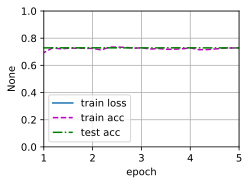
    


### 练习13.11.2

调节超参数，能进一步提升模型的精度吗？

**解答：**

&emsp;&emsp;不采用权重衰退的结果如下。


```python
%matplotlib inline
import torch
import torchvision
from torch import nn
from torch.nn import functional as F
from d2l import torch as d2l

pretrained_net = torchvision.models.resnet18(pretrained=True)
net = nn.Sequential(*list(pretrained_net.children())[:-2])
num_classes = 21
net.add_module('final_conv', nn.Conv2d(512, num_classes, kernel_size=1))#1×1卷积
net.add_module('transpose_conv', nn.ConvTranspose2d(num_classes, num_classes,
                                    kernel_size=64, padding=16, stride=32))#转置卷积

pretrained_net = torchvision.models.resnet18(pretrained=True)
net = nn.Sequential(*list(pretrained_net.children())[:-2])
num_classes = 21
net.add_module('final_conv', nn.Conv2d(512, num_classes, kernel_size=1))#1×1卷积
net.add_module('transpose_conv', nn.ConvTranspose2d(num_classes, num_classes,
                                    kernel_size=64, padding=16, stride=32))#转置卷积

conv_trans = nn.ConvTranspose2d(3, 3, kernel_size=4, padding=1, stride=2,
                                bias=False)
#nn.init.xavier_uniform_(conv_trans.weight)
conv_trans.weight.data.copy_(bilinear_kernel(3, 3, 4));

batch_size, crop_size = 32, (320, 480)
train_iter, test_iter = d2l.load_data_voc(batch_size, crop_size)


num_epochs, lr, wd, devices = 5, 0.001, 0, d2l.try_all_gpus()#不采用权重衰退
trainer = torch.optim.SGD(net.parameters(), lr=lr, weight_decay=wd)
d2l.train_ch13(net, train_iter, test_iter, loss, trainer, num_epochs, devices)
```

    loss 1.490, train acc 0.728, test acc 0.728
    3.7 examples/sec on [device(type='cpu')]
    


    
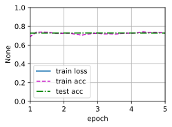
    


### 练习13.11.3

预测测试图像中所有像素的类别。

**解答：**


```python
def predict(img):
    X = test_iter.dataset.normalize_image(img).unsqueeze(0)
    pred = net(X.to(devices[0])).argmax(dim=1)
    return pred.reshape(pred.shape[1], pred.shape[2])
```


```python
def label2image(pred):
    colormap = torch.tensor(d2l.VOC_COLORMAP, device=devices[0])
    X = pred.long()
    return colormap[X, :]
```


```python
voc_dir = d2l.download_extract('voc2012', 'VOCdevkit/VOC2012')
test_images, test_labels = d2l.read_voc_images(voc_dir, False)
```


```python
n, imgs = 4, []
for i in range(n):
    crop_rect = (0, 0, 320, 480)
    #X = torchvision.transforms.functional.crop(test_images[i], *crop_rect)
    X = test_images[i]#预测所有像素的类别

    pred = label2image(predict(X))
    imgs += [X.permute(1,2,0), pred.cpu(),
                 test_labels[i].permute(1,2,0)]
A = imgs[::3] + imgs[1::3] + imgs[2::3]
d2l.show_images([i.to(torch.float32) for i in A], 3, n, scale=2);
```


    
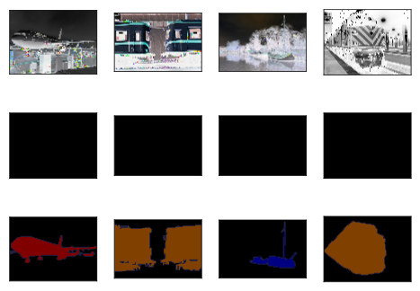
    


### 练习13.11.4

最初的全卷积网络的论文中还使用了某些卷积神经网络中间层的输出。试着实现这个想法。

**解答：**

&emsp;&emsp;我们可以将卷积神经网络的中间层输出与转置卷积层的输出进行融合，下面采用逐元素相加的方式进行融合。


```python
import torch
import torch.nn as nn

class FCN(nn.Module):
    def __init__(self, num_classes):
        super(FCN, self).__init__()
        # Encoder部分
        self.encoder_conv1 = nn.Conv2d(3, 64, kernel_size=3, padding=1)
        self.encoder_conv2 = nn.Conv2d(64, 128, kernel_size=3, padding=1)
        self.encoder_conv3 = nn.Conv2d(128, 256, kernel_size=3, padding=1)
        # ...
        
        # Decoder部分，使用转置卷积层进行上采样
        self.decoder_conv1 = nn.ConvTranspose2d(256, 128, kernel_size=2, stride=2)
        self.decoder_conv2 = nn.ConvTranspose2d(128, 64, kernel_size=2, stride=2)
        self.decoder_conv3 = nn.ConvTranspose2d(64, num_classes, kernel_size=2, stride=2)
        
        # 跳跃连接部分
        self.skip_conv1 = nn.Conv2d(64, num_classes, kernel_size=1)
        self.skip_conv2 = nn.Conv2d(128, num_classes, kernel_size=1)
        self.skip_conv3 = nn.Conv2d(256, num_classes, kernel_size=1)

    def forward(self, x):
        # Encoder部分
        x1 = torch.relu(self.encoder_conv1(x))
        x2 = torch.relu(self.encoder_conv2(x1))
        x3 = torch.relu(self.encoder_conv3(x2))
        # Decoder部分，使用转置卷积层进行上采样
        x = torch.relu(self.decoder_conv1(x3))
        skip1 = self.skip_conv1(x1)
        skip1 = self.crop_and_concat(skip1, x)  # 调整大小并与x相加
        x = torch.relu(self.decoder_conv2(x))
        skip2 = self.skip_conv2(x2)
        skip2 = self.crop_and_concat(skip2, x)  # 调整大小并与x相加
        x = self.decoder_conv3(x)
        skip3 = self.skip_conv3(x3)
        skip3 = self.crop_and_concat(skip3, x)  # 调整大小并与x相加
        return x

    def crop_and_concat(self, x1, x2):
        # 调整x1的大小，使其与x2的大小一致
        _, _, H, W = x2.size()
        x1 = torch.nn.functional.interpolate(x1, size=(H, W), mode='bilinear', align_corners=True)
        return torch.cat((x1, x2), dim=1)  # 在通道维度上拼接

# 创建FCN实例并指定类别数
num_classes = 21  # 示例中使用21类，可以根据任务需求进行修改
model = FCN(num_classes)

# 使用模型进行前向传播
input_data = torch.randn(1, 3, 256, 256)  # 假设输入图像尺寸为256x256
output = model(input_data)
output.shape
```


    torch.Size([1, 21, 2048, 2048])


## 13.12 风格迁移

### 练习13.12.1

选择不同的内容和风格层，输出有什么变化？

**解答：**

&emsp;&emsp;选取不同的网络层数为`style_layers, content_layers = [0, 4, 9, 18, 28], [26]`。
&emsp;&emsp;一般来说，越靠近输入层，越容易抽取图像的细节信息；反之，则越容易抽取图像的全局信息。我们选取的风格层更靠近输入层，内容层更靠近输出层，由实验的结果可以看出，图像的细节更多，图像中的内容更加清晰了。


```python
%matplotlib inline
import torch
import torchvision
from torch import nn
from d2l import torch as d2l

d2l.set_figsize()
content_img = d2l.Image.open('../img/rainier.jpg')
d2l.plt.imshow(content_img);
```


    
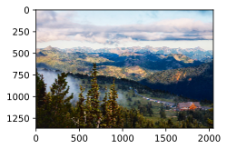
    


```python
style_img = d2l.Image.open('../img/autumn-oak.jpg')
d2l.plt.imshow(style_img);
```


    
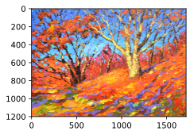
    


```python
##预处理和后处理
rgb_mean = torch.tensor([0.485, 0.456, 0.406])
rgb_std = torch.tensor([0.229, 0.224, 0.225])

def preprocess(img, image_shape):
    transforms = torchvision.transforms.Compose([
        torchvision.transforms.Resize(image_shape),
        torchvision.transforms.ToTensor(),
        torchvision.transforms.Normalize(mean=rgb_mean, std=rgb_std)])
    return transforms(img).unsqueeze(0)

def postprocess(img):
    img = img[0].to(rgb_std.device)
    img = torch.clamp(img.permute(1, 2, 0) * rgb_std + rgb_mean, 0, 1)
    return torchvision.transforms.ToPILImage()(img.permute(2, 0, 1))
## 特征提取

def extract_features(X, content_layers, style_layers):
    contents = []
    styles = []
    for i in range(len(net)):
        X = net[i](X)
        if i in style_layers:
            styles.append(X)
        if i in content_layers:
            contents.append(X)
    return contents, styles

def get_contents(image_shape, device):
    content_X = preprocess(content_img, image_shape).to(device)
    contents_Y, _ = extract_features(content_X, content_layers, style_layers)
    return content_X, contents_Y

def get_styles(image_shape, device):
    style_X = preprocess(style_img, image_shape).to(device)
    _, styles_Y = extract_features(style_X, content_layers, style_layers)
    return style_X, styles_Y

##损失函数
def content_loss(Y_hat, Y):
    # 我们从动态计算梯度的树中分离目标：
    # 这是一个规定的值，而不是一个变量。
    return torch.square(Y_hat - Y.detach()).mean()
def gram(X):
    num_channels, n = X.shape[1], X.numel() // X.shape[1]
    X = X.reshape((num_channels, n))
    return torch.matmul(X, X.T) / (num_channels * n)
def style_loss(Y_hat, gram_Y):
    return torch.square(gram(Y_hat) - gram_Y.detach()).mean()
def tv_loss(Y_hat):
    return 0.5 * (torch.abs(Y_hat[:, :, 1:, :] - Y_hat[:, :, :-1, :]).mean() +
                  torch.abs(Y_hat[:, :, :, 1:] - Y_hat[:, :, :, :-1]).mean())


def compute_loss(X, contents_Y_hat, styles_Y_hat, contents_Y, styles_Y_gram):
    # 分别计算内容损失、样式损失和总变差损失
    contents_l = [content_loss(Y_hat, Y) * content_weight for Y_hat, Y in zip(
        contents_Y_hat, contents_Y)]
    styles_l = [style_loss(Y_hat, Y) * style_weight for Y_hat, Y in zip(
        styles_Y_hat, styles_Y_gram)]
    tv_l = tv_loss(X) * tv_weight
    # 对所有损失求和
    l = sum(10 * styles_l + contents_l + [tv_l])
    return contents_l, styles_l, tv_l, l

## 初始化合成图像
class SynthesizedImage(nn.Module):
    def __init__(self, img_shape, **kwargs):
        super(SynthesizedImage, self).__init__(**kwargs)
        self.weight = nn.Parameter(torch.rand(*img_shape))

    def forward(self):
        return self.weight
def get_inits(X, device, lr, styles_Y):
    gen_img = SynthesizedImage(X.shape).to(device)
    gen_img.weight.data.copy_(X.data)
    trainer = torch.optim.Adam(gen_img.parameters(), lr=lr)
    styles_Y_gram = [gram(Y) for Y in styles_Y]
    return gen_img(), styles_Y_gram, trainer
def train(X, contents_Y, styles_Y, device, lr, num_epochs, lr_decay_epoch):
    X, styles_Y_gram, trainer = get_inits(X, device, lr, styles_Y)
    scheduler = torch.optim.lr_scheduler.StepLR(trainer, lr_decay_epoch, 0.8)
    animator = d2l.Animator(xlabel='epoch', ylabel='loss',
                            xlim=[10, num_epochs],
                            legend=['content', 'style', 'TV'],
                            ncols=2, figsize=(7, 2.5))
    for epoch in range(num_epochs):
        trainer.zero_grad()
        contents_Y_hat, styles_Y_hat = extract_features(
            X, content_layers, style_layers)
        contents_l, styles_l, tv_l, l = compute_loss(
            X, contents_Y_hat, styles_Y_hat, contents_Y, styles_Y_gram)
        l.backward()
        trainer.step()
        scheduler.step()
        if (epoch + 1) % 10 == 0:
            animator.axes[1].imshow(postprocess(X))
            animator.add(epoch + 1, [float(sum(contents_l)),
                                     float(sum(styles_l)), float(tv_l)])
    return X
```


```python
pretrained_net = torchvision.models.vgg19(pretrained=True)
#style_layers, content_layers = [0, 5, 10, 19, 28], [25]
style_layers, content_layers = [0, 4, 9, 18, 28], [26]
net = nn.Sequential(*[pretrained_net.features[i] for i in
                      range(max(content_layers + style_layers) + 1)])

content_weight, style_weight, tv_weight = 1, 1e3, 10

device, image_shape = d2l.try_gpu(), (300, 450)
net = net.to(device)
content_X, contents_Y = get_contents(image_shape, device)
_, styles_Y = get_styles(image_shape, device)
output = train(content_X, contents_Y, styles_Y, device, 0.3, 500, 50)
```


    
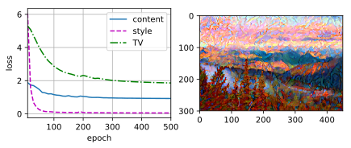
    


### 练习13.12.2

调整损失函数中的权重超参数。输出是否保留更多内容或减少更多噪点？

**解答：**

&emsp; &emsp;风格转移的损失函数是内容损失、风格损失和总变化损失的加权和。我们将原先的超参数[1, 1e3, 10]更改为[1e3, 1, 10]。发现当我们减少内容损失的权重，增加风格损失的权重时，输出保留了更多的噪点。


```python
pretrained_net = torchvision.models.vgg19(pretrained=True)
style_layers, content_layers = [0, 5, 10, 19, 28], [25]
net = nn.Sequential(*[pretrained_net.features[i] for i in
                      range(max(content_layers + style_layers) + 1)])

content_weight, style_weight, tv_weight = 1e3, 1, 10

device, image_shape = d2l.try_gpu(), (300, 450)
net = net.to(device)
content_X, contents_Y = get_contents(image_shape, device)
_, styles_Y = get_styles(image_shape, device)
output = train(content_X, contents_Y, styles_Y, device, 0.3, 500, 50)
```


    
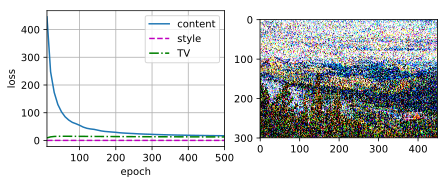
    


### 练习13.12.3

替换实验中的内容图像和风格图像，能创作出更有趣的合成图像吗？

**解答：**


```python
%matplotlib inline
import torch
import torchvision
from torch import nn
from d2l import torch as d2l

d2l.set_figsize()
content_img = d2l.Image.open('../img/where-wally-walker-books.jpg')
d2l.plt.imshow(content_img);
```


    
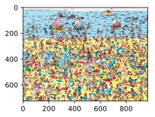
    


```python
style_img = d2l.Image.open('../img/autumn-oak.jpg')
d2l.plt.imshow(style_img);
```


    

    


```python
pretrained_net = torchvision.models.vgg19(pretrained=True)
style_layers, content_layers = [0, 5, 10, 19, 28], [25]
net = nn.Sequential(*[pretrained_net.features[i] for i in
                      range(max(content_layers + style_layers) + 1)])

content_weight, style_weight, tv_weight = 1, 1e3, 10

device, image_shape = d2l.try_gpu(), (300, 450)
net = net.to(device)
content_X, contents_Y = get_contents(image_shape, device)
_, styles_Y = get_styles(image_shape, device)
output = train(content_X, contents_Y, styles_Y, device, 0.3, 500, 50)
```


    
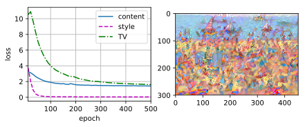
    


### 练习13.12.4

我们可以对文本使用风格迁移吗？提示:可以参阅调查报告[68]。

**解答：**

&emsp;&emsp;可以。文本风格迁移是一种将给定文本的风格从一个样式（例如正式、非正式、形式、非形式等）转移到另一个样式的任务，旨在保留文本内容的基础上通过编辑或生成的方式更改文本的特定风格或属性（如情感、时态和性别等）。它类似于图像风格迁移，但在文本领域中操作文本序列而不是图像像素。

## 13.13 实战 Kaggle 比赛：图像分类 (CIFAR-10) 

### 练习13.13.1

在这场Kaggle竞赛中使用完整的CIFAR-10数据集。将超参数设为`batch_size = 128`，`num_epochs = 100`，`lr = 0.1`，`lr_period = 50`，`lr_decay = 0.1`。看看在这场比赛中能达到什么准确度和排名。能进一步改进吗？

**解答：**


```python
&emps;&emsp;在仅使用示例数据进行训练的时候，该参数设置下模型性能极差，大家可以试着设置`demo = False`，使用完整数据对模型进行训练。
```


```python
import collections
import math
import os
import shutil
import pandas as pd
import torch
import torchvision
from torch import nn
from d2l import torch as d2l
```


```python
# 如果你使用完整的Kaggle竞赛的数据集，设置`demo`为 False
demo = True

if demo:
    data_dir = d2l.download_extract('cifar10_tiny')
else:
    data_dir = '../data/cifar-10/'
    
labels = d2l.read_csv_labels(os.path.join(data_dir, 'trainLabels.csv'))
print('# 训练示例 :', len(labels))
print('# 类别 :', len(set(labels.values())))
```

    # 训练示例 : 1000
    # 类别 : 10
    


```python
def reorg_cifar10_data(data_dir, valid_ratio):
    labels = d2l.read_csv_labels(os.path.join(data_dir, 'trainLabels.csv'))
    d2l.reorg_train_valid(data_dir, labels, valid_ratio)
    d2l.reorg_test(data_dir)
    
valid_ratio = 0.1
reorg_cifar10_data(data_dir, valid_ratio)
```


```python
def get_net():
    num_classes = 10
    net = d2l.resnet18(num_classes, 3)
    return net

loss = nn.CrossEntropyLoss(reduction="none")

def train(net, train_iter, valid_iter, num_epochs, lr, wd, devices, lr_period,
          lr_decay):
    trainer = torch.optim.SGD(net.parameters(), lr=lr, momentum=0.9,
                              weight_decay=wd)
    scheduler = torch.optim.lr_scheduler.StepLR(trainer, lr_period, lr_decay)
    num_batches, timer = len(train_iter), d2l.Timer()
    legend = ['train loss', 'train acc']
    if valid_iter is not None:
        legend.append('valid acc')
    animator = d2l.Animator(xlabel='epoch', xlim=[1, num_epochs],
                            legend=legend)
    net = nn.DataParallel(net, device_ids=devices).to(devices[0])
    for epoch in range(num_epochs):
        net.train()
        metric = d2l.Accumulator(3)
        for i, (features, labels) in enumerate(train_iter):
            timer.start()
            l, acc = d2l.train_batch_ch13(net, features, labels,
                                          loss, trainer, devices)
            metric.add(l, acc, labels.shape[0])
            timer.stop()
            if (i + 1) % (num_batches // 5) == 0 or i == num_batches - 1:
                animator.add(epoch + (i + 1) / num_batches,
                             (metric[0] / metric[2], metric[1] / metric[2],
                              None))
        if valid_iter is not None:
            valid_acc = d2l.evaluate_accuracy_gpu(net, valid_iter)
            animator.add(epoch + 1, (None, None, valid_acc))
        scheduler.step()
    measures = (f'train loss {metric[0] / metric[2]:.3f}, '
                f'train acc {metric[1] / metric[2]:.3f}')
    if valid_iter is not None:
        measures += f', valid acc {valid_acc:.3f}'
    print(measures + f'\n{metric[2] * num_epochs / timer.sum():.1f}'
          f' examples/sec on {str(devices)}')
```


```python
transform_train = torchvision.transforms.Compose([
    # 在高度和宽度上将图像放大到40像素的正方形
    torchvision.transforms.Resize(40),
    # 随机裁剪出一个高度和宽度均为40像素的正方形图像，
    # 生成一个面积为原始图像面积0.64到1倍的小正方形，
    # 然后将其缩放为高度和宽度均为32像素的正方形
    torchvision.transforms.RandomResizedCrop(32, scale=(0.64, 1.0),
                                                   ratio=(1.0, 1.0)),
    torchvision.transforms.RandomHorizontalFlip(),
    torchvision.transforms.ToTensor(),
    # 标准化图像的每个通道
    torchvision.transforms.Normalize([0.4914, 0.4822, 0.4465],
                                     [0.2023, 0.1994, 0.2010])])
transform_test = torchvision.transforms.Compose([
    torchvision.transforms.ToTensor(),
    torchvision.transforms.Normalize([0.4914, 0.4822, 0.4465],
                                     [0.2023, 0.1994, 0.2010])])
```


```python
train_ds, train_valid_ds = [torchvision.datasets.ImageFolder(
    os.path.join(data_dir, 'train_valid_test', folder),
    transform=transform_train) for folder in ['train', 'train_valid']]

valid_ds, test_ds = [torchvision.datasets.ImageFolder(
    os.path.join(data_dir, 'train_valid_test', folder),
    transform=transform_test) for folder in ['valid', 'test']]
```


```python
batch_size = 32 if demo else 128
train_iter, train_valid_iter = [torch.utils.data.DataLoader(
    dataset, batch_size, shuffle=True, drop_last=True)
    for dataset in (train_ds, train_valid_ds)]

valid_iter = torch.utils.data.DataLoader(valid_ds, batch_size, shuffle=False,
                                         drop_last=True)

test_iter = torch.utils.data.DataLoader(test_ds, batch_size, shuffle=False,
                                        drop_last=False)
```


```python
devices, num_epochs, lr, wd = d2l.try_all_gpus(), 100, 0.1, 5e-4
lr_period, lr_decay, net = 50, 0.1, get_net()
train(net, train_iter, valid_iter, num_epochs, lr, wd, devices, lr_period,
      lr_decay)
```

    train loss nan, train acc 0.103, valid acc 0.125
    67.1 examples/sec on [device(type='cpu')]
    


```python
net, preds = get_net(), []
train(net, train_valid_iter, None, num_epochs, lr, wd, devices, lr_period,
      lr_decay)

for X, _ in test_iter:
    y_hat = net(X.to(devices[0]))
    preds.extend(y_hat.argmax(dim=1).type(torch.int32).cpu().numpy())
sorted_ids = list(range(1, len(test_ds) + 1))
sorted_ids.sort(key=lambda x: str(x))
df = pd.DataFrame({'id': sorted_ids, 'label': preds})
df['label'] = df['label'].apply(lambda x: train_valid_ds.classes[x])
df.to_csv('submission.csv', index=False)
```

    train loss nan, train acc 0.101
    67.6 examples/sec on [device(type='cpu')]
    

### 练习13.13.2

不使用图像增广时，能获得怎样的准确度？

**解答：**


```python
# 如果你使用完整的Kaggle竞赛的数据集，设置`demo`为 False
demo = True

if demo:
    data_dir = d2l.download_extract('cifar10_tiny')
else:
    data_dir = '../data/cifar-10/'
    
labels = d2l.read_csv_labels(os.path.join(data_dir, 'trainLabels.csv'))
print('# 训练示例 :', len(labels))
print('# 类别 :', len(set(labels.values())))
```

    # 训练示例 : 1000
    # 类别 : 10
    


```python
train_ds, train_valid_ds = [torchvision.datasets.ImageFolder(
    os.path.join(data_dir, 'train_valid_test', folder),
    transform=transform_test) for folder in ['train', 'train_valid']]

valid_ds, test_ds = [torchvision.datasets.ImageFolder(
    os.path.join(data_dir, 'train_valid_test', folder),
    transform=transform_test) for folder in ['valid', 'test']]#不使用图像增广

train_iter, train_valid_iter = [torch.utils.data.DataLoader(
    dataset, batch_size, shuffle=True, drop_last=True)
    for dataset in (train_ds, train_valid_ds)]

valid_iter = torch.utils.data.DataLoader(valid_ds, batch_size, shuffle=False,
                                         drop_last=True)

test_iter = torch.utils.data.DataLoader(test_ds, batch_size, shuffle=False,
                                        drop_last=False)
```


```python
devices, num_epochs, lr, wd = d2l.try_all_gpus(), 20, 2e-4, 5e-4
lr_period, lr_decay, net = 4, 0.9, get_net()
train(net, train_iter, valid_iter, num_epochs, lr, wd, devices, lr_period,
      lr_decay)
```

    train loss 0.002, train acc 1.000, valid acc 0.328
    66.0 examples/sec on [device(type='cpu')]
    


```python
net, preds = get_net(), []
train(net, train_valid_iter, None, num_epochs, lr, wd, devices, lr_period,
      lr_decay)

for X, _ in test_iter:
    y_hat = net(X.to(devices[0]))
    preds.extend(y_hat.argmax(dim=1).type(torch.int32).cpu().numpy())
sorted_ids = list(range(1, len(test_ds) + 1))
sorted_ids.sort(key=lambda x: str(x))
df = pd.DataFrame({'id': sorted_ids, 'label': preds})
df['label'] = df['label'].apply(lambda x: train_valid_ds.classes[x])
df.to_csv('submission.csv', index=False)
```

    train loss 0.002, train acc 1.000
    66.8 examples/sec on [device(type='cpu')]
    

## 13.14 实战Kaggle比赛：狗的品种识别（ImageNet Dogs）

### 练习13.14.1

试试使用完整Kaggle比赛数据集，增加`batch_size`（批量大小）和`num_epochs`（迭代轮数），或者设计其它超参数为`lr = 0.01`，`lr_period = 10`，和`lr_decay = 0.1`时，能取得什么结果？

**解答：**


```python
import os
import torch
import torchvision
from torch import nn
from d2l import torch as d2l
```


```python
# 如果你使用Kaggle比赛的完整数据集，请将下面的变量更改为False
demo = True
if demo:
    data_dir = d2l.download_extract('dog_tiny')
else:
    data_dir = os.path.join('..', 'data', 'dog-breed-identification')
```


```python
def reorg_dog_data(data_dir, valid_ratio):
    labels = d2l.read_csv_labels(os.path.join(data_dir, 'labels.csv'))
    d2l.reorg_train_valid(data_dir, labels, valid_ratio)
    d2l.reorg_test(data_dir)


batch_size = 32 if demo else 128
valid_ratio = 0.1
reorg_dog_data(data_dir, valid_ratio)
```


```python
transform_train = torchvision.transforms.Compose([
    # 随机裁剪图像，所得图像为原始面积的0.08到1之间，高宽比在3/4和4/3之间。
    # 然后，缩放图像以创建224 x 224的新图像
    torchvision.transforms.RandomResizedCrop(224, scale=(0.08, 1.0),
                                             ratio=(3.0/4.0, 4.0/3.0)),
    torchvision.transforms.RandomHorizontalFlip(),
    # 随机更改亮度，对比度和饱和度
    torchvision.transforms.ColorJitter(brightness=0.4,
                                       contrast=0.4,
                                       saturation=0.4),
    # 添加随机噪声
    torchvision.transforms.ToTensor(),
    # 标准化图像的每个通道
    torchvision.transforms.Normalize([0.485, 0.456, 0.406],
                                     [0.229, 0.224, 0.225])])
```


```python
transform_test = torchvision.transforms.Compose([
    torchvision.transforms.Resize(256),
    # 从图像中心裁切224x224大小的图片
    torchvision.transforms.CenterCrop(224),
    torchvision.transforms.ToTensor(),
    torchvision.transforms.Normalize([0.485, 0.456, 0.406],
                                     [0.229, 0.224, 0.225])])
```


```python
train_ds, train_valid_ds = [torchvision.datasets.ImageFolder(
    os.path.join(data_dir, 'train_valid_test', folder),
    transform=transform_train) for folder in ['train', 'train_valid']]

valid_ds, test_ds = [torchvision.datasets.ImageFolder(
    os.path.join(data_dir, 'train_valid_test', folder),
    transform=transform_test) for folder in ['valid', 'test']]
train_iter, train_valid_iter = [torch.utils.data.DataLoader(
    dataset, batch_size, shuffle=True, drop_last=True)
    for dataset in (train_ds, train_valid_ds)]

valid_iter = torch.utils.data.DataLoader(valid_ds, batch_size, shuffle=False,
                                         drop_last=True)

test_iter = torch.utils.data.DataLoader(test_ds, batch_size, shuffle=False,
                                        drop_last=False)
```


```python
def get_net(devices):
    finetune_net = nn.Sequential()
    finetune_net.features = torchvision.models.resnet34(pretrained=True)
    # 定义一个新的输出网络，共有120个输出类别
    finetune_net.output_new = nn.Sequential(nn.Linear(1000, 256),
                                            nn.ReLU(),
                                            nn.Linear(256, 120))
    # 将模型参数分配给用于计算的CPU或GPU
    finetune_net = finetune_net.to(devices[0])
    # 冻结参数
    for param in finetune_net.features.parameters():
        param.requires_grad = False
    return finetune_net
```


```python
loss = nn.CrossEntropyLoss(reduction='none')

def evaluate_loss(data_iter, net, devices):
    l_sum, n = 0.0, 0
    for features, labels in data_iter:
        features, labels = features.to(devices[0]), labels.to(devices[0])
        outputs = net(features)
        l = loss(outputs, labels)
        l_sum += l.sum()
        n += labels.numel()
    return (l_sum / n).to('cpu')
```


```python
def train(net, train_iter, valid_iter, num_epochs, lr, wd, devices, lr_period,
          lr_decay):
    # 只训练小型自定义输出网络
    net = nn.DataParallel(net, device_ids=devices).to(devices[0])
    trainer = torch.optim.SGD((param for param in net.parameters()
                               if param.requires_grad), lr=lr,
                              momentum=0.9, weight_decay=wd)
    scheduler = torch.optim.lr_scheduler.StepLR(trainer, lr_period, lr_decay)
    num_batches, timer = len(train_iter), d2l.Timer()
    legend = ['train loss']
    if valid_iter is not None:
        legend.append('valid loss')
    animator = d2l.Animator(xlabel='epoch', xlim=[1, num_epochs],
                            legend=legend)
    for epoch in range(num_epochs):
        metric = d2l.Accumulator(2)
        for i, (features, labels) in enumerate(train_iter):
            timer.start()
            features, labels = features.to(devices[0]), labels.to(devices[0])
            trainer.zero_grad()
            output = net(features)
            l = loss(output, labels).sum()
            l.backward()
            trainer.step()
            metric.add(l, labels.shape[0])
            timer.stop()
            if (i + 1) % (num_batches // 5) == 0 or i == num_batches - 1:
                animator.add(epoch + (i + 1) / num_batches,
                             (metric[0] / metric[1], None))
        measures = f'train loss {metric[0] / metric[1]:.3f}'
        if valid_iter is not None:
            valid_loss = evaluate_loss(valid_iter, net, devices)
            animator.add(epoch + 1, (None, valid_loss.detach()))
        scheduler.step()
    if valid_iter is not None:
        measures += f', valid loss {valid_loss:.3f}'
    print(measures + f'\n{metric[1] * num_epochs / timer.sum():.1f}'
          f' examples/sec on {str(devices)}')
```


```python
#调整超参数lr = 0.01，lr_period = 10，和lr_decay = 0.1
devices, num_epochs, lr, wd = d2l.try_all_gpus(), 10, 0.01, 1e-4
lr_period, lr_decay, net = 10, 0.1, get_net(devices)
train(net, train_iter, valid_iter, num_epochs, lr, wd, devices, lr_period,
      lr_decay)
```

    train loss 204954443.481, valid loss 688164928.000
    33.9 examples/sec on [device(type='cpu')]
    


```python
net = get_net(devices)
train(net, train_valid_iter, None, num_epochs, lr, wd, devices, lr_period,
      lr_decay)

preds = []
for data, label in test_iter:
    output = torch.nn.functional.softmax(net(data.to(devices[0])), dim=0)
    preds.extend(output.cpu().detach().numpy())
ids = sorted(os.listdir(
    os.path.join(data_dir, 'train_valid_test', 'test', 'unknown')))
with open('submission.csv', 'w') as f:
    f.write('id,' + ','.join(train_valid_ds.classes) + '\n')
    for i, output in zip(ids, preds):
        f.write(i.split('.')[0] + ',' + ','.join(
            [str(num) for num in output]) + '\n')
```

    train loss 24182001098.710
    33.8 examples/sec on [device(type='cpu')]
    

### 练习13.14.2

如果使用更深的预训练模型，会得到更好的结果吗？如何调整超参数？能进一步改善结果吗？

**解答：**

&emsp;&emsp;改用resnet50网络模型作为预训练模型，学习更多轮次。


```python
def get_net(devices):
    finetune_net = nn.Sequential()
    finetune_net.features = torchvision.models.resnet50(pretrained=True)#使用resnet50
    # 定义一个新的输出网络，共有120个输出类别
    finetune_net.output_new = nn.Sequential(nn.Linear(1000, 256),
                                            nn.ReLU(),
                                            nn.Linear(256, 120))
    # 将模型参数分配给用于计算的CPU或GPU
    finetune_net = finetune_net.to(devices[0])
    # 冻结参数
    for param in finetune_net.features.parameters():
        param.requires_grad = False
    return finetune_net
```


```python
devices, num_epochs, lr, wd = d2l.try_all_gpus(), 20, 1e-4, 1e-4
lr_period, lr_decay, net = 2, 0.9, get_net(devices)
train(net, train_iter, valid_iter, num_epochs, lr, wd, devices, lr_period,
      lr_decay)
```

    train loss 0.697, valid loss 1.281
    19.6 examples/sec on [device(type='cpu')]
    


```python
net = get_net(devices)
train(net, train_valid_iter, None, num_epochs, lr, wd, devices, lr_period,
      lr_decay)

preds = []
for data, label in test_iter:
    output = torch.nn.functional.softmax(net(data.to(devices[0])), dim=0)
    preds.extend(output.cpu().detach().numpy())
ids = sorted(os.listdir(
    os.path.join(data_dir, 'train_valid_test', 'test', 'unknown')))
with open('submission.csv', 'w') as f:
    f.write('id,' + ','.join(train_valid_ds.classes) + '\n')
    for i, output in zip(ids, preds):
        f.write(i.split('.')[0] + ',' + ','.join(
            [str(num) for num in output]) + '\n')
```

    train loss 0.756
    19.3 examples/sec on [device(type='cpu')]
    
