- 2月27日，开始学习本书，加油~

# cuda安装

- 首先查看自己电脑支持的cuda最高版本（前提是有nvidia显卡）

```Plain Text
命令行输入：nvidia-smi

C:\Users\10213>nvidia-smi
Mon Feb 27 20:09:27 2023
+-----------------------------------------------------------------------------+
| NVIDIA-SMI 512.36       Driver Version: 512.36       CUDA Version: 11.6     |
|-------------------------------+----------------------+----------------------+
| GPU  Name            TCC/WDDM | Bus-Id        Disp.A | Volatile Uncorr. ECC |
| Fan  Temp  Perf  Pwr:Usage/Cap|         Memory-Usage | GPU-Util  Compute M. |
|                               |                      |               MIG M. |
|===============================+======================+======================|
|   0  NVIDIA GeForce ... WDDM  | 00000000:01:00.0  On |                  N/A |
| N/A   38C    P0    26W /  N/A |   1645MiB /  6144MiB |      1%      Default |
|                               |                      |                  N/A |
+-------------------------------+----------------------+----------------------+
```

- 我这里最高支持CUDA Version: 11.6

- `nvcc --version`:查看`cuda`版本

- 安装torch-GPU

  - 去官网安装。

  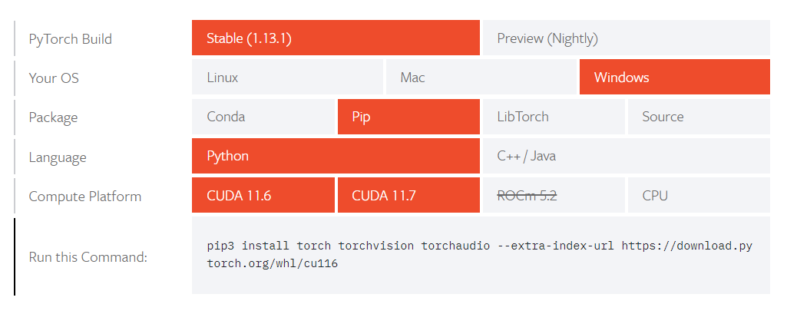

  - 上图是在torch官网的版本选择，以下是官网

  [PyTorch](https://pytorch.org/get-started/locally/)

  - `torch.cuda.is_available()`：可以查看`torch`是否支持`GPU`运算。

# ch-2

#### 课后练习

```Python
# 课后练习
X < Y, X > Y
```

```Python
(tensor([[ True, False,  True, False],
         [False, False, False, False],
         [False, False, False, False]]),
 tensor([[False, False, False, False],
         [ True,  True,  True,  True],
         [ True,  True,  True,  True]]))
```

```Python
# 用其他形状（如三阶张量）替换广播中按元素操作的张量。结果是否与预期相同
a = torch.arange(2*3*4).reshape((2, 3, 4))
b = torch.arange(1*3*4).reshape((1, 3, 4))
a, b
```

```Python
(tensor([[[ 0,  1,  2,  3],
          [ 4,  5,  6,  7],
          [ 8,  9, 10, 11]],
 
         [[12, 13, 14, 15],
          [16, 17, 18, 19],
          [20, 21, 22, 23]]]),
 tensor([[[ 0,  1,  2,  3],
          [ 4,  5,  6,  7],
          [ 8,  9, 10, 11]]]))
```

```Python
a + b, a*b
```

```Python
(tensor([[[ 0,  2,  4,  6],
          [ 8, 10, 12, 14],
          [16, 18, 20, 22]],
 
         [[12, 14, 16, 18],
          [20, 22, 24, 26],
          [28, 30, 32, 34]]]),
 tensor([[[  0,   1,   4,   9],
          [ 16,  25,  36,  49],
          [ 64,  81, 100, 121]],
 
         [[  0,  13,  28,  45],
          [ 64,  85, 108, 133],
          [160, 189, 220, 253]]]))
```

### 2.2 预备知识

```Python
import torch
import pandas as pd
import os


os.makedirs(os.path.join('..', 'data'), exist_ok=True)
data_file = os.path.join('..', 'data', 'house_tiny.csv')
with open(data_file, 'w') as f:
f.write('NumRooms,Alley,Price\n')  # 列名
f.write('NA,Pave,127500\n')  # 每行表示一个数据样本
f.write('2,NA,106000\n')
f.write('4,NA,178100\n')
f.write('NA,NA,140000\n')


# 读取数据
data = pd.read_csv(data_file)

# 处理缺失值
inputs = data.iloc[:, :2]
outputs = data.iloc[:, -1]
inputs = inputs.fillna(inputs.mean())  # 在nan处填写该列的平均值

# 对于inputs中的类别值或离散值，我们将“NaN”视为一个类别。 由于“巷子类型”（“Alley”）列只接受两种类型的类别值“Pave”和“NaN”， pandas可以自动将此列转换为两列“Alley_Pave”和“Alley_nan”。 巷子类型为“Pave”的行会将“Alley_Pave”的值设置为1，“Alley_nan”的值设置为0。 缺少巷子类型的行会将“Alley_Pave”和“Alley_nan”分别设置为0和1。
inputs = pd.get_dummies(inputs, dummy_na=True)

# 转为张量格式
X, y = torch.tensor(inputs.values), torch.tensor(outputs.values)


```

#### 课后习题

```Python
# 课后习题
# 创建包含包含更多更多行和列的数据寄
# （1）删除缺失值最多的列
# （2）将处理后的数据集转化为张量格式

# 创建更多的数据
os.makedirs(os.path.join('..', 'data'), exist_ok=True)
data_file = os.path.join('..', 'data', 'house_tiny_课后题.csv')
with open(data_file, 'w') as f:
    f.write('NumRooms,Alley,Price\n')  # 列名
    for _ in range(12):
        f.write('NA,Pave,127500\n')  # 每行表示一个数据样本
        f.write('2,NA,106000\n')
        f.write('4,NA,178100\n')
        f.write('NA,NA,140000\n')

data = pd.read_csv('../data/house_tiny_课后题.csv')
data.dropna(axis=1).head()        
```

## 2.3 线性代数

1. 证明一个矩阵$\mathbf{A}$的转置的转置是$\mathbf{A}$，即$(\mathbf{A}^\top)^\top = \mathbf{A}$。

2. 给出两个矩阵$\mathbf{A}$和$\mathbf{B}$，证明“它们转置的和”等于“它们和的转置”，即$\mathbf{A}^\top + \mathbf{B}^\top = (\mathbf{A} + \mathbf{B})^\top$。

3. 给定任意方阵$\mathbf{A}$，$\mathbf{A} + \mathbf{A}^\top$总是对称的吗?为什么?

4. 本节中定义了形状$(2,3,4)$的张量`X`。`len(X)`的输出结果是什么？

5. 对于任意形状的张量`X`,`len(X)`是否总是对应于`X`特定轴的长度?这个轴是什么?

6. 运行`A/A.sum(axis=1)`，看看会发生什么。请分析一下原因？

7. 考虑一个具有形状$(2,3,4)$的张量，在轴0、1、2上的求和输出是什么形状?

8. 为`linalg.norm`函数提供3个或更多轴的张量，并观察其输出。对于任意形状的张量这个函数计算得到什么?

```Python
import torch
import numpy as np

# 证明一个矩阵 𝐀 的转置的转置是 𝐀
A = torch.arange(12).reshape((3, 4))
A.T.T == A

tensor([[True, True, True, True],
        [True, True, True, True],
        [True, True, True, True]])

# 给出两个矩阵 𝐀和 𝐁 ，证明“它们转置的和”等于“它们和的转置”
B = torch.randn((3, 4))
A.T + B.T == (A + B).T

tensor([[True, True, True],
        [True, True, True],
        [True, True, True],
        [True, True, True]])

# 给定任意方阵 𝐀， 𝐀+𝐀⊤,总是对称的吗?为什么?
C = torch.arange(16).reshape(4, -1)
C + C.T

tensor([[ 0,  5, 10, 15],
        [ 5, 10, 15, 20],
        [10, 15, 20, 25],
        [15, 20, 25, 30]])

# 本节中定义了形状 (2,3,4)的张量X。len(X)的输出结果是什么？
# 答：len(X)为张量的第一个维度大小
X = torch.arange(24).reshape((2, 3, 4))
len(X)

2

# 对于任意形状的张量X,len(X)是否总是对应于X特定轴的长度?这个轴是什么?
# 这个轴是张量的第0个轴， 即dim=0时的，长度

# 运行A/A.sum(axis=1)，看看会发生什么。请分析一下原因？
A, A.sum(axis=1)
# 运行A/A.sum(axis=1)会报错，A的shape为（3，4）， A.sum(axis=1)是按第二个轴计算总和降维，两个张量的纬度不同，无法广播

(tensor([[ 0,  1,  2,  3],
         [ 4,  5,  6,  7],
         [ 8,  9, 10, 11]]),
 tensor([ 6, 22, 38]))

# 考虑一个具有形状 (2,3,4)的张量，在轴0、1、2上的求和输出是什么形状?
X.sum(dim=0),X.sum(dim=0).shape, X.sum(dim=1),X.sum(dim=1).shape, X.sum(dim=2),X.sum(dim=2).shape,
# 会按dim的轴对张量进行降维

(tensor([[12, 14, 16, 18],
         [20, 22, 24, 26],
         [28, 30, 32, 34]]),
 torch.Size([3, 4]),
 tensor([[12, 15, 18, 21],
         [48, 51, 54, 57]]),
 torch.Size([2, 4]),
 tensor([[ 6, 22, 38],
         [54, 70, 86]]),
 torch.Size([2, 3]))

# 为torch.norm(L2范数)函数提供3个或更多轴的张量，并观察其输出。对于任意形状的张量这个函数计算得到什么?
# torch.norm(),矩阵必须为float类型
D = torch.arange(24, dtype=torch.float64).reshape((2, 3, 4))
torch.norm(D)

tensor(65.7571, dtype=torch.float64)
```

## 2.4 微积分

9. 绘制函数$y = f(x) = x^3 - \frac{1}{x}$和其在$x = 1$处切线的图像。

10. 求函数$f(\mathbf{x}) = 3x_1^2 + 5e^{x_2}$的梯度。

11. 函数$f(\mathbf{x}) = \|\mathbf{x}\|_2$的梯度是什么？

12. 尝试写出函数$u = f(x, y, z)$，其中$x = x(a, b)$，$y = y(a, b)$，$z = z(a, b)$的链式法则。

```Python
%matplotlib inline
import numpy as np
from matplotlib_inline import backend_inline
from d2l import torch as d2l

# 绘制函数 𝑦=𝑓(𝑥)=𝑥3−1/𝑥和其在 𝑥=1处切线的图像。
x = np.arange(0, 3, 0.1)
d2l.plot(x, [x**3 - 1/x, 4 * x - 4], 'x', 'f(x)', legend=['f(x)', 'Tangent line (x=1)'])
```


```Python
# 求函数 𝑓(𝐱)=3𝑥21+5𝑒𝑥2 的梯度。
# [6x_1, 5e^x_2]

# 函数 𝑓(𝐱)=‖𝐱‖2 的梯度是什么？
# let y=f(x), Df(x) = x/y
```

## 2.5 自动微分

使$f(x)=\sin(x)$，绘制$f(x)$和$\frac{df(x)}{dx}$的图像，其中后者不使用$f'(x)=\cos(x)$。

```Python
import torch
a = torch.arange(0,10,0.1, dtype=torch.float64, requires_grad=True)

a.grad
y = torch.sin(a)
y.sum().backward()
a.grad

d2l.plot(a.detach(), [y.detach(), a.grad], 'a', 'y_', legend=['a', 'y_'])

```

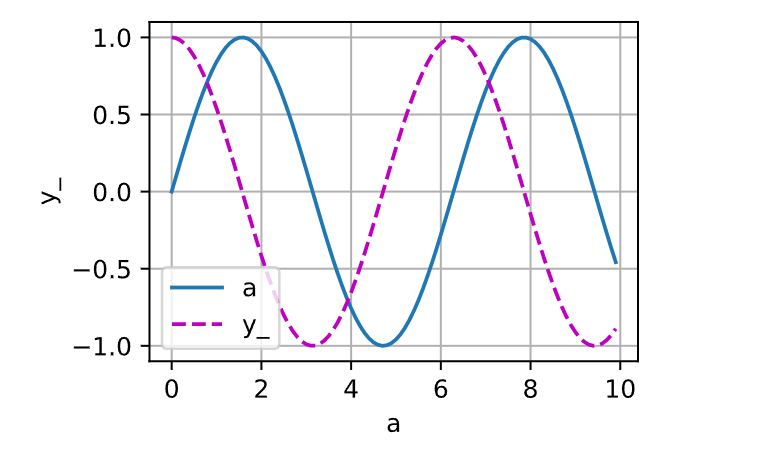

## 2.6 概率

进行𝑚=500组实验，每组抽取𝑛=10个样本。改变𝑚和𝑛，观察和分析实验结果。

```Python
%matplotlib inline
import torch
from torch.distributions import multinomial
from d2l import torch as d2l

# 进行 𝑚=500 组实验，每组抽取 𝑛=10 个样本。改变 𝑚 和 𝑛 ，观察和分析实验结果。
fair_probs = torch.ones([6]) / 6
counts = multinomial.Multinomial(256, fair_probs).sample((10000,))
cum_counts = counts.cumsum(dim=0)
estimates = cum_counts / cum_counts.sum(dim=1, keepdims=True)

d2l.set_figsize((6, 4.5))
for i in range(6):
    d2l.plt.plot(estimates[:, i].numpy(),
                 label=("P(die=" + str(i + 1) + ")"))
d2l.plt.axhline(y=0.167, color='black', linestyle='dashed')
d2l.plt.gca().set_xlabel('Groups of experiments')
d2l.plt.gca().set_ylabel('Estimated probability')
d2l.plt.legend();
```


-  给定两个概率为𝑃(A)和𝑃(B)的事件，计算𝑃(A∪B)和𝑃(A∩B)的上限和下限。

$max(P(A), P(B)) \leq P(AUB)\leq P(A)+P(B)\\0<=P(A\cap B)<=min(P(A), P(B))$

# ch-3

## 3.1 线性回归

- 算法的步骤如下：

- （1）初始化模型参数的值，如随机初始化； 

- （2）从数据集中随机抽取小批量样本且在负梯度的方向上更新参数，并不断迭代这一步骤。 对于平方损失和仿射变换，我们可以明确地写成如下形式:

$$
\begin{aligned} \mathbf{w} &\leftarrow \mathbf{w} -   \frac{\eta}{|\mathcal{B}|} \sum_{i \in \mathcal{B}} \partial_{\mathbf{w}} l^{(i)}(\mathbf{w}, b) = \mathbf{w} - \frac{\eta}{|\mathcal{B}|} \sum_{i \in \mathcal{B}} \mathbf{x}^{(i)} \left(\mathbf{w}^\top \mathbf{x}^{(i)} + b - y^{(i)}\right),\\ b &\leftarrow b -  \frac{\eta}{|\mathcal{B}|} \sum_{i \in \mathcal{B}} \partial_b l^{(i)}(\mathbf{w}, b)  = b - \frac{\eta}{|\mathcal{B}|} \sum_{i \in \mathcal{B}} \left(\mathbf{w}^\top \mathbf{x}^{(i)} + b - y^{(i)}\right). \end{aligned}
$$


#### 课后习题

13. 假设我们有一些数据$x_1, \ldots, x_n \in \mathbb{R}$。我们的目标是找到一个常数$b$，使得最小化$\sum_i (x_i - b)^2$。

  14. 找到最优值$b$的解析解。

  15. 这个问题及其解与正态分布有什么关系?

16. 推导出使用平方误差的线性回归优化问题的解析解。为了简化问题，可以忽略偏置$b$（我们可以通过向$\mathbf X$添加所有值为1的一列来做到这一点）。

  17. 用矩阵和向量表示法写出优化问题（将所有数据视为单个矩阵，将所有目标值视为单个向量）。

  18. 计算损失对$w$的梯度。

  19. 通过将梯度设为0、求解矩阵方程来找到解析解。

  20. 什么时候可能比使用随机梯度下降更好？这种方法何时会失效？

21. 假定控制附加噪声$\epsilon$的噪声模型是指数分布。也就是说，$p(\epsilon) = \frac{1}{2} \exp(-|\epsilon|)$

  22. 写出模型$-\log P(\mathbf y \mid \mathbf X)$下数据的负对数似然。

  23. 请试着写出解析解。

  24. 提出一种随机梯度下降算法来解决这个问题。哪里可能出错？（提示：当我们不断更新参数时，在驻点附近会发生什么情况）请尝试解决这个问题。

1.a
$$
\begin{array}{c}
\text { 即求 } \underset{b}{\operatorname{argmin}} \sum_{i=1}^{n}\left(x_{i}-b\right)^{2} \\
\Rightarrow \frac{\delta \sum_{i=1}^{n}\left(x_{i}-b\right)^{2}}{\delta b}=0 \\
\Rightarrow \sum_{i=1}^{n}\left(x_{i}-b\right)=0 \\
\Rightarrow \sum_{i=1}^{n} x_{i}-n b=0 \\
\Rightarrow b=\frac{\sum_{i=1}^{n} x_{i}}{n}
\end{array}
$$
$$

$\text { 令 } x_i=b+\epsilon\left(\epsilon \sim N\left(0, \sigma^2\right)\right)$

                                                           则 $P\left(x_i \mid b\right)=\frac{1}{\sqrt{2 \pi \sigma^2}} \exp \left(-\frac{1}{2 \sigma^2}\left(x^i-b\right)\right)$

## 3.2 从零实现线性回归

- 生成数据集

```Python
def synthetic_data(w, b, num_examples):  #@save
    """生成y=Xw+b+噪声"""
    X = torch.normal(0, 1, (num_examples, len(w)))
    y = torch.matmul(X, w) + b
    y += torch.normal(0, 0.01, y.shape)
    return X, y.reshape((-1, 1))
  
true_w = torch.tensor([2, -3.4])
true_b = 4.2
features, labels = synthetic_data(true_w, true_b, 1000)
d2l.set_figsize()
d2l.plt.scatter(features[:, 1].detach().numpy(), labels.detach().numpy(), 1);
```

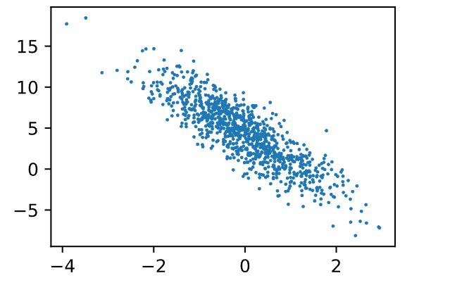

```Python
def data_iter(batch_size, features, labels):
    num_examples = len(features)
    indices = list(range(num_examples))
    # 这些样本是随机读取的，没有特定的顺序
    random.shuffle(indices)
    for i in range(0, num_examples, batch_size):
        batch_indices = torch.tensor(
            indices[i: min(i + batch_size, num_examples)])
        yield features[batch_indices], labels[batch_indices]
```

`indices:`索引列表，然后将索引列表打乱， 再`features[batch_indices], labels[batch_indices]`把打乱的样本从数据集中取出。

```Python
%matplotlib inline
import random
import torch
from d2l import torch as d2l

# 数据集的生成
def synthetic_data(w, b, num_examples):  #@save
    """生成y=Xw+b+噪声"""
    X = torch.normal(0, 1, (num_examples, len(w)))
    y = torch.matmul(X, w) + b
    y += torch.normal(0, 0.01, y.shape)
    return X, y.reshape((-1, 1)) # 这里回返回一个num_examples行， len(w)列的张量；和一个num_examples行，1列的标签
  
true_w = torch.tensor([2, -3.4])
true_b = 4.2
features, labels = synthetic_data(true_w, true_b, 1001)

d2l.set_figsize()
d2l.plt.scatter(features[:, 1].detach().numpy(), labels.detach().numpy(), 1);
```

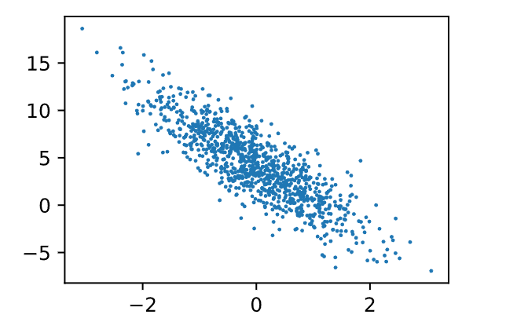

```Python
def data_iter(batch_size, features, labels):
    num_examples = len(features)
    indices = list(range(num_examples))
    random.shuffle(indices)  # 打乱索引
    for i in range(0, num_examples, batch_size):
        batch_indices = torch.tensor(indices[i:min(i+batch_size, num_examples)])
        yield features[batch_indices], labels[batch_indices]
        
next(iter(data_iter(10, features, labels)))
# 初始化参数
w = torch.normal(0, 0.01, size=(2,1), requires_grad=True)
b = torch.zeros(1, requires_grad=True)

# 定义模型
def linreg(X, w, b):  #@save
    """线性回归模型"""
    return torch.matmul(X, w) + b
  
# 损失函数
def squared_loss(y_hat, y):  #@save
    """均方损失"""
    return (y_hat - y.reshape(y_hat.shape)) ** 2 / 2
# 优化算法
def sgd(params, lr, batch_size):  #@save
    """小批量随机梯度下降"""
    with torch.no_grad():
        for param in params:
            param -= lr * param.grad / batch_size
            param.grad.zero_()
# 训练
lr = 0.03
num_epochs = 3
net = linreg
loss = squared_loss
batch_size = 10

for epoch in range(num_epochs):
    for X, y in data_iter(batch_size, features, labels):
        l = loss(net(X, w, b), y)  # X和y的小批量损失
        # 因为l形状是(batch_size,1)，而不是一个标量。l中的所有元素被加到一起,
        # 并以此计算关于[w,b]的梯度
        l.sum().backward()
        sgd([w, b], lr, batch_size)  # 使用参数的梯度更新参数
    with torch.no_grad():
        train_l = loss(net(features, w, b), labels)
        print(f'epoch {epoch + 1}, loss {float(train_l.mean()):f}')
```

#### 习题

**1.如果我们将权重初始化为零，会发生什么。算法仍然有效吗？**

  尝试过，仍然有效

**2. 假设试图为电压和电流的关系建立一个模型。自动微分可以用来学习模型的参数吗?**

  可以，建立模型U=IW+b，然后采集(U，I)的数据集，通过自动微分即可学习W和b的参数。

**3.1. 能基于[普朗克定律](https://en.wikipedia.org/wiki/Planck%27s_law)使用光谱能量密度来确定物体的温度吗？**

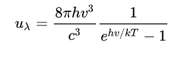

**4.计算二阶导数可能会遇到什么问题？你会如何解决这些问题？**

  不太懂，等大佬

**5.为什么在`squared_loss`函数中需要使用`reshape`函数？**

  一个是行向量、一个是列向量，使用reshape，可以确保shape一样。

**6.如果样本个数不能被批量大小整除，`data_iter`函数的行为会有什么变化？**

  并不会报错，因为在**`data_iter`**函数中的batch提取中有这行代码`indices[i: min(i + batch_size, num_examples)])`，当样本的数量不足一个batch时，其他的全部拿走，作为一个batch。

## 3.3 简洁实现

```Python
import numpy as np
import torch
from torch.utils import data
from d2l import torch as d2l
from torch import nn

# 生成数据集
true_w = torch.tensor([2, -3.4])
true_b = torch.tensor(4.2)
feature, labels = d2l.synthetic_data(true_w, true_b, 1000)

def load_array(data_arrays, batch_size, is_train=True):  #@save
    """构造一个PyTorch数据迭代器"""
    dataset = data.TensorDataset(*data_arrays)
    return data.DataLoader(dataset, batch_size, shuffle=is_train)

# 读取数据集
batch_size = 10
data_iter = d2l.load_array((feature, labels), batch_size)

# 定义模型
# 我们将两个参数传递到nn.Linear中。 第一个指定输入特征形状，即2，第二个指定输出特征形状，输出特征形状为单个标量，因此为1。
net = nn.Sequential(nn.Linear(2, 1))

# 定义损失函数
loss = nn.MSELoss()

# 定义优化算法
trainer = torch.optim.SGD(net.parameters(), lr=0.03)

# 训练
num_epochs = 3
for epoch in range(num_epochs):
    for X, y in data_iter:
        l = loss(net(X) ,y)  # 每个batch的损失函数值
        trainer.zero_grad()  # 梯度清零
        l.backward()  # 反向传播
        trainer.step()  # 更新参数，根据当前梯度更新网络参数，一个batch数据会计算一次梯度，trainer.step()更新
    l = loss(net(features), labels)  # 一个epoch的损失函数值
    print(f'epoch {epoch + 1}, loss {l:f}')
    
w, b = net[0].weight.data, net[0].bias.data
print(f'w的误差：{true_w - w.reshape(true_w.shape)}')
print('b的误差：', true_b - b.reshape(true_b.shape))
```

### 课后习题

25. 如果将小批量的总损失替换为小批量损失的平均值，需要如何更改学习率？

  `loss = nn.MSELoss(reduction='sum):`应该把学习率除以batch_size，因为默认参数是`mean`，替换为`sum`需要除以批量数。

26. 查看深度学习框架文档，它们提供了哪些损失函数和初始化方法？用Huber损失代替原损失，即
$l(y,y') = \begin{cases}|y-y'| -\frac{\sigma}{2} & \text{ if } |y-y'| > \sigma \\ \frac{1}{2 \sigma} (y-y')^2 & \text{ 其它情况}\end{cases}$

  自带函数`torch.nn.SmoothL1Loss()`

  [《动手学深度学习》参考答案(第二版)-第三章](https://www.jianshu.com/p/8b8206988655)

  ```Python
import torch.nn as nn
import torch.nn.functional as F

class HuberLoss(nn.Module):
    def __init__(self, sigma):
        super(HuberLoss, self).__init__()
        self.sigma = sigma
    def forward(self, y, y_hat):
        if F.l1_loss(y, y_hat) > self.sigma:
            loss = F.l1_loss(y, y_hat) - self.sigma/2
        else:
            loss = (1/(2*self.sigma))*F.mse_loss(y, y_hat)
        return loss
  ```

27. 如何访问线性回归的梯度？

  ```Python
net[0].weight.grad
net[0].bias.grad
  ```

## 3.4 softmax

softmax函数能够将未规范化的预测变换为非负数并且总和为1，同时让模型保持可导的性质。为了完成这一目标，我们首先对每个未规范化的预测求幂，这样可以确保输出非负。为了确保最终输出的概率值总和为1，我们再让每个求幂后的结果除以它们的总和。如下式：

                                                           $\hat{\mathbf{y}} = \mathrm{softmax}(\mathbf{o})\quad \text{其中}\quad \hat{y}_j = \frac{\exp(o_j)}{\sum_k \exp(o_k)}$

这里，对于所有的$j$总有$0 \leq \hat{y}_j \leq 1$。因此，$\hat{\mathbf{y}}$可以视为一个正确的概率分布。`softmax`运算不会改变未规范化的预测$\mathbf{o}$之间的大小次序，只会确定分配给每个类别的概率。因此，在预测过程中，我们仍然可以用下式来选择最有可能的类别。

$\operatorname*{argmax}_j \hat y_j = \operatorname*{argmax}_j o_j.$

尽管softmax是一个非线性函数，但***softmax回归的输出仍然由输入特征的仿射变换决定***。因此，softmax回归是一个*线性模型*（linear model）。

## 3.5 图像分类数据集

28. 减少`batch_size`（如减少到1）是否会影响读取性能？

  会

29. 数据迭代器的性能非常重要。当前的实现足够快吗？探索各种选择来改进它。

  足够快了

30. 查阅框架的在线API文档。还有哪些其他数据集可用？

  ImageNet， Qmnist

## 3.6 softmax从零实现

- [**实现softmax**]由三个步骤组成：

31. 对每个项求幂（使用`exp`）；

32. 对每一行求和（小批量中每个样本是一行），得到每个样本的规范化常数；

33. 将每一行除以其规范化常数，确保结果的和为1。

在查看代码之前，我们回顾一下这个表达式：

$\mathrm{softmax}(\mathbf{X})_{ij} = \frac{\exp(\mathbf{X}_{ij})}{\sum_k \exp(\mathbf{X}_{ik})}.$

```Python
def softmax(X):
    X_exp = torch.exp(X)
    partition = X_exp.sum(1, keepdim=True)
    return X_exp / partition  # 这里应用了广播机制
```

```Python
X = torch.normal(0, 1, (2, 5))
X_prob = softmax(X)
X_prob, X_prob.sum(1)

(tensor([[0.1450, 0.2775, 0.4076, 0.1002, 0.0698],
         [0.1125, 0.2700, 0.3372, 0.2130, 0.0673]]),
 tensor([1., 1.]))
```

```Python
def accuracy(y_hat, y):  #@save
    """计算预测正确的数量"""
    if len(y_hat.shape) > 1 and y_hat.shape[1] > 1:
        y_hat = y_hat.argmax(axis=1)
    cmp = y_hat.type(y.dtype) == y  # y_hat中与y相同的判断（正确的）
    return float(cmp.type(y.dtype).sum())  # 加起来的个数
  
  accuracy(y_hat, y)/len(y)  # 准确率
```

```Python
def evaluate_accuracy(net, data_iter):  #@save
    """计算在指定数据集上模型的精度"""
    if isinstance(net, torch.nn.Module):
        net.eval()  # 将模型设置为评估模式
    metric = Accumulator(2)  # 正确预测数、预测总数
    with torch.no_grad():
        for X, y in data_iter:
            metric.add(accuracy(net(X), y), y.numel())
    return metric[0] / metric[1]  # 分类正确的样本数和总样本数相除，就是模型精度
```

```Python
class Accumulator:  #@save
    """在n个变量上累加"""
    def __init__(self, n):
        self.data = [0.0] * n

    def add(self, *args):
        self.data = [a + float(b) for a, b in zip(self.data, args)]

    def reset(self):
        self.data = [0.0] * len(self.data)

    def __getitem__(self, idx):
        return self.data[idx]
```

```Python
def train_epoch_ch3(net, train_iter, loss, updater):  #@save
    """训练模型一个迭代周期（定义见第3章）"""
    # 将模型设置为训练模式
    if isinstance(net, torch.nn.Module):
        net.train()
    # 训练损失总和、训练准确度总和、样本数
    metric = Accumulator(3)
    for X, y in train_iter:
        # 计算梯度并更新参数
        y_hat = net(X)
        l = loss(y_hat, y)
        if isinstance(updater, torch.optim.Optimizer):
            # 使用PyTorch内置的优化器和损失函数
            updater.zero_grad()
            l.mean().backward()
            updater.step()
        else:
            # 使用定制的优化器和损失函数
            l.sum().backward()
            updater(X.shape[0])
        metric.add(float(l.sum()), accuracy(y_hat, y), y.numel())
    # 返回训练损失和训练精度
    return metric[0] / metric[2], metric[1] / metric[2]
```

```Python
class Animator:  #@save
    """在动画中绘制数据"""
    def __init__(self, xlabel=None, ylabel=None, legend=None, xlim=None,
                 ylim=None, xscale='linear', yscale='linear',
                 fmts=('-', 'm--', 'g-.', 'r:'), nrows=1, ncols=1,
                 figsize=(3.5, 2.5)):
        # 增量地绘制多条线
        if legend is None:
            legend = []
        d2l.use_svg_display()
        self.fig, self.axes = d2l.plt.subplots(nrows, ncols, figsize=figsize)
        if nrows * ncols == 1:
            self.axes = [self.axes, ]
        # 使用lambda函数捕获参数
        self.config_axes = lambda: d2l.set_axes(
            self.axes[0], xlabel, ylabel, xlim, ylim, xscale, yscale, legend)
        self.X, self.Y, self.fmts = None, None, fmts

    def add(self, x, y):
        # 向图表中添加多个数据点
        if not hasattr(y, "__len__"):
            y = [y]
        n = len(y)
        if not hasattr(x, "__len__"):
            x = [x] * n
        if not self.X:
            self.X = [[] for _ in range(n)]
        if not self.Y:
            self.Y = [[] for _ in range(n)]
        for i, (a, b) in enumerate(zip(x, y)):
            if a is not None and b is not None:
                self.X[i].append(a)
                self.Y[i].append(b)
        self.axes[0].cla()
        for x, y, fmt in zip(self.X, self.Y, self.fmts):
            self.axes[0].plot(x, y, fmt)
        self.config_axes()
        display.display(self.fig)
        display.clear_output(wait=True)
```

```Python
def train_ch3(net, train_iter, test_iter, loss, num_epochs, updater):  #@save
    """训练模型（定义见第3章）"""
    animator = Animator(xlabel='epoch', xlim=[1, num_epochs], ylim=[0.3, 0.9],
                        legend=['train loss', 'train acc', 'test acc'])
    for epoch in range(num_epochs):
        train_metrics = train_epoch_ch3(net, train_iter, loss, updater)
        test_acc = evaluate_accuracy(net, test_iter)
        animator.add(epoch + 1, train_metrics + (test_acc,))
    train_loss, train_acc = train_metrics
    assert train_loss < 0.5, train_loss
    assert train_acc <= 1 and train_acc > 0.7, train_acc
    assert test_acc <= 1 and test_acc > 0.7, test_acc
```

**1.在本节中，我们直接实现了基于数学定义softmax运算的`softmax`函数。这可能会导致什么问题？提示：尝试计算 exp(50) 的大小。**

  如果网络参数初始化不恰当，或者输入有数值较大的噪音，基于数学定义的softmax运算可能造成溢出，因为分母要计算多个exp的值求和，解决方法可以参考log_softmax。

**2.本节中的函数 `cross_entropy` 是根据交叉熵损失函数的定义实现的。这个实现可能有什么问题？提示：考虑对数的值域。**

  y^中若某行最大的值也接近0的话，loss的值也可能造成溢出，可以参考nllloss和log_softmax一起使用。

**3.你可以想到什么解决方案来解决上述两个问题？**

  参考nllloss和log_softmax一起使用。

**4.返回概率最大的标签总是一个好主意吗？例如，医疗诊断场景下你会这样做吗？**

  返回最大概率标签不总是个好主意，医疗诊断场景也有尽可能避免小概率事件的发生。

**5.假设我们希望使用softmax回归来基于某些特征预测下一个单词。词汇量大可能会带来哪些问题?**

  词汇量大意味着class的类别很多，这容易带来两个问题。一是造成较大的计算压力，二是所有的单词所得概率容易很接近0，单词间概率差别不大，很难判断应该输出哪个结果。

## 3.7 简洁实现

```Python
import torch
from torch import nn
from d2l import torch as d2l

# 加载数据
batch_size = 256
train_iter, test_iter = d2l.load_data_fashion_mnist(batch_size)

# 初始化模型及参数

net = nn.Sequential(nn.Flatten(), nn.Linear(784, 10))

# 其实这里也可以不初始化参数

# def init_weights(m):
#     if type(m) == nn.Linear:
#         nn.init.normal_(m.weight, std=0.01)
# net.apply(init_weights)

# 损失函数
loss = nn.CrossEntropyLoss(reduction='none')
# 优化算法
trainer = torch.optim.SGD(net.parameters(), lr=0.1)
# 训练
num_epochs = 10
d2l.train_ch3(net, train_iter, test_iter, loss, num_epochs, trainer)
```

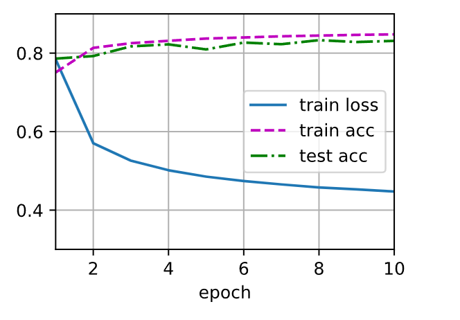

# ch-4

## 4.1 多层感知机

通过在网络中加入一个或多个隐藏层来克服线性模型的限制， 使其能处理更普遍的函数关系类型。 要做到这一点，最简单的方法是将许多全连接层堆叠在一起。 每一层都输出到上面的层，直到生成最后的输出。 我们可以把前𝐿−1层看作表示，把最后一层看作线性预测器。 这种架构通常称为*多层感知机*（multilayer perceptron），通常缩写为*MLP*。

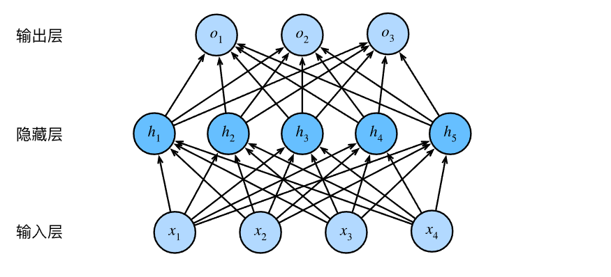

- Relu函数

  $\operatorname{ReLU}(x) = \max(x, 0).$

  ```Python
x = torch.arange(-8.0, 8.0, 0.1, requires_grad=True)
y = torch.relu(x)
d2l.plot(x.detach(), y.detach(), 'x', 'relu(x)', figsize=(5, 2.5))
```


  当输入为负时，ReLU函数的导数为0，而当输入为正时，ReLU函数的导数为1。 注意，当输入值精确等于0时，ReLU函数不可导。 在此时，我们默认使用左侧的导数，即当输入为0时导数为0。 我们可以忽略这种情况，因为输入可能永远都不会是0。

***"如果微妙的边界条件很重要，我们很可能是在研究数学而非工程"***

  ```Python
d2l.plot(x.detach() ,x.grad.detach(), 'x', 'grad of relu', figsize=(5, 2.5))
```

  

- Sigmoid函数

                                                                    $\operatorname{sigmoid}(x) = \frac{1}{1 + \exp(-x)}.$

  ```Python
y = torch.sigmoid(x)
d2l.plot(x.detach(), y.detach(), 'x', 'sigmoid(x)', figsize=(5, 2.5))
```

  

  sigmoid函数的导数为下面的公式：

                                   $\frac{d}{dx} \operatorname{sigmoid}(x) = \frac{\exp(-x)}{(1 + \exp(-x))^2} = \operatorname{sigmoid}(x)\left(1-\operatorname{sigmoid}(x)\right).$

  ```Python
# 清除以前的梯度
x.grad.data.zero_()
y.backward(torch.ones_like(x),retain_graph=True)
d2l.plot(x.detach(), x.grad, 'x', 'grad of sigmoid', figsize=(5, 2.5))
```

  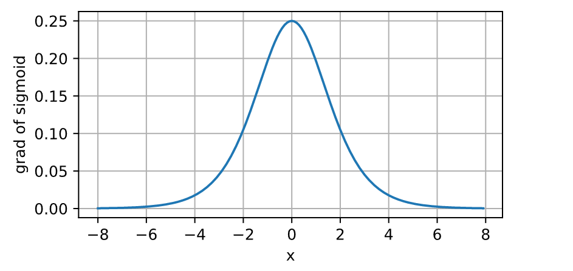

- tanh函数

                                                                  **$\operatorname{tanh}(x) = \frac{1 - \exp(-2x)}{1 + \exp(-2x)}.$**

  ```Python
y = torch.tanh(x)
d2l.plot(x.detach(), y.detach(), 'x', 'tanh(x)', figsize=(5, 2.5))
```

  

  tanh函数的导数是：

  $\frac{d}{dx} \operatorname{tanh}(x) = 1 - \operatorname{tanh}^2(x).$

  ```Python
# 清除以前的梯度
x.grad.data.zero_()
y.backward(torch.ones_like(x),retain_graph=True)
d2l.plot(x.detach(), x.grad, 'x', 'grad of tanh', figsize=(5, 2.5))
```

  

### 习题

34. **计算pReLU激活函数的导数。**

  $\operatorname{PRelu}(x) = \max(0, x) + a * \min(0, x)$

  当x＞0时，导数为1；当x小于0时，倒数为a。

35. **证明一个仅使用ReLU（或pReLU）的多层感知机构造了一个连续的分段线性函数。**

  ReLU的神经网络可以严格等于任何(有限段)分段线性函数。任何(有限区间上)连续函数，总可以在任给定的误差下，用(有限段)分段线性函数近似。对于有限个间断点的函数，可以在间断点附近挖掉任意小的小区间，在外面用连续函数近似。

36. **证明tanh(𝑥)+1=2sigmoid(2𝑥)。**

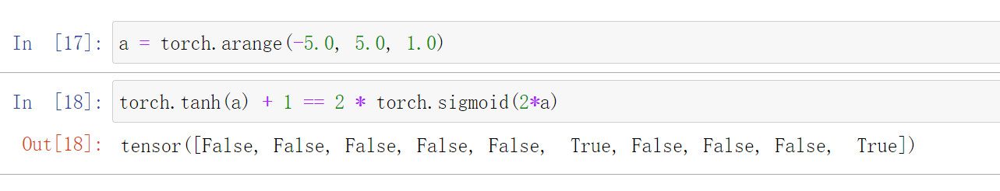

  为什么数值上是不相等的，疑惑

37. **假设我们有一个非线性单元，将它一次应用于一个小批量的数据。这会导致什么样的问题？**

  数据可能会被剧烈的拉伸或者压缩，可能会导致分布的偏移，并且与后面的神经元对接后可能会损失一定的特征。

## 4.2 多层感知机从零实现

```Python
import torch
from torch import nn
from d2l import torch as d2l

# 加载数据
batch_size = 256
train_iter, test_iter = d2l.load_data_fashion_mnist(batch_size)

# 初始化模型参数
num_inputs, num_outputs, num_hiddens = 784, 10, 256
W1 = nn.Parameter(torch.randn(
    num_inputs, num_hiddens, requires_grad=True) * 0.01)
b1 = nn.Parameter(torch.zeros(num_hiddens, requires_grad=True))
W2 = nn.Parameter(torch.randn(
    num_hiddens, num_outputs, requires_grad=True) * 0.01)
b2 = nn.Parameter(torch.zeros(num_outputs, requires_grad=True))
params = [W1, b1, W2, b2]

# 激活函数：relu
def relu(X):
    a = torch.zeros_like(X)
    return torch.max(X, a)
  
# 模型
def net(X):
    X = X.reshape((-1, num_inputs))
    H = relu(X@W1 + b1)  # 这里“@”代表矩阵乘法
    return (H@W2 + b2)
  
# 损失函数
loss = nn.CrossEntropyLoss(reduction='none')

# 训练
num_epochs, lr = 10, 0.1
updater = torch.optim.SGD(params, lr=lr)
d2l.train_ch3(net, train_iter, test_iter, loss, num_epochs, updater)

# 模型展示
d2l.predict_ch3(net, test_iter)
```

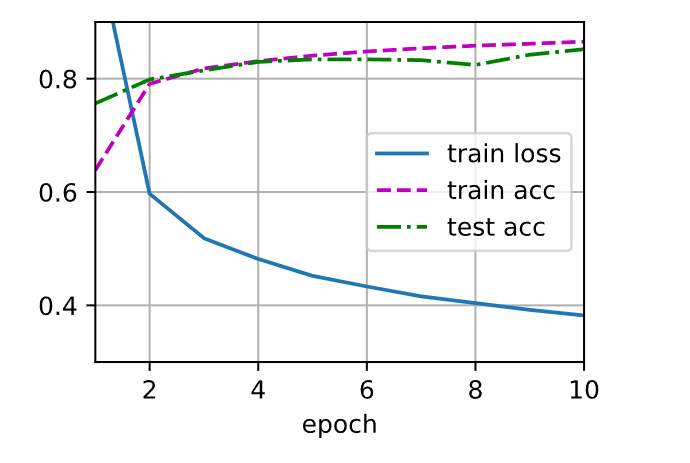

### 练习

38. **在所有其他参数保持不变的情况下，更改超参数`num_hiddens`的值，并查看此超参数的变化对结果有何影响。确定此超参数的最佳值。**

  实验操作一下

39. **尝试添加更多的隐藏层，并查看它对结果有何影响。**

  实验操作

40. **改变学习速率会如何影响结果？保持模型架构和其他超参数（包括轮数）不变，学习率设置为多少会带来最好的结果？**

  实验操作

41. **通过对所有超参数（学习率、轮数、隐藏层数、每层的隐藏单元数）进行联合优化，可以得到的最佳结果是什么？**

  实验操作

42. **描述为什么涉及多个超参数更具挑战性。**

43. **如果想要构建多个超参数的搜索方法，请想出一个聪明的策略。**

  启发式

## 4.3 多层感知机简洁实现

- 这个地方建议增加一个num_work的自定义选项.

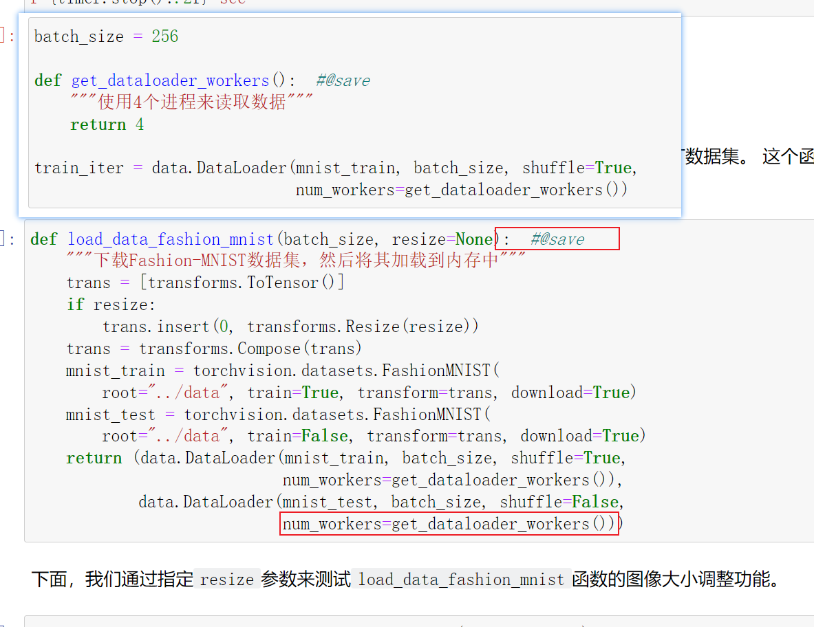

```Python
import torch
from torch import nn
from d2l import torch as d2l

# 建立模型
net = nn.Sequential(nn.Flatten(),
                    nn.Linear(784, 256),
                    nn.ReLU(),
                    nn.Linear(256, 10))

# 此处即使不初始化参数，torch也会自己初始化
def init_weights(m):
    if type(m) == nn.Linear:
        nn.init.normal_(m.weight, std=0.01)

net.apply(init_weights)

# 损失函数 学习率 优化器
batch_size, lr, num_epochs = 256, 0.1, 10
loss = nn.CrossEntropyLoss(reduction='none')
trainer = torch.optim.SGD(net.parameters(), lr=lr)

# 加载数据 训练模型
train_iter, test_iter = d2l.load_data_fashion_mnist(batch_size)
d2l.train_ch3(net, train_iter, test_iter, loss, num_epochs, trainer)
```


## 4.4模型选择

- ***只有当模型真正发现了一种泛化模式时，才会作出有效的预测。***

- ***将模型在训练数据上拟合的比在潜在分布中更接近的现象称为过拟合（overfitting）， 用于对抗过拟合的技术称为正则化（regularization）。***


44. **可调整参数的数量。当可调整参数的数量（有时称为*自由度*）很大时，模型往往更容易过拟合。**

45. **参数采用的值。当权重的取值范围较大时，模型可能更容易过拟合。**

46. **训练样本的数量。即使模型很简单，也很容易过拟合只包含一两个样本的数据集。而过拟合一个有数百万个样本的数据集则需要一个极其灵活的模型。**

## 4.5 权重衰减

实际上，我们通过*正则化常数*$\lambda$来描述这种权衡，这是一个非负超参数，我们使用验证数据拟合：

$L(\mathbf{w}, b) + \frac{\lambda}{2} \|\mathbf{w}\|^2,$

对于$\lambda = 0$，我们恢复了原来的损失函数。对于$\lambda > 0$，我们限制$\| \mathbf{w} \|$的大小。

- ***正则化是处理过拟合的常用方法：在训练集的损失函数中加入惩罚项，以降低学习到的模型的复杂度。***

- ***保持模型简单的一个特别的选择是使用𝐿2惩罚的权重衰减。这会导致学习算法更新步骤中的权重衰减。***

- ***权重衰减功能在深度学习框架的优化器中提供。***

- ***在同一训练代码实现中，不同的参数集可以有不同的更新行为。***

## 4.6 暂退法 Dropout

*在 Pytorch 中继承 torch.nn.Module 后, 要执行 self(自己, self).__init__( ) 才能通过调用实例化的对象的 实例化对象( ) 的方法调用 forward 函数*

**1.如果更改第一层和第二层的暂退法概率，会发生什么情况？具体地说，如果交换这两个层，会发生什么情况？设计一个实验来回答这些问题，定量描述你的结果，并总结定性的结论。**

在实验中发现，在误差允许的范围内其实差别不大，第一层暂退法概率大点，第二层暂退法概率小点效果会略微优一点。猜测原因可能有：①前面层抽取的是比较底层的语义信息，有较多的无用信息冗余通过强神经元，从而使得网络记住这些冗余信息而学不到关键信息(导致过拟合)，用较大Dropout较好，后面层主管高层抽象语义信息，较为关键，是把握识别整体的关键部分，用较小Dropout较好；②一般前面层全连接数目比较大，抽取信息量比较多，自然带来冗余信息较多，那么多的数目连接，可以通过较大Dropout丢弃掉大部分的全连接，实际上因为基数大，剩下的没有置0的连接数目还是很多的。

具体实验过程可看下面这个链接：[参考链接](https://links.jianshu.com/go?to=https%3A%2F%2Fgist.github.com%2Frandomgeek78%2F89ec0242ac756db88d14e2d1982abae9)

**2.增加训练轮数，并将使用暂退法和不使用暂退法时获得的结果进行比较。**

随着训练轮数的增加，使用Dropout的loss将会逐渐趋于一个稳定值并有小幅度的波动，不使用Dropout的loss将会一直小幅度的下降，最后在训练集上，可以看到不使用Dropout的会比使用Dropout的loss小，但是在测试集上面，前者的准确率会比后者小。这明显发生了过拟合。

**3.当应用或不应用暂退法时，每个隐藏层中激活值的方差是多少？绘制一个曲线图，以显示这两个模型的每个隐藏层中激活值的方差是如何随时间变化的。**

Dropout会减少对强神经元的依赖，因此强神经元的激活值会降低(在本轮训练中被置零，梯度更新不会更新)，但激活弱神经元的值会增加，这样强、弱神经元之间方差变小了。

**4.为什么在测试时通常不使用暂退法？**

因为测试的时候网络模型是固定的，可以认为是一种已知的先验，那当然是不用Dropout加入噪声的。

**5.以本节中的模型为例，比较使用暂退法和权重衰减的效果。如果同时使用暂退法和权重衰减，会发生什么情况？结果是累加的吗？收益是否减少（或者说更糟）？它们互相抵消了吗？**

结果会更好，因为它们防止过拟合的思考点不同，暂退法思考点引入一定的噪声，增加模型对输入数据的扰动鲁棒，从而增强泛化性；权重衰减在于约束模型参数来防止模型过拟合。

**6.如果我们将暂退法应用到权重矩阵的各个权重，而不是激活值，会发生什么？**

我感觉这个题的题目意思应该是：“Dropout应该放在激活函数之前还是之后”。

目前代码上面Dropout都是用在激活函数之后的，因为有些激活函数在0处的梯度并不是0，这样的话先用Dropout置零后再经过激活函数，这样那个神经元就会有梯度了(我们一般把神经层+Batchnorm层+激活函数为一层，所以把Dropout放在激活函数之后也是有道理的)，起不到了Dropout的作用了，应该在激活函数之后用Dropout。

**7.发明另一种用于在每一层注入随机噪声的技术，该技术不同于标准的暂退法技术。尝试开发一种在Fashion-MNIST数据集（对于固定架构）上性能优于暂退法的方法。**

可以尝试下把每一层算它的方差和均值，然后作一个高斯噪声叠加上去。

参考(参考)

[《动手学深度学习》参考答案(第二版)-第四章](https://www.jianshu.com/p/a8cab5a45b2e)

## 4.8 梯度消失

曾经sigmoid函数$1/(1 + \exp(-x))$（ :numref:`sec_mlp`提到过）很流行，因为它类似于阈值函数。由于早期的人工神经网络受到生物神经网络的启发，神经元要么完全激活要么完全不激活（就像生物神经元）的想法很有吸引力。然而，它却是导致梯度消失问题的一个常见的原因，让我们仔细看看sigmoid函数为什么会导致梯度消失。

```Python
%matplotlib inline
import torch
from d2l import torch as d2l

x = torch.arange(-8.0, 8.0, 0.1, requires_grad=True)
y = torch.sigmoid(x)
y.backward(torch.ones_like(x))

d2l.plot(x.detach().numpy(), [y.detach().numpy(), x.grad.numpy()],
         legend=['sigmoid', 'gradient'], figsize=(4.5, 2.5))
```

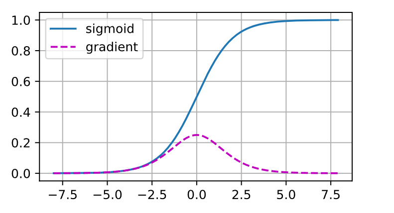

***当sigmoid函数的输入很大或是很小时，它的梯度都会消失。***

# ch-5

## 5.1 层和块

- 自定义块

```Python
class MLP(nn.Module):
    # 用模型参数声明层。这里，我们声明两个全连接的层
    def __init__(self):
        # 调用MLP的父类Module的构造函数来执行必要的初始化。
        # 这样，在类实例化时也可以指定其他函数参数，例如模型参数params（稍后将介绍）
        super().__init__()
        self.hidden = nn.Linear(20, 256)  # 隐藏层
        self.out = nn.Linear(256, 10)  # 输出层

    # 定义模型的前向传播，即如何根据输入X返回所需的模型输出
    def forward(self, X):
        # 注意，这里我们使用ReLU的函数版本，其在nn.functional模块中定义。
        return self.out(F.relu(self.hidden(X)))
```

- 顺序快

```Python
class MySequential(nn.Module):
    def __init__(self, *args):
        super().__init__()
        for idx, module in enumerate(args):
            # 这里，module是Module子类的一个实例。我们把它保存在'Module'类的成员
            # 变量_modules中。_module的类型是OrderedDict
            self._modules[str(idx)] = module

    def forward(self, X):
        # OrderedDict保证了按照成员添加的顺序遍历它们
        for block in self._modules.values():
            X = block(X)
        return X
```

- **在前向传播函数中执行代码**

```Python
class FixedHiddenMLP(nn.Module):
    def __init__(self):
        super().__init__()
        # 不计算梯度的随机权重参数。因此其在训练期间保持不变
        self.rand_weight = torch.rand((20, 20), requires_grad=False)
        self.linear = nn.Linear(20, 20)

    def forward(self, X):
        X = self.linear(X)
        # 使用创建的常量参数以及relu和mm函数
        X = F.relu(torch.mm(X, self.rand_weight) + 1)
        # 复用全连接层。这相当于两个全连接层共享参数
        X = self.linear(X)
        # 控制流
        while X.abs().sum() > 1:
            X /= 2
        return X.sum()
```

- 混搭、组合块

```Python
class NestMLP(nn.Module):
    def __init__(self):
        super().__init__()
        self.net = nn.Sequential(nn.Linear(20, 64), nn.ReLU(),
                                 nn.Linear(64, 32), nn.ReLU())
        self.linear = nn.Linear(32, 16)

    def forward(self, X):
        return self.linear(self.net(X))

chimera = nn.Sequential(NestMLP(), nn.Linear(16, 20), FixedHiddenMLP())
chimera(X)
```

### 练习

47. ***如果将`MySequential`中存储块的方式更改为Python列表，会出现什么样的问题？***

  报错，试过了，但不知道为啥。

48. ***实现一个块，它以两个块为参数，例如`net1`和`net2`，并返回前向传播中两个网络的串联输出。这也被称为平行块。***

  ```Python
class myMLP(nn.Module):
    def __init__(self, *args):
        super().__init__()
        for block in args:
            self._modules[block] = block
    
    def forward(self, X):
        outputs = []
        for block in self._modules.values():
            outputs.append(block)
        return outputs
net = myMLP(nn.Linear(20, 256), nn.Sequential(nn.Linear(20, 128), nn.ReLU(), nn.Linear(128, 256)))
net(X)

[Linear(in_features=20, out_features=256, bias=True),
 Sequential(
   (0): Linear(in_features=20, out_features=128, bias=True)
   (1): ReLU()
   (2): Linear(in_features=128, out_features=256, bias=True)
 )]
  ```

  课后题参考

  ```Python
class Bigkuai(nn.Module):
    def __init__(self):
        super().__init__()
        self.net1=nn.Sequential(nn.Linear(20,66),nn.ReLU())
        self.net2=nn.Sequential(nn.Linear(20,33),nn.ReLU())
        
    def forward(self,X):
        x1= self.net1(X)
        x2= self.net2(X)
        x3= torch.cat((x1,x2),1)
        Twao=nn.Sequential(nn.Linear(x3.shape[1],30),nn.ReLU())
        return Twao(x3)

X = torch.rand(2,20)
k=Bigkuai()
print(k(X))
k(X).shape

tensor([[0.0079, 0.1055, 0.0116, 0.0000, 0.1243, 0.0000, 0.0000, 0.0000, 0.0000,
         0.0000, 0.0000, 0.0000, 0.0519, 0.1405, 0.1829, 0.0000, 0.3230, 0.0000,
         0.0000, 0.0000, 0.0000, 0.0000, 0.0099, 0.3829, 0.0150, 0.2154, 0.0000,
         0.0000, 0.3000, 0.0210],
        [0.0000, 0.0799, 0.0315, 0.0000, 0.0242, 0.0000, 0.0000, 0.0000, 0.0222,
         0.0000, 0.0674, 0.0000, 0.0000, 0.1620, 0.0587, 0.0000, 0.3102, 0.0000,
         0.0000, 0.0050, 0.0000, 0.0000, 0.0217, 0.2538, 0.0432, 0.1730, 0.0000,
         0.0000, 0.1923, 0.1408]], grad_fn=<ReluBackward0>)
torch.Size([2, 30])
  ```

  ```Python
class MyParallel(nn.Module):
    def __init__(self, *args):
        super().__init__()
        for idx, module in enumerate(args):
            self._modules[str(idx)] = module

    def forward(self, X):
        return torch.concat((self._modules['0'](X), self._modules['1'](X)),1)

X = torch.rand(2, 20)
n1 = nn.Linear(20, 256)
n2 = nn.Linear(20, 128)
p = MyParallel(n1,n2)
print(p(X).shape, p(X))
print(p)
  ```

49. ***假设我们想要连接同一网络的多个实例。实现一个函数，该函数生成同一个块的多个实例，并在此基础上构建更大的网络。***

  ```Python
class Factory(nn.Module):
    def __init__(self, net, ins, outs, k):
        super().__init__()
        for idx in range(k):
            self._modules[str(idx)] = net(ins, outs)

    def forward(self, X):
        res = list()
        for idx in range(len(self._modules)):
            res.append(self._modules[str(idx)](X))
        return torch.concat(res, 1)

X = torch.rand(2, 20)
f = Factory(nn.Linear, 20, 256, 3)
print(f(X).shape, f(X))
print(f)

torch.Size([2, 768]) tensor([[ 0.3325, -0.7102,  0.8746,  ...,  0.2731,  0.5325, -0.2417],
        [-0.0586, -0.8537,  0.7218,  ...,  0.4606,  0.5317, -0.1221]],
       grad_fn=<CatBackward0>)
Factory(
  (0): Linear(in_features=20, out_features=256, bias=True)
  (1): Linear(in_features=20, out_features=256, bias=True)
  (2): Linear(in_features=20, out_features=256, bias=True)
)
  ```

## 5.2 参数管理

- 参数初始化方法

```Python
def init_normal(m):
    if type(m) == nn.Linear:
        nn.init.normal_(m.weight, mean=0, std=0.01)
        nn.init.zeros_(m.bias)
net.apply(init_normal)
net[0].weight.data[0], net[0].bias.data[0]
```

- 也可以将参数初始化为常数

```Python
def init_constant(m):
    if type(m) == nn.Linear:
        nn.init.constant_(m.weight, 1)
        nn.init.zeros_(m.bias)
net.apply(init_constant)
net[0].weight.data[0], net[0].bias.data[0]
```

- 对某些块应用不同的初始化方法

```Python
def init_xavier(m):
    if type(m) == nn.Linear:
        nn.init.xavier_uniform_(m.weight)
def init_42(m):
    if type(m) == nn.Linear:
        nn.init.constant_(m.weight, 42)

net[0].apply(init_xavier)
net[2].apply(init_42)
print(net[0].weight.data[0])
print(net[2].weight.data)
```

### 练习

50. **使用 :numref:`sec_model_construction` 中定义的`FancyMLP`模型，访问各个层的参数。**

  ```Python
from torch.nn import functional as F
class FixedHiddenMLP(nn.Module):
    def __init__(self):
        super().__init__()
        # 不计算梯度的随机权重参数。因此其在训练期间保持不变
        self.rand_weight = torch.rand((20, 20), requires_grad=False)
        self.linear = nn.Linear(20, 20)

    def forward(self, X):
        X = self.linear(X)
        # 使用创建的常量参数以及relu和mm函数
        X = F.relu(torch.mm(X, self.rand_weight) + 1)
        # 复用全连接层。这相当于两个全连接层共享参数
        X = self.linear(X)
        # 控制流
        while X.abs().sum() > 1:
            X /= 2
        return X.sum()

X = torch.rand(2, 20)
net = FixedHiddenMLP()
net(X)
net.state_dict()
  ```

51. **查看初始化模块文档以了解不同的初始化方法。**

52. **构建包含共享参数层的多层感知机并对其进行训练。在训练过程中，观察模型各层的参数和梯度。**

53. **为什么共享参数是个好主意？**

  共享参数通常可以节省内存，并在以下方面具有特定的好处：

  - 对于图像识别中的CNN，共享参数使网络能够在图像中的任何地方而不是仅在某个区域中查找给定的功能。

  - 对于RNN，它在序列的各个时间步之间共享参数，因此可以很好地推广到不同序列长度的示例。

  - 对于自动编码器，编码器和解码器共享参数。 在具有线性激活的单层自动编码器中，共享权重会在权重矩阵的不同隐藏层之间强制正交。

## 5.4 自定义层

- 不带参数的层

```Python
import torch
import torch.nn.functional as F
from torch import nn


class CenteredLayer(nn.Module):
    def __init__(self):
        super().__init__()

    def forward(self, X):
        return X - X.mean()
```

- 带参数的层

```Python
class MyLinear(nn.Module):
    def __init__(self, in_units, units):
        super().__init__()
        self.weight = nn.Parameter(torch.randn(in_units, units))
        self.bias = nn.Parameter(torch.randn(units,))
    def forward(self, X):
        linear = torch.matmul(X, self.weight.data) + self.bias.data
        return F.relu(linear)
```

### 练习

54. **设计一个接受输入并计算张量降维的层，它返回$y_k = \sum_{i, j} W_{ijk} x_i x_j$。**

  我看不懂这个公式。呜呜呜

55. **设计一个返回输入数据的傅立叶系数前半部分的层。**

  别说了 这个也不懂

## 5.5 读写文件

- 整一个小模型

```Python
class MLP(nn.Module):
    def __init__(self):
        super().__init__()
        self.hidden = nn.Linear(20, 256)
        self.output = nn.Linear(256, 10)

    def forward(self, x):
        return self.output(F.relu(self.hidden(x)))

net = MLP()
X = torch.randn(size=(2, 20))
Y = net(X)
Y
```

- 将模型的参数存储在一个叫做“mlp.params”的文件中

```Python
torch.save(net.state_dict(), 'mlp.params')
```

- 读取模型

```Python
clone = MLP()
clone.load_state_dict(torch.load('mlp.params'))
clone.eval(), clone(X)


(MLP(
   (hidden): Linear(in_features=20, out_features=256, bias=True)
   (output): Linear(in_features=256, out_features=10, bias=True)
 ),
 tensor([[ 0.7277,  0.3096, -0.0589,  0.2266,  0.1683, -0.1756, -0.2814, -0.3548,
          -0.2932,  0.3911],
         [ 0.2269, -0.0754, -0.1885, -0.0034, -0.0981,  0.1551,  0.0071, -0.0637,
          -0.1451,  0.0316]], grad_fn=<AddmmBackward0>))
```

### 小结

- `save`和`load`函数可用于张量对象的文件读写。

- 我们可以通过参数字典保存和加载网络的全部参数。

- 保存架构必须在代码中完成，而不是在参数中完成。

## 5.6 GPU

```Python
!nvidia-smi

Sat Mar  4 11:12:36 2023       
+-----------------------------------------------------------------------------+
| NVIDIA-SMI 528.49       Driver Version: 528.49       CUDA Version: 12.0     |
|-------------------------------+----------------------+----------------------+
| GPU  Name            TCC/WDDM | Bus-Id        Disp.A | Volatile Uncorr. ECC |
| Fan  Temp  Perf  Pwr:Usage/Cap|         Memory-Usage | GPU-Util  Compute M. |
|                               |                      |               MIG M. |
|===============================+======================+======================|
|   0  NVIDIA GeForce ... WDDM  | 00000000:01:00.0  On |                  N/A |
| N/A   33C    P8    13W /  94W |   1079MiB /  6144MiB |      0%      Default |
|                               |                      |                  N/A |
+-------------------------------+----------------------+----------------------+
                                                                               
+-----------------------------------------------------------------------------+
| Processes:                                                                  |
|  GPU   GI   CI        PID   Type   Process name                  GPU Memory |
|        ID   ID                                                   Usage      |
|=============================================================================|
|    0   N/A  N/A      2244    C+G   C:\Windows\explorer.exe         N/A      |
|    0   N/A  N/A      2492    C+G   ...y\ShellExperienceHost.exe    N/A      |
|    0   N/A  N/A      2968    C+G   ...8wekyb3d8bbwe\Cortana.exe    N/A      |
|    0   N/A  N/A      3420    C+G   ...2gh52qy24etm\Nahimic3.exe    N/A      |
|    0   N/A  N/A      3504    C+G   ...artMenuExperienceHost.exe    N/A      |
|    0   N/A  N/A      3528    C+G   ...587.57\msedgewebview2.exe    N/A      |
|    0   N/A  N/A      5444    C+G   ...2txyewy\TextInputHost.exe    N/A      |
|    0   N/A  N/A      7792    C+G   ...7pnf6hceqser\snipaste.exe    N/A      |
|    0   N/A  N/A      9108    C+G   ...cw5n1h2txyewy\LockApp.exe    N/A      |
|    0   N/A  N/A     10108    C+G   ...me\Application\chrome.exe    N/A      |
|    0   N/A  N/A     18992    C+G   ...perience\NVIDIA Share.exe    N/A      |
|    0   N/A  N/A     20012    C+G   ...oft\OneDrive\OneDrive.exe    N/A      |
|    0   N/A  N/A     20236    C+G   ...8bbwe\WindowsTerminal.exe    N/A      |
|    0   N/A  N/A     20824    C+G   ...d\runtime\WeChatAppEx.exe    N/A      |
|    0   N/A  N/A     21260    C+G   ...e\PhoneExperienceHost.exe    N/A      |
|    0   N/A  N/A     21724    C+G   ..._dt26b99r8h8gj\RtkUWP.exe    N/A      |
|    0   N/A  N/A     24524    C+G   ...8wekyb3d8bbwe\msteams.exe    N/A      |
|    0   N/A  N/A     24968    C+G   ...n1h2txyewy\SearchHost.exe    N/A      |
|    0   N/A  N/A     25212    C+G   ...CloudMusic\cloudmusic.exe    N/A      |
|    0   N/A  N/A     25380    C+G   ...perience\NVIDIA Share.exe    N/A      |
|    0   N/A  N/A     25460    C+G   D:\flowus\FlowUs.exe            N/A      |
+-----------------------------------------------------------------------------+
```

# ch-6

## 6.2 图像卷积

- 输入是高度为3、宽度为3的二维张量（即形状为3×3）。卷积核的高度和宽度都是2，而卷积核窗口（或卷积窗口）的形状由内核的高度和宽度决定（即2×2）。


- 基于定义的`corr2d`函数[**实现二维卷积层**]。在`__init__`构造函数中，将`weight`和`bias`声明为两个模型参数。前向传播函数调用`corr2d`函数并添加偏置。

```Python
def corr2d(X, K):  #@save
    """计算二维互相关运算"""
    h, w = K.shape
    Y = torch.zeros((X.shape[0] - h + 1, X.shape[1] - w + 1))
    for i in range(Y.shape[0]):
        for j in range(Y.shape[1]):
            Y[i, j] = (X[i:i + h, j:j + w] * K).sum()
    return Y

class Conv2D(nn.Module):
    def __init__(self, kernel_size):
        super().__init__()
        self.weight = nn.Parameter(torch.rand(kernel_size))
        self.bias = nn.Parameter(torch.zeros(1))

    def forward(self, x):
        return corr2d(x, self.weight) + self.bias

net = Conv2D((3,3))
net(X)
```

```Python
# 构造一个二维卷积层，它具有1个输出通道和形状为（1，2）的卷积核
conv2d = nn.Conv2d(1,1, kernel_size=(1, 2), bias=False)

# 这个二维卷积层使用四维输入和输出格式（批量大小、通道、高度、宽度），
# 其中批量大小和通道数都为1
X = X.reshape((1, 1, 6, 8))
Y = Y.reshape((1, 1, 6, 7))
lr = 3e-2  # 学习率

for i in range(10):
    Y_hat = conv2d(X)
    l = (Y_hat - Y) ** 2
    conv2d.zero_grad()
    l.sum().backward()
    # 迭代卷积核
    conv2d.weight.data[:] -= lr * conv2d.weight.grad
    if (i + 1) % 2 == 0:
        print(f'epoch {i+1}, loss {l.sum():.3f}')
```

- ***在卷积过程中，是在学习`kernel_size`的参数。（对`kernel_size`内的参数梯度下降，更新）***

### 练习

56. 构建一个具有对角线边缘的图像`X`。

  57. 如果将本节中举例的卷积核`K`应用于`X`，会发生什么情况？

    ```Python
X = torch.eye(8)
K = torch.tensor([[1.0, -1.0]])
Y = corr2d(X, K)
X, Y

(tensor([[1., 0., 0., 0., 0., 0., 0., 0.],
         [0., 1., 0., 0., 0., 0., 0., 0.],
         [0., 0., 1., 0., 0., 0., 0., 0.],
         [0., 0., 0., 1., 0., 0., 0., 0.],
         [0., 0., 0., 0., 1., 0., 0., 0.],
         [0., 0., 0., 0., 0., 1., 0., 0.],
         [0., 0., 0., 0., 0., 0., 1., 0.],
         [0., 0., 0., 0., 0., 0., 0., 1.]]),
 tensor([[ 1.,  0.,  0.,  0.,  0.,  0.,  0.],
         [-1.,  1.,  0.,  0.,  0.,  0.,  0.],
         [ 0., -1.,  1.,  0.,  0.,  0.,  0.],
         [ 0.,  0., -1.,  1.,  0.,  0.,  0.],
         [ 0.,  0.,  0., -1.,  1.,  0.,  0.],
         [ 0.,  0.,  0.,  0., -1.,  1.,  0.],
         [ 0.,  0.,  0.,  0.,  0., -1.,  1.],
         [ 0.,  0.,  0.,  0.,  0.,  0., -1.]]))
```

  58. 如果转置`X`会发生什么？

    nothing happend

    ```Python
Y = corr2d(X.T, K)
X, Y

(tensor([[1., 0., 0., 0., 0., 0., 0., 0.],
         [0., 1., 0., 0., 0., 0., 0., 0.],
         [0., 0., 1., 0., 0., 0., 0., 0.],
         [0., 0., 0., 1., 0., 0., 0., 0.],
         [0., 0., 0., 0., 1., 0., 0., 0.],
         [0., 0., 0., 0., 0., 1., 0., 0.],
         [0., 0., 0., 0., 0., 0., 1., 0.],
         [0., 0., 0., 0., 0., 0., 0., 1.]]),
 tensor([[ 1.,  0.,  0.,  0.,  0.,  0.,  0.],
         [-1.,  1.,  0.,  0.,  0.,  0.,  0.],
         [ 0., -1.,  1.,  0.,  0.,  0.,  0.],
         [ 0.,  0., -1.,  1.,  0.,  0.,  0.],
         [ 0.,  0.,  0., -1.,  1.,  0.,  0.],
         [ 0.,  0.,  0.,  0., -1.,  1.,  0.],
         [ 0.,  0.,  0.,  0.,  0., -1.,  1.],
         [ 0.,  0.,  0.,  0.,  0.,  0., -1.]]))
```

  59. 如果转置`K`会发生什么？

    Y的结果会转置
    
    ```Python
Y = corr2d(X, K.T)
X, Y

(tensor([[1., 0., 0., 0., 0., 0., 0., 0.],
         [0., 1., 0., 0., 0., 0., 0., 0.],
         [0., 0., 1., 0., 0., 0., 0., 0.],
         [0., 0., 0., 1., 0., 0., 0., 0.],
         [0., 0., 0., 0., 1., 0., 0., 0.],
         [0., 0., 0., 0., 0., 1., 0., 0.],
         [0., 0., 0., 0., 0., 0., 1., 0.],
         [0., 0., 0., 0., 0., 0., 0., 1.]]),
 tensor([[ 1., -1.,  0.,  0.,  0.,  0.,  0.,  0.],
         [ 0.,  1., -1.,  0.,  0.,  0.,  0.,  0.],
         [ 0.,  0.,  1., -1.,  0.,  0.,  0.,  0.],
         [ 0.,  0.,  0.,  1., -1.,  0.,  0.,  0.],
         [ 0.,  0.,  0.,  0.,  1., -1.,  0.,  0.],
         [ 0.,  0.,  0.,  0.,  0.,  1., -1.,  0.],
         [ 0.,  0.,  0.,  0.,  0.,  0.,  1., -1.]]))
```

## 6.3 步幅、填充

### 练习

60. 对于本节中的最后一个示例，计算其输出形状，以查看它是否与实验结果一致。

  输入(8,8)，输出：0维：(8-3+0)/3+1=2(取下整数)，1维:(8-5+1)/4+1=2

61. 在本节中的实验中，试一试其他填充和步幅组合。

62. 对于音频信号，步幅$2$说明什么？

  可能音频的最小单位是2？

63. 步幅大于$1$的计算优势是什么？

  减小采样率和输出大小，提高计算速度

## 6.4 多输入、多输出通道

***当输入包含多个通道时，需要构造一个与输入数据具有相同输入通道数的卷积核，以便与输入数据进行互相关运算。假设输入的通道数为$c_i$，那么卷积核的输入通道数也需要为$c_i$。如果卷积核的窗口形状是$k_h\times k_w$，那么当$c_i=1$时，我们可以把卷积核看作形状为$k_h\times k_w$的二维张量。***

***然而，当$c_i>1$时，我们卷积核的每个输入通道将包含形状为$k_h\times k_w$的张量。将这些张量$c_i$连结在一起可以得到形状为$c_i\times k_h\times k_w$的卷积核。由于输入和卷积核都有$c_i$个通道，我们可以对每个通道输入的二维张量和卷积核的二维张量进行互相关运算，再对通道求和（将$c_i$的结果相加）得到二维张量。这是多通道输入和多输入通道卷积核之间进行二维互相关运算的结果。***

***我们演示了一个具有两个输入通道的二维互相关运算的示例。阴影部分是第一个输出元素以及用于计算这个输出的输入和核张量元素：$(1\times1+2\times2+4\times3+5\times4)+(0\times0+1\times1+3\times2+4\times3)=56$。***


## 6.5 汇聚层(池化)

- ***它具有双重目的：降低卷积层对位置的敏感性，同时降低对空间降采样表示的敏感性。***

## 6.6 LeNet-5


每个卷积块中的基本单元是一个卷积层、一个sigmoid激活函数和平均汇聚层。请注意，虽然ReLU和最大汇聚层更有效，但它们在20世纪90年代还没有出现。每个卷积层使用5×5卷积核和一个sigmoid激活函数。这些层将输入映射到多个二维特征输出，通常同时增加通道的数量。第一卷积层有6个输出通道，而第二个卷积层有16个输出通道。每个2×2池操作（步幅2）通过空间下采样将维数减少4倍。卷积的输出形状由批量大小、通道数、高度、宽度决定。

为了将卷积块的输出传递给稠密块，我们必须在小批量中展平每个样本。换言之，我们将这个四维输入转换成全连接层所期望的二维输入。这里的二维表示的第一个维度索引小批量中的样本，第二个维度给出每个样本的平面向量表示。LeNet的稠密块有三个全连接层，分别有120、84和10个输出。因为我们在执行分类任务，所以输出层的10维对应于最后输出结果的数量。

通过下面的LeNet代码，可以看出用深度学习框架实现此类模型非常简单。我们只需要实例化一个`Sequential`块并将需要的层连接在一起。

```Python
import torch
from torch import nn
from d2l import torch as d2l

net = nn.Sequential(
    nn.Conv2d(1, 6, kernel_size=5, padding=2), nn.Sigmoid(), # 6*28*28
    nn.AvgPool2d(kernel_size=2, stride=2), # 6*14*14
    nn.Conv2d(6, 16, kernel_size=5), nn.Sigmoid(), # 16*10*10
    nn.AvgPool2d(kernel_size=2, stride=2), # 16*5*5
    nn.Flatten(),
    nn.Linear(16 * 5 * 5, 120), nn.Sigmoid(),
    nn.Linear(120, 84), nn.Sigmoid(),
    nn.Linear(84, 10))
```


```Python
X = torch.rand(size=(1, 1, 28, 28), dtype=torch.float32)
for layer in net:
    X = layer(X)
    print(layer.__class__.__name__,'output shape: \t',X.shape)
    
    
Conv2d output shape: 	 torch.Size([1, 6, 28, 28])
Sigmoid output shape: 	 torch.Size([1, 6, 28, 28])
AvgPool2d output shape: 	 torch.Size([1, 6, 14, 14])
Conv2d output shape: 	 torch.Size([1, 16, 10, 10])
Sigmoid output shape: 	 torch.Size([1, 16, 10, 10])
AvgPool2d output shape: 	 torch.Size([1, 16, 5, 5])
Flatten output shape: 	 torch.Size([1, 400])
Linear output shape: 	 torch.Size([1, 120])
Sigmoid output shape: 	 torch.Size([1, 120])
Linear output shape: 	 torch.Size([1, 84])
Sigmoid output shape: 	 torch.Size([1, 84])
Linear output shape: 	 torch.Size([1, 10])
```

### 小结

- 卷积神经网络（CNN）是一类使用卷积层的网络。

- 在卷积神经网络中，我们组合使用卷积层、非线性激活函数和汇聚层。

- 为了构造高性能的卷积神经网络，我们通常对卷积层进行排列，逐渐降低其表示的空间分辨率，同时增加通道数。

- 在传统的卷积神经网络中，卷积块编码得到的表征在输出之前需由一个或多个全连接层进行处理。

- LeNet是最早发布的卷积神经网络之一。

### 练习

64. 将平均汇聚层替换为最大汇聚层，会发生什么？

  直接寄掉


65. 尝试构建一个基于LeNet的更复杂的网络，以提高其准确性。

  66. 调整卷积窗口大小。

  67. 调整输出通道的数量。

  68. 调整激活函数（如ReLU）。

  69. 调整卷积层的数量。

  70. 调整全连接层的数量。

  71. 调整学习率和其他训练细节（例如，初始化和轮数）。

72. 在MNIST数据集上尝试以上改进的网络。

73. 显示不同输入（例如毛衣和外套）时，LeNet第一层和第二层的激活值。

# ch-7

## AlexNet

- 模型


```Python
import torch
from torch import nn
from d2l import torch as d2l

net = nn.Sequential(
    # 这里使用一个11*11的更大窗口来捕捉对象。
    # 同时，步幅为4，以减少输出的高度和宽度。
    # 另外，输出通道的数目远大于LeNet
    nn.Conv2d(1, 96, kernel_size=11, stride=4, padding=1), nn.ReLU(),
    nn.MaxPool2d(kernel_size=3, stride=2),
    # 减小卷积窗口，使用填充为2来使得输入与输出的高和宽一致，且增大输出通道数
    nn.Conv2d(96, 256, kernel_size=5, padding=2), nn.ReLU(),
    nn.MaxPool2d(kernel_size=3, stride=2),
    # 使用三个连续的卷积层和较小的卷积窗口。
    # 除了最后的卷积层，输出通道的数量进一步增加。
    # 在前两个卷积层之后，汇聚层不用于减少输入的高度和宽度
    nn.Conv2d(256, 384, kernel_size=3, padding=1), nn.ReLU(),
    nn.Conv2d(384, 384, kernel_size=3, padding=1), nn.ReLU(),
    nn.Conv2d(384, 256, kernel_size=3, padding=1), nn.ReLU(),
    nn.MaxPool2d(kernel_size=3, stride=2),
    nn.Flatten(),
    # 这里，全连接层的输出数量是LeNet中的好几倍。使用dropout层来减轻过拟合
    nn.Linear(6400, 4096), nn.ReLU(),
    nn.Dropout(p=0.5),
    nn.Linear(4096, 4096), nn.ReLU(),
    nn.Dropout(p=0.5),
    # 最后是输出层。由于这里使用Fashion-MNIST，所以用类别数为10，而非论文中的1000
    nn.Linear(4096, 10))
```

- 查看模型输出形状

```Python
def get_net_outshape(net, X):
    for layer in net:
        X=layer(X)
        print(layer.__class__.__name__,'output shape:\t',X.shape)
        
        
X = torch.randn(1, 1, 224, 224)
get_net_outshape(net, X)
```

```Python
X = torch.randn(1, 1, 224, 224)
for layer in net:
    X=layer(X)
    print(layer.__class__.__name__,'output shape:\t',X.shape)

Conv2d output shape:	 torch.Size([1, 96, 54, 54])
ReLU output shape:	 torch.Size([1, 96, 54, 54])
MaxPool2d output shape:	 torch.Size([1, 96, 26, 26])
Conv2d output shape:	 torch.Size([1, 256, 26, 26])
ReLU output shape:	 torch.Size([1, 256, 26, 26])
MaxPool2d output shape:	 torch.Size([1, 256, 12, 12])
Conv2d output shape:	 torch.Size([1, 384, 12, 12])
ReLU output shape:	 torch.Size([1, 384, 12, 12])
Conv2d output shape:	 torch.Size([1, 384, 12, 12])
ReLU output shape:	 torch.Size([1, 384, 12, 12])
Conv2d output shape:	 torch.Size([1, 256, 12, 12])
ReLU output shape:	 torch.Size([1, 256, 12, 12])
MaxPool2d output shape:	 torch.Size([1, 256, 5, 5])
Flatten output shape:	 torch.Size([1, 6400])
Linear output shape:	 torch.Size([1, 4096])
ReLU output shape:	 torch.Size([1, 4096])
Dropout output shape:	 torch.Size([1, 4096])
Linear output shape:	 torch.Size([1, 4096])
ReLU output shape:	 torch.Size([1, 4096])
Dropout output shape:	 torch.Size([1, 4096])
Linear output shape:	 torch.Size([1, 10])
```

- 读取数据集

```Python
batch_size = 128
train_iter, test_iter = d2l.load_data_fashion_mnist(batch_size, resize=224)

lr, num_epochs = 0.01, 10
d2l.train_ch6(net, train_iter, test_iter, num_epochs, lr, d2l.try_gpu())

```


### 模型输出形状计算

                                           $\lfloor(n_h-k_h+p_h+s_h)/s_h\rfloor \times \lfloor(n_w-k_w+p_w+s_w)/s_w\rfloor.$

## VGG-11

3×3卷积核、填充为1（保持高度和宽度）的卷积层，和带有2×2汇聚窗口、步幅为2（每个块后的分辨率减半）的最大汇聚层。在下面的代码中，我们定义了一个名为`vgg_block`的函数来实现一个VGG块。

该函数有三个参数，分别对应于卷积层的数量`num_convs`、输入通道的数量`in_channels` 和输出通道的数量`out_channels`.

```Python
import torch
from torch import nn
from d2l import torch as d2l


def vgg_block(num_convs, in_channels, out_channels):
    layers = []
    for _ in range(num_convs):
        layers.append(nn.Conv2d(in_channels, out_channels,
                                kernel_size=3, padding=1))
        layers.append(nn.ReLU())
        in_channels = out_channels  # 此时，输入通道和输出通道岂不是一样了
    layers.append(nn.MaxPool2d(kernel_size=2,stride=2))
    return nn.Sequential(*layers)
```


- 模型

```Python
conv_arch = ((1, 64), (1, 128), (2, 256), (2, 512), (2, 512))

def vgg(conv_arch):
    conv_blks = []
    in_channels = 1
    # 卷积层部分
    for (num_convs, out_channels) in conv_arch:
        conv_blks.append(vgg_block(num_convs, in_channels, out_channels))
        in_channels = out_channels

    return nn.Sequential(
        *conv_blks, nn.Flatten(),
        # 全连接层部分
        nn.Linear(out_channels * 7 * 7, 4096), nn.ReLU(), nn.Dropout(0.5),
        nn.Linear(4096, 4096), nn.ReLU(), nn.Dropout(0.5),
        nn.Linear(4096, 10))

net = vgg(conv_arch)

X = torch.randn(size=(1, 1, 224, 224))
for blk in net:
    X = blk(X)
    print(blk.__class__.__name__,'output shape:\t',X.shape)

Sequential output shape:	 torch.Size([1, 64, 112, 112])
Sequential output shape:	 torch.Size([1, 128, 56, 56])
Sequential output shape:	 torch.Size([1, 256, 28, 28])
Sequential output shape:	 torch.Size([1, 512, 14, 14])
Sequential output shape:	 torch.Size([1, 512, 7, 7])
Flatten output shape:	 torch.Size([1, 25088])
Linear output shape:	 torch.Size([1, 4096])
ReLU output shape:	 torch.Size([1, 4096])
Dropout output shape:	 torch.Size([1, 4096])
Linear output shape:	 torch.Size([1, 4096])
ReLU output shape:	 torch.Size([1, 4096])
Dropout output shape:	 torch.Size([1, 4096])
Linear output shape:	 torch.Size([1, 10])
```

## NiN

- 模型

NiN块以一个普通卷积层开始，后面是两个1×1的卷积层。这两个1×1卷积层充当带有ReLU激活函数的逐像素全连接层。 第一层的卷积窗口形状通常由用户设置。 随后的卷积窗口形状固定为1×1。

```Python
import torch
from torch import nn
from d2l import torch as d2l


def nin_block(in_channels, out_channels, kernel_size, strides, padding):
    return nn.Sequential(
        nn.Conv2d(in_channels, out_channels, kernel_size, strides, padding),
        nn.ReLU(),
        nn.Conv2d(out_channels, out_channels, kernel_size=1), nn.ReLU(),
        nn.Conv2d(out_channels, out_channels, kernel_size=1), nn.ReLU())
    
net = nn.Sequential(
    nin_block(1, 96, kernel_size=11, strides=4, padding=0),
    nn.MaxPool2d(3, stride=2),
    nin_block(96, 256, kernel_size=5, strides=1, padding=2),
    nn.MaxPool2d(3, stride=2),
    nin_block(256, 384, kernel_size=3, strides=1, padding=1),
    nn.MaxPool2d(3, stride=2),
    nn.Dropout(0.5),
    # 标签类别数是10
    nin_block(384, 10, kernel_size=3, strides=1, padding=1),
    nn.AdaptiveAvgPool2d((1, 1)),
    # 将四维的输出转成二维的输出，其形状为(批量大小,10)
    nn.Flatten())

X = torch.rand(size=(1, 1, 224, 224))
for layer in net:
    X = layer(X)
    print(layer.__class__.__name__,'output shape:\t', X.shape)

Sequential output shape:	 torch.Size([1, 96, 54, 54])
MaxPool2d output shape:	 torch.Size([1, 96, 26, 26])
Sequential output shape:	 torch.Size([1, 256, 26, 26])
MaxPool2d output shape:	 torch.Size([1, 256, 12, 12])
Sequential output shape:	 torch.Size([1, 384, 12, 12])
MaxPool2d output shape:	 torch.Size([1, 384, 5, 5])
Dropout output shape:	 torch.Size([1, 384, 5, 5])
Sequential output shape:	 torch.Size([1, 10, 5, 5])
AdaptiveAvgPool2d output shape:	 torch.Size([1, 10, 1, 1])
Flatten output shape:	 torch.Size([1, 10])
```


## GoogleLeNet(并行)

- Inception：在GoogLeNet中，基本的卷积块被称为*Inception块*（Inception block）。这很可能得名于电影《盗梦空间》（Inception），因为电影中的一句话“我们需要走得更深”（“We need to go deeper”）。

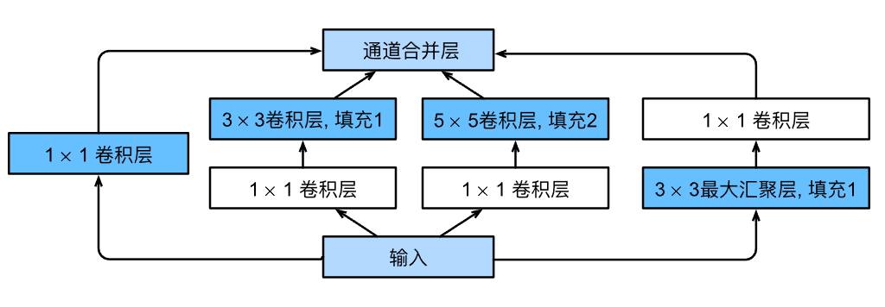

```Python
import torch
from torch import nn
from torch.nn import functional as F
from d2l import torch as d2l


class Inception(nn.Module):
    # c1--c4是每条路径的输出通道数
    def __init__(self, in_channels, c1, c2, c3, c4, **kwargs):
        super(Inception, self).__init__(**kwargs)
        # 线路1，单1x1卷积层
        self.p1_1 = nn.Conv2d(in_channels, c1, kernel_size=1)
        # 线路2，1x1卷积层后接3x3卷积层
        self.p2_1 = nn.Conv2d(in_channels, c2[0], kernel_size=1)
        self.p2_2 = nn.Conv2d(c2[0], c2[1], kernel_size=3, padding=1)
        # 线路3，1x1卷积层后接5x5卷积层
        self.p3_1 = nn.Conv2d(in_channels, c3[0], kernel_size=1)
        self.p3_2 = nn.Conv2d(c3[0], c3[1], kernel_size=5, padding=2)
        # 线路4，3x3最大汇聚层后接1x1卷积层
        self.p4_1 = nn.MaxPool2d(kernel_size=3, stride=1, padding=1)
        self.p4_2 = nn.Conv2d(in_channels, c4, kernel_size=1)

    def forward(self, x):
        p1 = F.relu(self.p1_1(x))
        p2 = F.relu(self.p2_2(F.relu(self.p2_1(x))))
        p3 = F.relu(self.p3_2(F.relu(self.p3_1(x))))
        p4 = F.relu(self.p4_2(self.p4_1(x)))
        # 在通道维度上连结输出
        return torch.cat((p1, p2, p3, p4), dim=1)
```

- ***GoogLeNet中不同Inception块out_channels的个数和配比把我看震惊了，他们当初是进行了多少实验才找出来的数量配比啊，离谱，牛！单是这个输出形状我就得算一天***

```Python
b1 = nn.Sequential(nn.Conv2d(1, 64, kernel_size=7, stride=2, padding=3),
                   nn.ReLU(),
                   nn.MaxPool2d(kernel_size=3, stride=2, padding=1))

b2 = nn.Sequential(nn.Conv2d(64, 64, kernel_size=1),
                   nn.ReLU(),
                   nn.Conv2d(64, 192, kernel_size=3, padding=1),
                   nn.ReLU(),
                   nn.MaxPool2d(kernel_size=3, stride=2, padding=1))

b3 = nn.Sequential(Inception(192, 64, (96, 128), (16, 32), 32),
                   Inception(256, 128, (128, 192), (32, 96), 64),
                   nn.MaxPool2d(kernel_size=3, stride=2, padding=1))

b4 = nn.Sequential(Inception(480, 192, (96, 208), (16, 48), 64),
                   Inception(512, 160, (112, 224), (24, 64), 64),
                   Inception(512, 128, (128, 256), (24, 64), 64),
                   Inception(512, 112, (144, 288), (32, 64), 64),
                   Inception(528, 256, (160, 320), (32, 128), 128),
                   nn.MaxPool2d(kernel_size=3, stride=2, padding=1))

b5 = nn.Sequential(Inception(832, 256, (160, 320), (32, 128), 128),
                   Inception(832, 384, (192, 384), (48, 128), 128),
                   nn.AdaptiveAvgPool2d((1,1)),
                   nn.Flatten())

net = nn.Sequential(b1, b2, b3, b4, b5, nn.Linear(1024, 10))

X = torch.rand(size=(1, 1, 96, 96))
for layer in net:
    X = layer(X)
    print(layer.__class__.__name__,'output shape:\t', X.shape)
    
Sequential output shape:	 torch.Size([1, 64, 24, 24])
Sequential output shape:	 torch.Size([1, 192, 12, 12])
Sequential output shape:	 torch.Size([1, 480, 6, 6])
Sequential output shape:	 torch.Size([1, 832, 3, 3])
Sequential output shape:	 torch.Size([1, 1024])
Linear output shape:	 torch.Size([1, 10])
```

- *第一个模块使用64个通道、7×7卷积层。*

- *第二个模块使用两个卷积层：第一个卷积层是64个通道、1×1卷积层；第二个卷积层使用将通道数量增加三倍的3×3卷积层。 这对应于`Inception`块中的第二条路径。*

- *第三个模块串联两个完整的`Inception`块。 第一个`Inception`块的输出通道数为`64+128+32+32=256`，四个路径之间的输出通道数量比为`64:128:32:32=2:4:1:1`。 第二个和第三个路径首先将输入通道的数量分别减少到`96/192=1/2`和`16/192=1/12`，然后连接第二个卷积层。第二个`Inception`块的输出通道数增加到`128+192+96+64=480`，四个路径之间的输出通道数量比为`128:192:96:64=4:6:3:2`。 第二条和第三条路径首先将输入通道的数量分别减少到`128/256=1/2和32/256=1/8`。*

- *第四模块更加复杂， 它串联了5个`Inception`块，其输出通道数分别是`192+208+48+64=512`、`160+224+64+64=512`、`128+256+64+64=512`、`112+288+64+64=528`和`256+320+128+128=832`。 这些路径的通道数分配和第三模块中的类似，首先是含3×3卷积层的第二条路径输出最多通道，其次是仅含1×1卷积层的第一条路径，之后是含5×5卷积层的第三条路径和含3×3最大汇聚层的第四条路径。 其中第二、第三条路径都会先按比例减小通道数。 这些比例在各个`Inception`块中都略有不同。*

- *第五模块包含输出通道数为`256+320+128+128=832`和`384+384+128+128=1024`的两个`Inception`块。 其中每条路径通道数的分配思路和第三、第四模块中的一致，只是在具体数值上有所不同。 需要注意的是，第五模块的后面紧跟输出层，该模块同NiN一样使用全局平均汇聚层，将每个通道的高和宽变成1。 最后我们将输出变成二维数组，再接上一个输出个数为标签类别数的全连接层。*

## 7.5 批量规范化

- 从零实现

```Python
import torch
from torch import nn
from d2l import torch as d2l


def batch_norm(X, gamma, beta, moving_mean, moving_var, eps, momentum):
    # 通过is_grad_enabled来判断当前模式是训练模式还是预测模式
    if not torch.is_grad_enabled():
        # 如果是在预测模式下，直接使用传入的移动平均所得的均值和方差
        X_hat = (X - moving_mean) / torch.sqrt(moving_var + eps)
    else:
        assert len(X.shape) in (2, 4)
        if len(X.shape) == 2:
            # 使用全连接层的情况，计算特征维上的均值和方差
            mean = X.mean(dim=0)
            var = ((X - mean) ** 2).mean(dim=0)
        else:
            # 使用二维卷积层的情况，计算通道维上（axis=1）的均值和方差。
            # 这里我们需要保持X的形状以便后面可以做广播运算
            mean = X.mean(dim=(0, 2, 3), keepdim=True)
            var = ((X - mean) ** 2).mean(dim=(0, 2, 3), keepdim=True)
        # 训练模式下，用当前的均值和方差做标准化
        X_hat = (X - mean) / torch.sqrt(var + eps)
        # 更新移动平均的均值和方差
        moving_mean = momentum * moving_mean + (1.0 - momentum) * mean
        moving_var = momentum * moving_var + (1.0 - momentum) * var
    Y = gamma * X_hat + beta  # 缩放和移位
    return Y, moving_mean.data, moving_var.data

class BatchNorm(nn.Module):
    # num_features：完全连接层的输出数量或卷积层的输出通道数。
    # num_dims：2表示完全连接层，4表示卷积层
    def __init__(self, num_features, num_dims):
        super().__init__()
        if num_dims == 2:
            shape = (1, num_features)
        else:
            shape = (1, num_features, 1, 1)
        # 参与求梯度和迭代的拉伸和偏移参数，分别初始化成1和0
        self.gamma = nn.Parameter(torch.ones(shape))
        self.beta = nn.Parameter(torch.zeros(shape))
        # 非模型参数的变量初始化为0和1
        self.moving_mean = torch.zeros(shape)
        self.moving_var = torch.ones(shape)

    def forward(self, X):
        # 如果X不在内存上，将moving_mean和moving_var
        # 复制到X所在显存上
        if self.moving_mean.device != X.device:
            self.moving_mean = self.moving_mean.to(X.device)
            self.moving_var = self.moving_var.to(X.device)
        # 保存更新过的moving_mean和moving_var
        Y, self.moving_mean, self.moving_var = batch_norm(
            X, self.gamma, self.beta, self.moving_mean,
            self.moving_var, eps=1e-5, momentum=0.9)
        return Y
```

- 简单实现

```Python
# num_features：完全连接层的输出数量或卷积层的输出通道数。
# num_dims：2表示完全连接层，4表示卷积层
```

```Python
net = nn.Sequential(
    nn.Conv2d(1, 6, kernel_size=5), nn.BatchNorm2d(6), nn.Sigmoid(),
    nn.AvgPool2d(kernel_size=2, stride=2),
    nn.Conv2d(6, 16, kernel_size=5), nn.BatchNorm2d(16), nn.Sigmoid(),
    nn.AvgPool2d(kernel_size=2, stride=2), nn.Flatten(),
    nn.Linear(256, 120), nn.BatchNorm1d(120), nn.Sigmoid(),
    nn.Linear(120, 84), nn.BatchNorm1d(84), nn.Sigmoid(),
    nn.Linear(84, 10))
```

# ch-8

## 8.1 序列模型

- 这段代码我愿称之为最强！要是我的话 可能就要一条一条插入数据了，大神直接一插插一列，不愧是大格局

```Python
%matplotlib inline
import torch
from torch import nn
from d2l import torch as d2l

T = 1000  # 总共产生1000个点
time = torch.arange(1, T + 1, dtype=torch.float32)
x = torch.sin(0.01 * time) + torch.normal(0, 0.2, (T,))
d2l.plot(time, [x], 'time', 'x', xlim=[1, 1000], figsize=(6, 3))

# 这几行代码太秀了，要是我的话 可能就要一条一条插入数据了，大神直接一插插一列，不愧是大格局
tau = 4
features = torch.zeros((T - tau, tau))
for i in range(tau):
    features[:, i] = x[i: T - tau + i]
labels = x[tau:].reshape((-1, 1))
```

## 8.2 文本预处理

- 词元

```Python
class Vocab:  #@save
    """文本词表"""
    def __init__(self, tokens=None, min_freq=0, reserved_tokens=None):
        if tokens is None:
            tokens = []
        if reserved_tokens is None:
            reserved_tokens = []
        # 按出现频率排序
        counter = count_corpus(tokens)
        self._token_freqs = sorted(counter.items(), key=lambda x: x[1],
                                   reverse=True)
        # 未知词元的索引为0
        self.idx_to_token = ['<unk>'] + reserved_tokens
        self.token_to_idx = {token: idx
                             for idx, token in enumerate(self.idx_to_token)}
        for token, freq in self._token_freqs:
            if freq < min_freq:
                break
            if token not in self.token_to_idx:
                self.idx_to_token.append(token)
                self.token_to_idx[token] = len(self.idx_to_token) - 1

    def __len__(self):
        return len(self.idx_to_token)

    def __getitem__(self, tokens):
        if not isinstance(tokens, (list, tuple)):
            return self.token_to_idx.get(tokens, self.unk)
        return [self.__getitem__(token) for token in tokens]

    def to_tokens(self, indices):
        if not isinstance(indices, (list, tuple)):
            return self.idx_to_token[indices]
        return [self.idx_to_token[index] for index in indices]

    @property
    def unk(self):  # 未知词元的索引为0
        return 0

    @property
    def token_freqs(self):
        return self._token_freqs

def count_corpus(tokens):  #@save
    """统计词元的频率"""
    # 这里的tokens是1D列表或2D列表
    if len(tokens) == 0 or isinstance(tokens[0], list):
        # 将词元列表展平成一个列表
        tokens = [token for line in tokens for token in line]
    return collections.Counter(tokens)
```

太溜了 我之前都不会这样解包

```Python
li = [[1, 2, 3], [3, 4, 5], [3,9,10]]
[j for l in li for j in l]

[1, 2, 3, 3, 4, 5, 3, 9, 10]
```

## 8.3 学习语言模型

$P(x_1, x_2, \ldots, x_T) = \prod_{t=1}^T P(x_t  \mid  x_1, \ldots, x_{t-1}).$

例如，包含了四个单词的一个文本序列的概率是：

$P(\text{deep}, \text{learning}, \text{is}, \text{fun}) =  P(\text{deep}) P(\text{learning}  \mid  \text{deep}) P(\text{is}  \mid  \text{deep}, \text{learning}) P(\text{fun}  \mid  \text{deep}, \text{learning}, \text{is}).$

为了训练语言模型，我们需要计算单词的概率，以及给定前面几个单词后出现某个单词的条件概率。这些概率本质上就是语言模型的参数。

## 8.5 循环神经网络（困惑度）

如果想要压缩文本，我们可以根据当前词元集预测的下一个词元。一个更好的语言模型应该能让我们更准确地预测下一个词元。因此，它应该允许我们在压缩序列时花费更少的比特。所以我们可以通过一个序列中所有的$n$个词元的交叉熵损失的平均值来衡量：

$\frac{1}{n} \sum_{t=1}^n -\log P(x_t \mid x_{t-1}, \ldots, x_1),$

其中$P$由语言模型给出$x_t$是在时间步$t$从该序列中观察到的实际词元。这使得不同长度的文档的性能具有了可比性。
由于历史原因，自然语言处理的科学家更喜欢使用一个叫做*困惑度*（perplexity）的量。简而言之，它是

$\exp\left(-\frac{1}{n} \sum_{t=1}^n \log P(x_t \mid x_{t-1}, \ldots, x_1)\right).$

困惑度的最好的理解是“下一个词元的实际选择数的调和平均数”。我们看看一些案例。

- 在最好的情况下，模型总是完美地估计标签词元的概率为1。
在这种情况下，模型的困惑度为1。

- 在最坏的情况下，模型总是预测标签词元的概率为0。
在这种情况下，困惑度是正无穷大。

# ch-9

## 9.6 编码器和解码器

- 编码器

```Python
from torch import nn


#@save
class Encoder(nn.Module):
    """编码器-解码器架构的基本编码器接口"""
    def __init__(self, **kwargs):
        super(Encoder, self).__init__(**kwargs)

    def forward(self, X, *args):
        raise NotImplementedError
```

- 解码器

```Python
#@save
class Decoder(nn.Module):
    """编码器-解码器架构的基本解码器接口"""
    def __init__(self, **kwargs):
        super(Decoder, self).__init__(**kwargs)

    def init_state(self, enc_outputs, *args):
        raise NotImplementedError

    def forward(self, X, state):
        raise NotImplementedError
```

- 合并编码器-解码器

```Python
#@save
class EncoderDecoder(nn.Module):
    """编码器-解码器架构的基类"""
    def __init__(self, encoder, decoder, **kwargs):
        super(EncoderDecoder, self).__init__(**kwargs)
        self.encoder = encoder
        self.decoder = decoder

    def forward(self, enc_X, dec_X, *args):
        enc_outputs = self.encoder(enc_X, *args)
        dec_state = self.decoder.init_state(enc_outputs, *args)
        return self.decoder(dec_X, dec_state)
```


